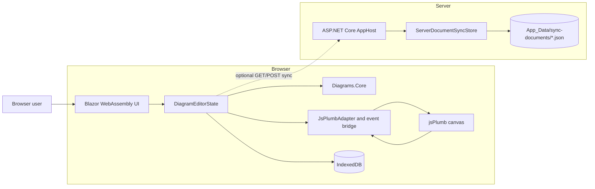
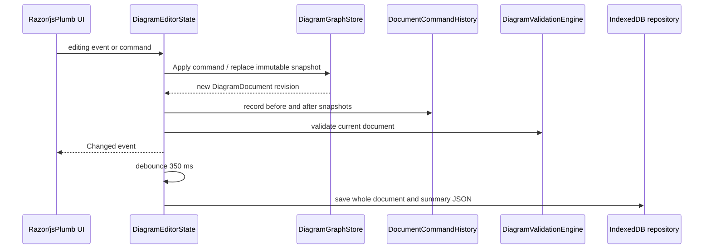

# Current Architecture

## Document status

- **System:** Diagram Studio prototype
- **Purpose:** Describe the design that is implemented in the current repository
- **Baseline date:** 2026-07-25
- **Implementation target:** .NET 10, Blazor Web App with Interactive WebAssembly, and jsPlumb 6.2.10
- **Evidence:** Fresh full Codebase Memory index, graph traversal, and verification against current project, Razor, JavaScript, and test files

This document is descriptive, not aspirational. It records the current runtime boundaries, data flows, implementation choices, and known gaps. It does not propose a target architecture.

## Executive summary

Diagram Studio is a local-first browser diagram editor hosted by an ASP.NET Core application. The host serves a static landing page and an Interactive WebAssembly editor, exposes a health endpoint, and provides an optional file-backed document sync API.

The application is divided into four production projects:

1. `AppHost` composes and serves the application and owns server-side sync files.
2. `Editor.Client` implements the document catalog, editor UI, application state, local persistence, and client-side sync adapter.
3. `Diagrams.Core` contains the immutable diagram model and the domain services that operate on it.
4. `Diagrams.Interop.JsPlumb` defines the .NET-to-JavaScript rendering boundary and the JavaScript-to-.NET interaction event bridge.

The browser is the primary system of record. Documents, snapshots, and reusable library fragments are stored as JSON in IndexedDB. Server sync is disabled by default and, when enabled, sends whole documents through revision-checked HTTP endpoints to JSON files under `AppHost/App_Data/sync-documents`.

## Runtime context



The browser and server share the `DiagramDocument` contract but do not share an in-memory state container. The browser state is scoped to the Blazor WebAssembly dependency-injection scope. The server sync store is a singleton inside one host process.

## Solution and dependency structure

| Project | Runtime role | Depends on |
| --- | --- | --- |
| `src/AppHost` | ASP.NET Core composition root, static assets, Razor routing, health check, and sync HTTP API | `Editor.Client` |
| `src/Editor.Client` | Interactive WebAssembly document catalog and diagram editor | `Diagrams.Core`, `Diagrams.Interop.JsPlumb` |
| `src/Diagrams.Core` | Platform-neutral domain model, commands, layouts, templates, validation, serialization, routing, and SVG export | No other solution project |
| `src/Diagrams.Interop.JsPlumb` | Razor class library containing the jsPlumb adapter, event bridge, CSS, and pinned browser dependency | `Diagrams.Core` |

All four production projects target `net10.0`. Nullable reference types and implicit usings are enabled centrally. The interop project pins `@jsplumb/browser-ui` to version `6.2.10` and copies its ESM browser asset into its Razor class-library static assets during build.

The large repository-level `vendor/jsplumb-community` tree is excluded from the application graph and is not referenced by the .NET project dependency chain. The interop project uses its own npm dependency and copied static asset.

## Server host

`src/AppHost/Program.cs` is the server composition root. It:

- registers Razor Components with Interactive WebAssembly support;
- registers health checks;
- registers `DiagramDocumentSerializer` and the singleton `ServerDocumentSyncStore`;
- enables production exception handling and HSTS outside development;
- enables HTTPS redirection, antiforgery, and static assets;
- maps `/healthz`;
- maps the document sync GET and POST routes; and
- exposes the AppHost and Editor.Client Razor assemblies through one router.

### Routes

| Route | Execution mode | Current responsibility |
| --- | --- | --- |
| `/` | Server-rendered Razor component | Product landing page and navigation |
| `/documents` | Interactive WebAssembly, prerender disabled | Local document and reusable-library catalog |
| `/editor` | Interactive WebAssembly, prerender disabled | Opens the latest favorite/recent document or creates a Flowchart |
| `/editor/{documentId}` | Interactive WebAssembly, prerender disabled | Opens a specific local document |
| `/healthz` | Server endpoint | ASP.NET Core health response |
| `GET /api/sync/documents/{documentId}` | Server endpoint | Pull a server-side document |
| `POST /api/sync/documents/{documentId}` | Server endpoint | Push a document with optimistic revision checking |

The server does not currently implement authentication, authorization, per-user tenancy, a database, background processing, or real-time collaboration.

## Client composition

`src/Editor.Client/Program.cs` registers the browser application services as scoped services:

- `DiagramDocumentSerializer`
- `DiagramLayoutEngine`
- `DiagramValidationEngine`
- stencil, port-preset, and template catalogs
- `SvgExportRenderer`
- `BrowserDocumentCatalogRepository`
- `HttpDocumentSyncService`
- `DocumentCommandHistory`
- `JsPlumbAdapter`
- `DiagramEditorState`

`DiagramEditorState` is the application facade used by both interactive pages. It is implemented as one partial class split into catalog, editing, and workflow concerns. It owns:

- the active diagram store;
- catalog, snapshot, and library projections;
- selection and active-layer state;
- undo/redo history;
- validation results;
- review and presentation flags;
- local/server sync status and known server revision;
- stencil and library search state; and
- autosave scheduling.

The state object exposes a `Changed` event. Razor components subscribe to that event, request a rerender, and unsubscribe during disposal.

## Domain model

`DiagramDocument` is the aggregate persisted and exchanged across every boundary. It is an immutable record whose current schema version is `2`.

The aggregate contains:

- document identity, revision, favorite flag, metadata, and template kind;
- canvas dimensions, grid size, and viewport state;
- nodes with bounds, stencil keys, properties, tags, links, layers, styles, and z-order;
- ports with node ownership, side, semantic role, endpoint shape, anchor, label, and connection limit;
- edges with source and target ports, connector kind, markers, animation, metadata, tags, links, layer, style, and optional manual waypoints;
- groups with bounds, children, collapsed state, layout specification, tags, links, layer, metadata, and z-order;
- layers with visibility, lock state, and order;
- document and element annotations;
- comment threads and resolution state; and
- reusable style tokens.

The model uses immutable arrays, dictionaries, and hash sets. `Touch()` produces a new document with an incremented revision and refreshed `UpdatedUtc`.

### Supported diagram vocabulary

The implementation includes 11 template kinds:

- Flowchart
- Org Chart
- UML Class
- UML Sequence
- ERD
- C4 Context
- BPMN Lite
- Network Topology
- Mind Map
- Data Flow
- State Dependency

The stencil catalog supplies node definitions, port presets, and inspector-field metadata. Templates create complete starter documents from those catalog definitions.

Edges support Flowchart, Straight, Bezier, and State Machine connectors. Marker and port-role mappings cover directed flow, bidirectional links, association, dependency, aggregation, composition, and inheritance. Manual waypoints are supported only for compatible connector kinds.

## Mutation and state flow



`DiagramGraphStore` applies `IDiagramCommand` implementations using an atomic compare-and-swap loop. Each successful command produces a touched immutable document. This gives the domain store safe replacement semantics even if commands are applied concurrently.

`DiagramEditorState` also performs some workflows through immutable transformation functions rather than explicit command types. Both paths converge in the same post-mutation behavior:

1. record the previous and current full snapshots for undo/redo;
2. prune selections whose targets no longer exist;
3. rerun validation;
4. schedule persistence when applicable; and
5. notify subscribed UI components.

Undo and redo are in-memory stacks of complete `DiagramDocument` snapshots. History resets when the document identity changes and does not survive a browser reload.

### Implemented editing workflows

The editor state currently supports:

- creating, opening, renaming, favoriting, duplicating, deleting, importing, and exporting documents;
- adding stencil nodes and reusable library fragments;
- connecting, relabeling, and deleting edges;
- inserting, moving, removing, and clearing compatible edge waypoints;
- moving, duplicating, deleting, nudging, aligning, distributing, and z-ordering selections;
- copy and paste within the active editor state;
- selecting nodes, edges, groups, or all content;
- creating groups, changing membership, resizing, collapsing, and applying group layouts;
- creating, locking, hiding, selecting, and ordering layers;
- running whole-document or group layouts;
- updating node inspector properties, tags, and links;
- saving and restoring named snapshots;
- saving selected content as reusable library items;
- adding and resolving review comments;
- adding pinned annotations;
- toggling review and presentation modes; and
- fitting the diagram or centering the current selection.

## Layout, validation, routing, and export

`DiagramLayoutEngine` implements Freeform, top-down hierarchy, left-right hierarchy, Tree, Grid, Radial, and Mind Map layouts. Layout is deterministic for the same input ordering and settings. Layout can target the whole document or a group, and affected routed edges have manual waypoints cleared where necessary.

`DiagramValidationEngine` runs on load and after mutations. It currently reports:

- missing node labels;
- nodes on locked layers;
- edges referencing missing ports;
- waypoints on unsupported connectors;
- duplicate consecutive waypoints;
- off-canvas waypoints;
- empty groups;
- a document whose nodes are all on hidden layers; and
- up to three node overlaps on the same layer.

`EdgeRouteResolver` converts the stored edge and waypoint data into routed points for rendering and export.

`SvgExportRenderer` renders a document without requiring the live canvas. JSON and SVG exports are generated in .NET. PNG export sends the generated SVG to the JavaScript adapter for browser-side rasterization and download.

## Browser rendering and interaction boundary

`DiagramCanvas.razor` owns an empty host element. On first render it:

1. creates a `JsPlumbEventBridge`;
2. connects bridge events to `DiagramEditorState`;
3. passes a .NET object reference and host element to `IJsPlumbAdapter.InitializeAsync`; and
4. asks the adapter to render the complete current document.

Every subsequent `DiagramEditorState.Changed` event marks the canvas for a full document render. Although `IJsPlumbAdapter` exposes `ApplyPatchAsync`, the current Razor component calls `RenderDocumentAsync`; incremental rendering is not wired into the active flow.

The bridge carries the following JavaScript-originated events back into .NET:

- node moved;
- edge created, relabeled, or deleted;
- waypoint inserted, moved, or removed;
- group membership, bounds, or collapse changed;
- selection changed;
- viewport changed; and
- editor hotkeys.

Hotkeys map to delete, undo, redo, copy, paste, duplicate, select-all, and directional nudge commands.

The minimap is rendered separately as Razor-generated SVG from document bounds and viewport state. It does not depend on jsPlumb.

## Local persistence

The browser repository stores JSON in an IndexedDB database named `diagram-studio`, currently opened at database version `2`.

| Object store | Key | Stored content |
| --- | --- | --- |
| `documents` | `documentId` | Full document JSON and denormalized summary JSON |
| `snapshots` | `snapshotId` | Document ID, snapshot summary JSON, and full document JSON |
| `library` | `libraryItemId` | Reusable fragment JSON |

The `snapshots` store has a non-unique `byDocumentId` index. Deleting a document also deletes its snapshots by cursor. Library items are independent of document deletion.

Autosave is scheduled 350 ms after a mutation. A newer mutation cancels the previous pending save. Persistence writes the entire document, not a delta or event stream.

The document catalog prefers favorite documents, then most recently updated documents. Opening `/editor` without an ID opens the preferred local document or creates a new Flowchart if the catalog is empty.

## Optional server synchronization

Server synchronization is disabled by default. The user enables it in the editor. Once enabled:

- a normal save also attempts a server push;
- the Push button sends the current document explicitly; and
- the Pull button replaces the active local document with the server revision.

The client sends a `knownServerRevision` with each push. The server serializes all access through one `SemaphoreSlim`, reads the existing JSON file when present, and rejects a stale revision by returning a `SyncResult` containing `HasConflict = true` and the current server document. A successful push assigns a revision greater than both the existing server revision and submitted document revision, updates `UpdatedUtc`, writes the whole JSON file, and returns the saved document.

Files are stored at:

```text
src/AppHost/App_Data/sync-documents/{documentId}.json
```

Both success and domain-level failure/conflict responses currently use HTTP 200 with a result payload. Conflict handling is informational in the client: the status message changes, but there is no merge, comparison, retry, or conflict-resolution UI.

The sync design is suitable for a single prototype host process. It does not currently provide:

- authentication or authorization;
- tenant/user isolation;
- document ID validation at the storage boundary;
- distributed locking across host instances;
- atomic replace/rename for file writes;
- database transactions, backups, or retention;
- encryption policy beyond the host transport configuration;
- offline sync queues; or
- real-time multi-user presence and collaboration.

## UI structure

The document catalog displays recent documents and reusable library items. It supports template-based creation, open, favorite, duplicate, and delete actions.

The editor uses a three-column workspace:

- **Left rail:** searchable stencil catalog or reusable library.
- **Center stage:** jsPlumb canvas with a Razor SVG minimap.
- **Right inspector:** selected-element properties, links, tags, layers, snapshots, validation, and optional review controls.

The top toolbar exposes save, snapshots, undo/redo, optional server sync, import/export, layouts, grouping, fitting, centering, review, and presentation controls. A status strip shows the active template, element counts, validation count, and sync state.

## Verification coverage

The repository contains three test projects:

| Test project | Implemented coverage |
| --- | --- |
| `Diagrams.Core.Tests` | Built-in templates, schema serialization, legacy schema defaults, validation, graph-store concurrency, and deterministic layout |
| `AppHost.Tests` | Landing page, editor shell route, health endpoint, missing sync document, push/pull round trip, and stale-revision conflict |
| `Editor.E2E.Tests` | Document creation/opening, node editing with undo/redo and persistence, snapshots, reusable library items, and review comments |

Current verification on 2026-07-25:

- `Diagrams.Core.Tests`: **6 passed**
- `AppHost.Tests`: **6 passed**
- `Editor.E2E.Tests`: **not executed successfully in this environment** because the required Playwright Chromium binary is not installed

The full solution command also exposed environment-specific restore-path differences between the sandbox and the user profile. The focused, already-built AppHost suite passed outside the sandbox.

## Known implementation gaps and constraints

### Blocking browser-canvas asset gap

`JsPlumbAdapter` imports:

```text
/_content/Diagrams.Interop.JsPlumb/js/diagram-editor.js
```

The current repository contains the `wwwroot/js` directory but not `diagram-editor.js`. The pinned jsPlumb library asset is present, but the application-specific module that must implement `initialize`, `renderDocument`, viewport commands, downloads, and bridge callbacks is absent. As checked in, the editor canvas cannot complete its JavaScript initialization.

This gap is not covered by the successful core or AppHost integration tests. The Playwright suite could validate it once the browser dependency is installed, but the suite did not run in the current environment.

### Prototype constraints

- Browser IndexedDB is the authoritative local store; clearing browser site data removes local documents.
- Documents, snapshots, history entries, sync payloads, and server files are whole-document copies.
- Undo/redo history is memory-only and unbounded.
- The state facade is broad and couples catalog, editing, review, presentation, persistence, validation, and sync workflows.
- Every state change causes a complete canvas render request; the available patch API is unused.
- Validation is synchronous and reruns across the whole document after mutations.
- Server sync uses one process-wide lock and local disk, so it is not horizontally scalable.
- Sync endpoints and stored documents have no identity or access-control boundary.
- Conflict detection exists, but conflict resolution does not.
- The serializer relies on record defaults for older documents; there is no explicit migration pipeline.
- The build copies the pinned third-party jsPlumb runtime but does not generate or restore the missing application-specific adapter module.

## Codebase Memory baseline

The repository was indexed in full mode as project:

```text
C-Users-justin-Source-samples-ghostworx-diagram-ghostworx-node
```

The index contains 3,664 nodes and 5,438 relationships. Generated outputs, `node_modules`, vendored jsPlumb source, and build directories were excluded. A compressed shareable artifact was written to:

```text
.codebase-memory/graph.db.zst
```

The highest-fan-in application operations are selection, state-change notification, mutation, command application, catalog refresh, browser database access, deserialization, and JavaScript invocation. This matches the implemented architecture: `DiagramEditorState` is the main orchestration hub, `DiagramDocument` is the shared contract, IndexedDB is the primary persistence boundary, and jsPlumb interop is the browser rendering boundary.
