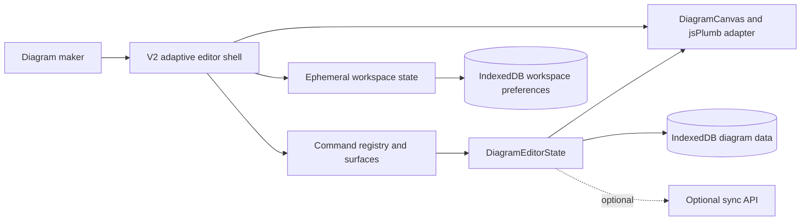
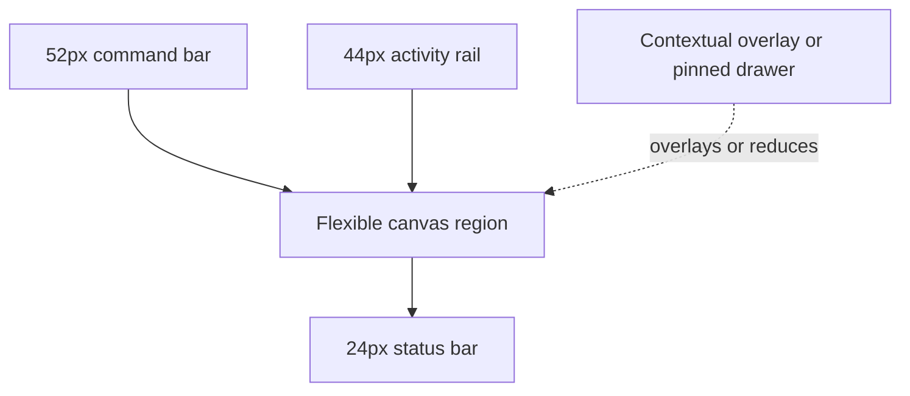
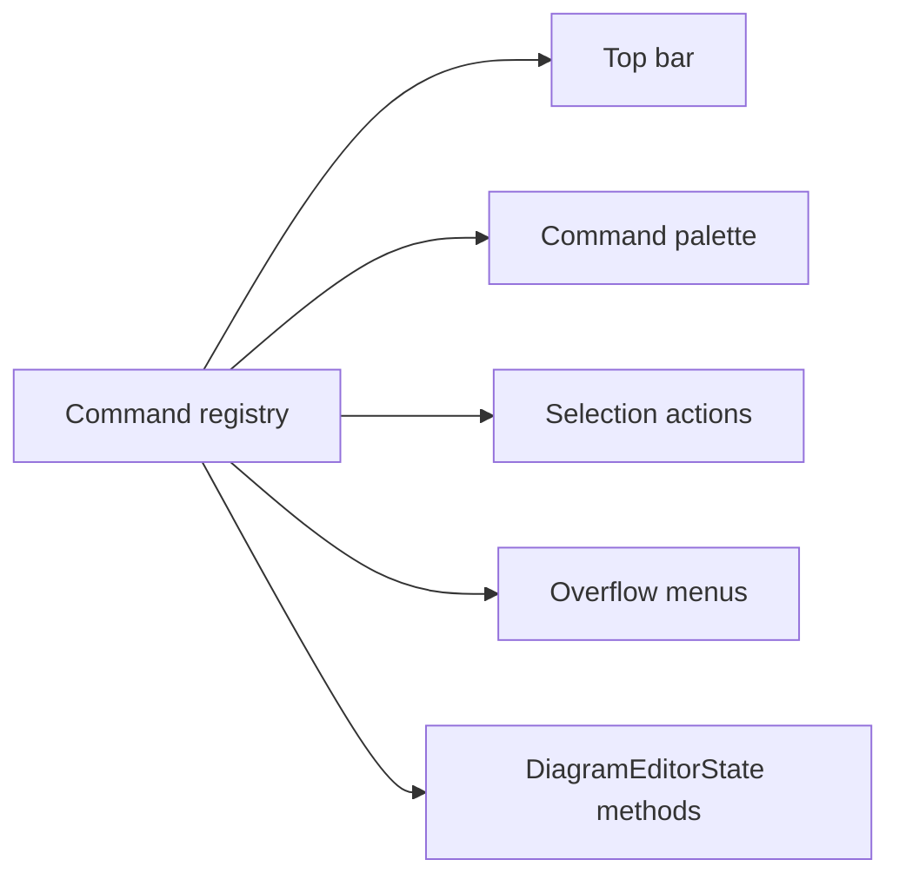
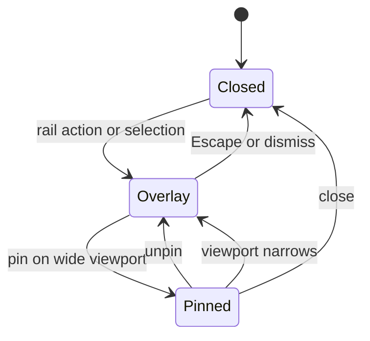
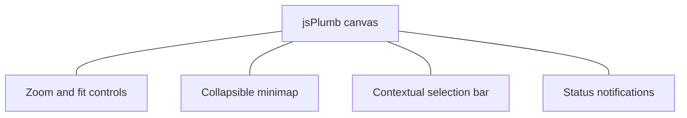
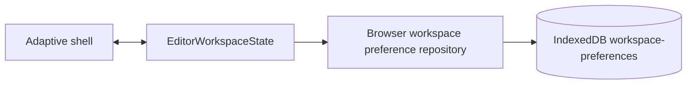
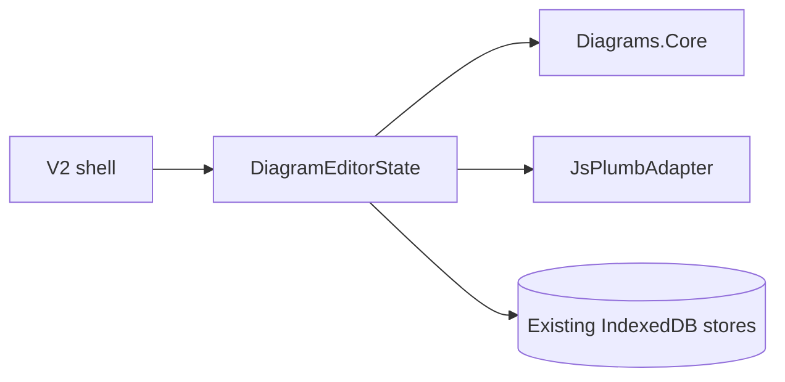
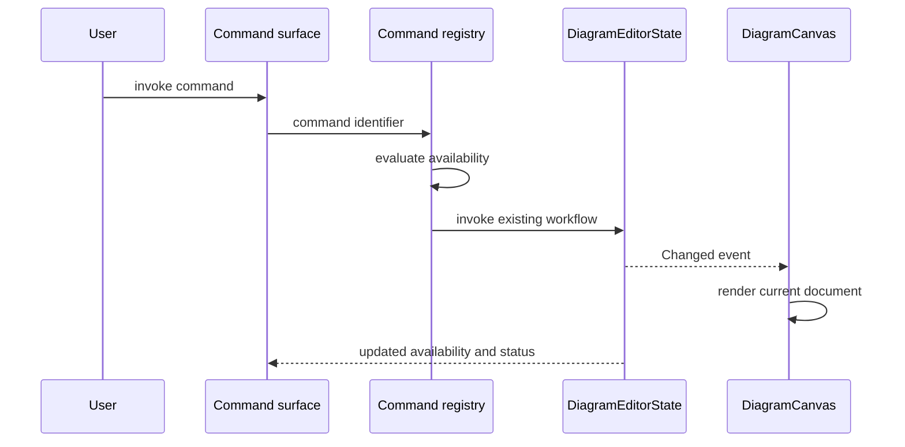
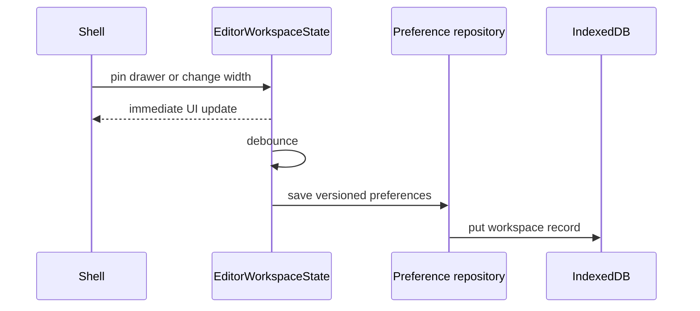

# High-Level Design Document: Diagram Studio Version 2

| Field         | Value                                                                |
| ------------- | -------------------------------------------------------------------- |
| Status        | Approved - JH                                                        |
| Version       | 2.0                                                                  |
| Date          | 2026-07-26                                                           |
| Scope         | Modern, canvas-first editor interface                                |
| Primary stack | .NET 10, Blazor Web App with Interactive WebAssembly, jsPlumb 6.2.10 |

## 1. Executive Summary

Diagram Studio version 2 replaces the current fixed three-column editor with a canvas-first adaptive workspace. The canvas becomes the stable spatial anchor; tools appear through a compact command bar, a narrow activity rail, contextual drawers, floating canvas controls, and a compact status bar.

The target preserves the current local-first application, immutable `DiagramDocument` model, `DiagramEditorState` workflows, IndexedDB document stores, optional server synchronization, and jsPlumb rendering boundary. It does not redesign domain behavior or persistence. Workspace-only preferences such as pinned panels and panel widths are stored separately from diagram content.

At a 1440 by 900 desktop viewport, the default no-drawer state targets at least 80 percent of viewport area for the canvas region. The current implementation permanently allocates 280 pixels to assets, 320 pixels to the inspector, 32 pixels to horizontal gaps and padding, a multi-row top toolbar, a footer, and a separate minimap row. Version 2 removes those permanent costs while keeping every existing workflow reachable.

This document and its linked ADRs are review candidates. They do not authorize implementation.

## 2. Objectives

### 2.1 Primary Objectives

- Make the diagram canvas the dominant visual and interaction surface.
- Reduce persistent editor chrome to a 52-pixel command bar, 44-pixel activity rail, and 24-pixel status bar.
- Replace fixed sidebars with contextual, resizable, pinnable drawers that overlay the canvas by default.
- Move common selection actions close to the selected object without hiding full inspector workflows.
- Preserve all current editor capabilities and the version 2 `DiagramDocument` schema.
- Provide complete keyboard access, visible focus, reduced-motion behavior, and WCAG 2.2 AA color-contrast targets.
- Adapt without stacking large panels above and below the canvas on narrower viewports.

### 2.2 Non-Goals for This Release

- Real-time collaboration, user identity, authorization, or multi-tenancy.
- A new diagram schema, explicit document migration pipeline, or event-sourced persistence.
- Replacing Blazor, jsPlumb, IndexedDB, or the optional sync API.
- Changing layout, validation, routing, import, export, review, snapshot, or library semantics.
- Mobile-first authoring below 768 pixels. Small screens receive a safe read/navigation experience and modal editing surfaces, not parity with desktop precision editing.
- Performance refactoring of full-document rendering or synchronous validation, except where required to avoid UI regressions.

## 3. Principal Use Cases

### 3.1 Build a Diagram with Maximum Canvas Space

The maker opens a document into an edge-to-edge canvas, opens Assets from the activity rail, searches or browses stencils, inserts an item, and dismisses the drawer without changing the viewport. Frequently used canvas commands remain available in a small floating control cluster.

### 3.2 Inspect and Refine a Selection

Selecting a node, edge, or group reveals a compact contextual action bar. The maker can perform common operations immediately or open the Inspector drawer for structured properties, metadata, layers, and advanced routing controls. The drawer may be pinned on wide displays.

### 3.3 Find and Execute a Secondary Command

The maker invokes the command palette from the command bar or `Ctrl+K`, searches commands such as export, snapshot, review, layout, or server sync, and executes a command without expanding permanent toolbar rows.

### 3.4 Focus, Review, and Present

Focus mode dismisses drawers and nonessential overlays while preserving an explicit exit control. Review mode adds review-specific actions without permanently expanding the inspector. Presentation mode removes editing chrome from layout instead of making it merely translucent.

## 4. Architecture Overview



The new shell is a presentation and interaction layer around existing application services. `DiagramEditorState` remains the authoritative browser facade for document and workflow state. A separate `EditorWorkspaceState` owns transient UI concerns and cannot mutate `DiagramDocument`.

### 4.1 Architectural Principles

- Canvas first: persistent chrome must justify every pixel it consumes.
- Context over inventory: show tools when they are relevant, while keeping them discoverable.
- One command, many surfaces: toolbar, palette, contextual actions, menus, and shortcuts invoke the same command definitions.
- Separate durable content from workspace preference.
- Progressive enhancement: the editor remains operable if a preference cannot be restored.
- Accessibility is a structural contract, not a finishing pass.
- Preserve local-first behavior and current trust boundaries.

### 4.2 Context and Trust Boundaries

- Diagram content remains inside the browser unless the user exports it or enables server sync.
- Workspace preferences remain browser-local and are never included in diagram export or sync.
- Imported JSON remains untrusted input and continues through the existing serializer and validation boundary.
- The jsPlumb module remains a browser rendering and interaction boundary, not a data authority.
- The optional sync server remains unauthenticated prototype infrastructure; version 2 does not broaden its exposure.

## 5. Major Components

### 5.1 Adaptive Editor Shell

The shell uses four persistent regions:

- a 52-pixel top command bar;
- a 44-pixel left activity rail;
- a canvas region that receives all remaining space; and
- a 24-pixel status bar.

Assets, Inspector, Layers, History, Validation, and Review are drawer modes. Only one drawer is open per side. Drawers overlay the canvas by default and may be pinned when the viewport is at least 1280 pixels wide. Pinned widths are resizable from 280 to 420 pixels.



### 5.2 Command System

A UI command registry describes command identifier, label, icon, category, shortcut, availability, checked state, and invocation delegate. It wraps existing `DiagramEditorState` methods; it does not duplicate workflow logic.

Primary save, undo, redo, document navigation, and command-palette access stay in the command bar. Selection actions appear contextually. Secondary document, export, layout, review, presentation, snapshot, and sync actions live in menus and the searchable palette.



### 5.3 Contextual Drawer Host

The drawer host renders one mode at a time, preserves focus origin, supports Escape to close, and exposes pin and resize controls on wide screens. Existing inspector sections are regrouped by task instead of rendered as one continuously scrolling panel.



### 5.4 Canvas Overlay Layer

The canvas overlay layer contains zoom/fit controls, the minimap, transient notifications, contextual selection actions, and focus-mode exit. Overlays are anchored to canvas edges and do not reserve grid rows. They must avoid the active drawer and remain reachable at 200 percent browser zoom.



### 5.5 Workspace Preference Store

`EditorWorkspaceState` owns active drawer, pin state, drawer width, minimap visibility, focus mode, density, and last command-palette query for the current session. A browser preference repository persists only stable preferences. Failure to load or save preferences falls back to defaults and never blocks document editing.



### 5.6 Existing Domain and Persistence Components

`DiagramEditorState`, `Diagrams.Core`, `BrowserDocumentCatalogRepository`, `HttpDocumentSyncService`, and `JsPlumbAdapter` retain their current responsibilities. The checked-in `diagram-editor.js` module is present in current source; therefore, the missing-module gap recorded in the 2026-07-25 architecture snapshot is no longer a current design premise.



## 6. Processing Pipeline



### 6.1 Idempotency and Consistency

Command surfaces do not mutate UI or document state independently. They route to one command definition and one existing state workflow. Drawer changes are independent of document revision. Restoring preferences must not open a drawer whose mode is unavailable.

### 6.2 Backpressure and Scheduling

Workspace preference writes are debounced and last-write-wins. Canvas interactions remain higher priority than preference persistence. Existing 350-millisecond document autosave behavior is unchanged. Panel animations use transforms and opacity and respect `prefers-reduced-motion`.

## 7. API and Contract Design

### 7.1 Public Interfaces

- `IEditorCommand`: metadata, availability, checked state, and asynchronous invocation.
- `IEditorCommandRegistry`: command lookup, enumeration, search, and change notification.
- `EditorWorkspaceState`: active panels, focus mode, density, minimap state, and viewport adaptation.
- `IWorkspacePreferenceRepository`: load and save a versioned browser-local preference record.

These are internal client contracts, not network APIs.

### 7.2 Versioning and Compatibility

`DiagramDocument.SchemaVersion` remains `2`. Existing IndexedDB `documents`, `snapshots`, and `library` stores remain unchanged. Workspace preferences use their own schema version and store. Unknown preference fields are ignored; an unsupported preference version resets to safe defaults without altering documents.

### 7.3 Validation and Error Contract

- Commands expose disabled reasons when prerequisites are unmet.
- Drawer and palette failures render nonblocking in-app feedback and keep the canvas usable.
- Preference failures are logged at warning level and fall back to defaults.
- Existing validation issues remain document-domain results and are surfaced through the Validation drawer and status indicator.
- Destructive commands require the same confirmation behavior regardless of invocation surface.

## 8. Data Flows

### 8.1 Document Editing Flow

Selection and commands continue through `DiagramEditorState`, immutable domain transformations, validation, canvas rerender, and debounced document persistence. Version 2 changes only where commands are presented.

### 8.2 Workspace Preference Flow



### 8.3 Command Discovery Flow

The palette queries command metadata locally, filters by label, category, aliases, and shortcut, excludes unavailable contextual commands unless explicitly requested, and invokes the selected command through the registry.

## 9. Security and Privacy

### 9.1 Default Deployment Posture

Local-first behavior is preserved. Workspace preferences contain layout choices only and must not contain diagram labels, metadata, links, comments, or content.

### 9.2 Hosted or Shared Deployment

The existing unauthenticated sync API remains a prototype constraint. Version 2 must not imply that server sync is private or multi-user safe. Sync remains disabled by default.

### 9.3 Content Protection

Imported labels and metadata are rendered as text, not trusted HTML. Command search indexes command metadata, never document content. Export and clipboard actions remain explicit user gestures.

### 9.4 Untrusted Content and Prompt Injection

No model or prompt system is in scope. Imported diagram JSON remains untrusted structured content and follows existing deserialization and validation paths.

## 10. Reliability and Recovery

- If preference initialization fails, render the default shell immediately.
- If a drawer component fails, retain canvas interaction and provide retry/close controls.
- Never write workspace preferences into a diagram snapshot or export.
- Keep existing document autosave, snapshots, undo/redo, and sync conflict behavior unchanged.
- Focus mode always provides a visible keyboard- and pointer-operable exit.

### Graceful Shutdown

On component disposal, unsubscribe from state events, cancel pending preference writes, dispose JavaScript references, and release focus-management subscriptions. Document save semantics remain owned by `DiagramEditorState`.

## 11. Observability

### Logging

Log command invocation failures, unavailable-command attempts, drawer render failures, preference migration/reset, and preference persistence failures without diagram content.

### Metrics

In local development and automated tests, capture canvas-area ratio, drawer open/close duration, command search latency, focus-mode transitions, and initial interactive render timing. Product telemetry is not added by this design.

### Health Checks

The existing `/healthz` server check remains unchanged. Client readiness is verified through a deterministic editor-ready marker that requires the shell and canvas adapter to initialize successfully.

## 12. Performance Targets

| Measure                                 | Proposed target                                          |
| --------------------------------------- | -------------------------------------------------------- |
| Default canvas region at 1440 by 900    | At least 80 percent of viewport area                     |
| Focus-mode canvas region at 1440 by 900 | At least 92 percent of viewport area                     |
| Persistent chrome                       | 52px top, 44px rail, 24px status                         |
| Drawer transition                       | 150ms or less; no animation under reduced motion         |
| Command palette filtering               | Under 50ms for the built-in command set                  |
| Interaction response                    | Visual acknowledgment within 100ms                       |
| Layout stability                        | No canvas reinitialization for overlay drawer open/close |

Targets require baseline measurement on reference hardware before approval. They are acceptance thresholds, not claims about current performance.

## 13. Configuration Model

Version 2 introduces client-local defaults:

| Setting      | Default           | Constraint                             |
| ------------ | ----------------- | -------------------------------------- |
| Drawer mode  | Overlay           | Pinning allowed at 1280px and wider    |
| Drawer width | 336px             | 280px minimum, 420px maximum           |
| Minimap      | Collapsed         | User can expand                        |
| UI density   | Comfortable       | Compact is optional                    |
| Motion       | System preference | Reduced motion overrides transitions   |
| Focus mode   | Off               | Never restored across browser restarts |

### Per-Scope Overrides

Stable visual preferences are browser-profile scoped. Active drawer, command query, and focus mode are session-only. No preference is document scoped in version 2.

## 14. Deployment

### 14.1 Runtime Topology

The current AppHost-served Interactive WebAssembly topology is unchanged. No new server, worker, database, or external service is introduced.

### 14.2 Packaging and Upgrade

The shell, command registry, workspace state, and preference repository ship with `Editor.Client`. Existing documents open without migration. The new preference store is created lazily and can be safely deleted.

## 15. Suggested Solution Structure

```text
src/Editor.Client/
  Components/
    Workspace/
      AdaptiveEditorShell.razor
      ActivityRail.razor
      CommandBar.razor
      DrawerHost.razor
      CanvasOverlayLayer.razor
      StatusBar.razor
    Commands/
      CommandPalette.razor
      ContextualCommandBar.razor
    Drawers/
      AssetsDrawer.razor
      InspectorDrawer.razor
      LayersDrawer.razor
      HistoryDrawer.razor
      ValidationDrawer.razor
      ReviewDrawer.razor
  Services/
    EditorCommandRegistry.cs
    EditorWorkspaceState.cs
    BrowserWorkspacePreferenceRepository.cs
  Models/
    EditorWorkspacePreferences.cs
```

This is a planning structure, not an instruction to create every file. Feature planning may consolidate components where cohesion and testability remain clear.

## 16. Testing Strategy

### Unit Tests

- Command metadata, availability, routing, aliases, and keyboard shortcuts.
- Workspace state transitions, responsive pinning rules, and default recovery.
- Preference serialization, version fallback, bounds clamping, and content exclusion.

### Integration Tests

- Existing `DiagramEditorState` commands produce identical document outcomes through the registry.
- Preference repository failure does not block document loading or editing.
- Canvas instance remains mounted when overlay drawers open and close.

### End-to-End Tests

- Measure canvas-area thresholds at 1440 by 900 and 1280 by 720.
- Create a document, insert a stencil, edit properties, undo, redo, snapshot, export, review, and reload.
- Operate primary workflows by keyboard only, including focus return after drawers and dialogs.
- Verify 200 percent zoom, reduced motion, high contrast, focus mode, and responsive drawers.
- Verify editor-ready initialization includes the checked-in jsPlumb adapter module.

### Load and Resilience Tests

- Exercise command search with an expanded synthetic registry.
- Repeatedly open, pin, resize, and close drawers while dragging and selecting nodes.
- Simulate unavailable IndexedDB preference storage and confirm editing remains available.

## 17. Risks and Mitigations

| Risk                                                    | Impact                                   | Mitigation                                                                                   |
| ------------------------------------------------------- | ---------------------------------------- | -------------------------------------------------------------------------------------------- |
| Hidden tools reduce discoverability                     | Users cannot find advanced workflows     | Labeled rail tooltips, searchable palette, onboarding hints, and stable categories           |
| Overlay drawers obscure selected content                | Editing feels disruptive                 | Preserve viewport, avoid selection anchor, allow pin/resize, and provide quick dismiss       |
| One command appears on multiple surfaces inconsistently | Incorrect availability or behavior       | Central command registry with shared tests                                                   |
| UI preferences leak into diagram data                   | Export and sync compatibility breaks     | Separate state and store; schema/content exclusion tests                                     |
| Responsive changes reinitialize jsPlumb                 | Lost viewport or interaction glitches    | Keep canvas mounted and change only surrounding layout                                       |
| Current broad state facade increases coupling           | Shell becomes hard to test               | Wrap existing workflows; do not add workspace concerns to`DiagramEditorState`              |
| Accessibility regresses under dense UI                  | Keyboard or low-vision users are blocked | Semantic landmarks, roving focus where appropriate, automated checks, and manual keyboard QA |

## 18. Delivery Phases

### Phase 1: Canvas-First Shell

Create the adaptive regions, activity rail, overlay drawer host, floating minimap and canvas controls, compact status bar, and visual tokens. Preserve existing commands through temporary adapters.

### Phase 2: Unified Commands and Accessibility

Introduce the command registry, palette, contextual action surface, focus management, keyboard navigation, reduced motion, responsive behavior, and full workflow parity.

### Phase 3: Preference Persistence and Hardening

Add separate versioned workspace preferences, resilience behavior, area/performance measurements, cross-browser checks, and migration removal of the old fixed shell.

Each phase requires a separately reviewed implementation plan. These phases do not authorize delivery.

## 19. Architecture Decisions

### ADR-001: Canvas-First Adaptive Editor Shell

Adopt a stable, canvas-first shell with compact persistent chrome, overlay-first contextual drawers, floating canvas controls, and a unified command model.

See [ADR-001](../02-ADR/ADR-001-canvas-first-adaptive-editor-shell.md).

### ADR-002: Separate Workspace Preferences from Diagram Data

Store versioned UI-only preferences through a separate browser persistence contract, never in `DiagramDocument`, document snapshots, exports, or sync payloads.

See [ADR-002](../02-ADR/ADR-002-separate-workspace-preferences-from-diagram-data.md).

## 20. Acceptance Criteria for Version 2

- At 1440 by 900 with drawers closed, automated measurement reports at least 80 percent of viewport area assigned to the canvas region.
- At the same viewport in focus mode, at least 92 percent is assigned to the canvas region.
- Persistent chrome does not exceed the specified 52-pixel top, 44-pixel rail, and 24-pixel status dimensions.
- Assets and Inspector default to overlay drawers; pinning is available only at 1280 pixels and wider.
- Opening or closing an overlay drawer does not recreate the `DiagramCanvas` or reset its viewport.
- Every existing version 1.5 editor workflow is reachable through a primary control, contextual surface, menu, drawer, shortcut, or command palette.
- Primary save, undo, redo, selection delete, fit, and drawer operations are keyboard operable with visible focus.
- Focus returns to the invoking control when a drawer, menu, or palette closes.
- The editor remains usable at 200 percent browser zoom and honors reduced-motion preferences.
- Existing diagram, snapshot, library, import/export, validation, review, layout, and sync tests remain behaviorally valid.
- Workspace preferences are absent from diagram JSON, snapshots, exports, and sync payloads.
- Preference storage failure does not prevent document load, edit, save, or export.
- The jsPlumb application module initializes in browser verification and the editor exposes a deterministic ready marker.

## 21. Immediate Next Steps

1. Review and accept, revise, or reject this design and both proposed ADRs.
2. Capture current canvas-area and interaction baselines at the acceptance viewports.
3. Produce a governed phase plan and feature plans after design approval.
4. Create interface wireframes and accessibility annotations within the approved shell constraints.
5. Define the exact command inventory and map every existing toolbar/inspector action to one command or drawer location.

## 22. Reference Material

- [Current architecture snapshot](../00-CONCEPT/CURRENT-ARCHITECTURE.md)
- [ADR-001: Canvas-first adaptive editor shell](../02-ADR/ADR-001-canvas-first-adaptive-editor-shell.md)
- [ADR-002: Separate workspace preferences from diagram data](../02-ADR/ADR-002-separate-workspace-preferences-from-diagram-data.md)
- Current UI evidence: `src/Editor.Client/Components/EditorShell.razor`
- Current layout evidence: `src/Editor.Client/wwwroot/editor.css`
- Current browser adapter evidence: `src/Diagrams.Interop.JsPlumb/wwwroot/js/diagram-editor.js`
- Codebase Memory project: `C-Users-justin-Source-samples-ghostworx-diagram-ghostworx-node`

## 23. Conclusion

Version 2 modernizes Diagram Studio by treating canvas space as the primary product resource. Compact persistent chrome, contextual drawers, unified commands, floating controls, and separate workspace preferences improve focus without disturbing the working local-first domain and persistence architecture. The design is deliberately evolutionary: it changes the interaction shell while protecting diagram compatibility and existing workflow behavior.

## Filing checklist

- [X] Status is Proposed; no implementation approval is implied.
- [X] Every regular file in `.swe/00-CONCEPT/` was read.
- [X] Current source and the Codebase Memory graph were used to verify material claims.
- [X] Existing design and ADR directories were checked before writing.
- [X] Major components have Mermaid diagrams.
- [X] Trust boundaries, reliability, performance, testing, risks, and acceptance criteria are explicit.
- [X] ADR links use repository-relative forward-slash paths.
- [X] Architecture snapshot drift is identified.
- [X] No application source or immutable template was modified.
