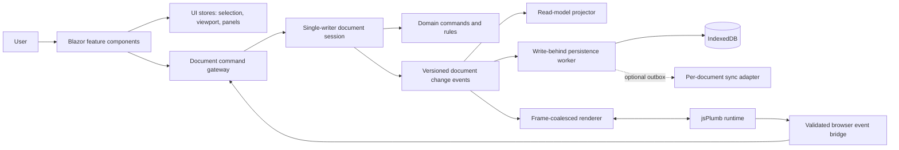
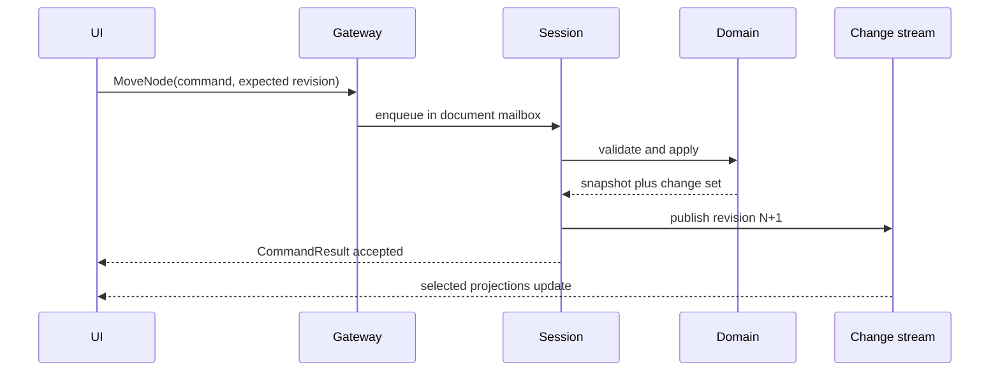
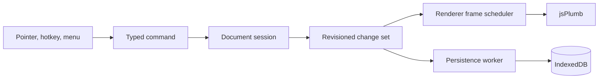

# High-Level Design Document: Diagram Studio Version 2

| Field | Value |
| --- | --- |
| Status | Proposed — review required |
| Version | 2.1 reliability architecture |
| Date | 2026-07-29 |
| Scope | Make editing responsive, diagnosable, and functionally reliable without abandoning local-first operation |
| Stack | .NET 10, Blazor Interactive WebAssembly, IndexedDB, jsPlumb 6.2.10 |

## 1. Executive Summary

This replaces the previous V2 design's UI-only scope with a reliability-first architecture. The current editor has good domain foundations — an immutable `DiagramDocument`, a command-capable graph store, local IndexedDB persistence, and a browser renderer — but its client facade performs too many responsibilities on the interaction path. A document change can synchronously validate the entire graph, capture a full history snapshot, schedule an unobserved save, notify every subscriber, request a complete jsPlumb rebuild, serialize the whole document, refresh the catalog, and optionally push the same payload to a server guarded by one global lock.

V2 introduces a **single-writer document session**, explicit typed commands and outcomes, independently scoped UI state, coalesced render deltas, write-behind persistence, and per-document synchronization. Commands remain local-first and deterministic; the browser renderer is a projection, never the source of truth. Full rendering is a recovery/initialization operation, not the normal response to an edit.

The design preserves the current document schema and editor capabilities. It does not authorize code changes, a backend product, real-time collaboration, or a schema migration.

## 2. Evidence and Problem Statement

The following observations are from the current source and Codebase Memory graph, not inferred from the user's report alone:

| Evidence | Reliability or performance consequence |
| --- | --- |
| The four partial `DiagramEditorState` files own editing, catalog, workflow, selection, validation, history, autosave, and sync state. `NotifyChanged` has high fan-in. | Unrelated changes share one invalidation and failure boundary. |
| Every accepted mutation calls `UpdateDerivedState`, which validates the complete document, records full before/after snapshots, and raises one broad `Changed` event. | Work scales with document size even for a small visual move. |
| `DiagramCanvas` normally answers `Changed` with `RenderDocumentAsync`. | Most command paths rebuild the canvas rather than update the changed element. |
| `renderDocument` resets jsPlumb, clears the stage, recreates groups/nodes/endpoints/connections, then repaints everything. `applyPatch` delegates to that same operation. | Repeated interaction can create long main-thread tasks and visual instability. |
| A save serializes the complete document, writes it to IndexedDB, refreshes the full catalog, and may push to the server. Debounced saves are fire-and-forget and only cancellation is handled. | Save failure is not a first-class result; catalog and network work are coupled to editing. |
| The file sync store uses one `SemaphoreSlim` for every document and whole-file writes. Conflicts are returned but the client only changes status text. | Independent documents block each other; conflicts cannot be resolved safely. |

The current architecture snapshot says the adapter module is missing and browser tests were unavailable. Those statements are stale: the module and a drag-regression E2E test are now checked in. This design does not treat their presence as evidence that every workflow is currently correct; it requires observable operation outcomes and browser-level coverage.

## 3. Objectives

### 3.1 Primary Objectives

- Keep pointer, keyboard, selection, and viewport interaction responsive under normal editing load.
- Make each user command either succeed with a versioned result or fail with an actionable, observable outcome.
- Ensure one ordered writer owns a document session, while independent documents remain independent.
- Render only the affected browser objects when possible and coalesce visual work to animation frames.
- Decouple persistence and optional synchronization from the interactive command path without losing local durability semantics.
- Bound memory, queues, retries, and background work; cancellation must be safe and diagnosable.
- Preserve `DiagramDocument` schema version 2 and the current local-first privacy default.

### 3.2 Non-Goals

- Real-time multi-user collaboration, presence, shared cursors, or automatic semantic merges.
- Replacing Blazor, IndexedDB, jsPlumb, or the existing domain vocabulary.
- Changing diagram meaning, templates, export formats, or permission policy.
- Promising a hosted/multi-tenant synchronization service. The existing server remains a prototype adapter.
- Refactoring every current feature before a measured vertical slice proves the new pipeline.

## 4. Architecture Overview



### 4.1 Architectural Principles

1. **Single writer, many readers.** Only a `DocumentSession` changes an active document. Components consume immutable projections and cannot mutate the aggregate.
2. **Commands, not facade methods.** A typed command is the common path for toolbar, hotkey, bridge, palette, and automation calls. Queries never mutate.
3. **Change sets, not global invalidation.** Every accepted command emits a classified `DocumentChangeSet`; subscribers choose what they need.
4. **Renderer as projection.** The JavaScript runtime owns DOM/jsPlumb resources but cannot silently become durable state. Browser events are input proposals, not edits.
5. **Fast path versus durable path.** Interaction commits in memory first; persistence observes a revision stream and reports its own state.
6. **Backpressure is a product behavior.** Queues are bounded and overflow has a defined visible outcome, never uncontrolled task creation.
7. **Progressive migration.** New services wrap the stable domain model. The old state facade is an adapter removed only when feature parity is proven.

### 4.2 Trust Boundaries

- IndexedDB is the default durable local store. Document content leaves the browser only through export or explicitly enabled sync.
- JSON import, server payloads, and browser-bridge payloads are untrusted input. They are size-limited and validated before creating a command.
- `diagram-editor.js` is a rendering adapter. It must not write the authoritative document or make uncorrelated callback retries.
- The optional sync API remains unauthenticated prototype infrastructure and is disabled by default. This design adds no claim of shared-deployment safety.

## 5. Major Components

### 5.1 Feature Components and UI Stores

`DocumentCatalog`, `EditorWorkspace`, `Inspector`, `Review`, and canvas controls read dedicated projections. `EditorUiStore` holds selection, active tool/panel, viewport, notification state, and transient input state; it is not persisted as diagram data. High-frequency viewport and drag previews stay browser/UI-local until a committed command boundary.

Components subscribe to a selector or projection, not a global `Changed` event. A selection update cannot cause the catalog to re-render, and a catalog refresh cannot recreate a canvas.

### 5.2 Document Command Gateway and Session

`IDocumentCommandGateway.ExecuteAsync` accepts `DocumentCommandEnvelope` with document ID, command ID, correlation ID, expected revision where required, origin, and cancellation token. A registry maps the command type to an application handler. Each active `DocumentSession` has a bounded FIFO mailbox and one asynchronous consumer; it applies domain commands against a snapshot and produces an immutable `CommandResult`.



The session is the replacement for the broad mutable facade. It owns active snapshot, revision, command serialization, undo checkpoint policy, and disposal. It does **not** own rendering, catalog projection, IndexedDB calls, HTTP, or Razor component lifetime.

### 5.3 Domain Command Handlers and Result Contract

`Diagrams.Core` remains platform-neutral. Each supported edit is an `IDocumentCommand` with a handler that returns either a new snapshot plus semantic change set or a structured rejection. Direct `Func<DiagramDocument, DiagramDocument>` mutations and UI-specific workflows migrate behind this boundary.

```csharp
public sealed record CommandResult(
    string CorrelationId,
    CommandDisposition Disposition,
    long Revision,
    DocumentChangeSet? Change,
    EditorProblem? Problem);
```

`CommandDisposition` is `Accepted`, `Rejected`, `Cancelled`, or `Deferred`. `EditorProblem` includes a stable code, safe message, retryability, and affected command ID. Expected failures (invalid port, locked layer, stale revision, unavailable renderer) are results, not console-only exceptions.

### 5.4 Change Stream and Read-Model Projections

`DocumentChangeSet` classifies additions, removals, property changes, bounds changes, edge topology changes, selection changes, viewport changes, validation impact, and full-rebuild barriers. A small in-process event stream publishes revisions in order. Projectors maintain catalog summaries, validation summaries, inspector models, minimap data, command availability, and sync/persistence status.

Projection work has explicit priority:

- **Immediate:** command result, selection, local visual move, status.
- **Coalesced:** renderer patch and minimap at the next animation frame.
- **Deferred:** validation not needed to reject a command, catalog sorting, snapshot cleanup, sync.

No projection may call back into the session synchronously. This prevents notification loops and makes latency traceable.

### 5.5 Renderer Protocol and Frame Scheduler

`IDiagramRenderer` exposes `InitializeAsync`, `ApplyAsync(RenderDelta)`, `ReplaceAsync(RenderSnapshot)`, `SetViewportAsync`, and `DisposeAsync`. `RenderDelta` is explicit: upsert/remove nodes, ports, groups, edges; update bounds/styles/labels; selection; viewport; and `RequiresReplace`.

The scheduler retains only the newest compatible delta before `requestAnimationFrame`; it merges changes by element ID, preserves ordering barriers, and reports the rendered revision. A full replace is required only for initialization, recovery after renderer rejection, unsupported structural change, or an explicit resync. It must never be triggered by a plain selection, viewport, or successful node-bound update.

The JS bridge validates IDs, coordinates, and shape before enqueuing a command. Drag and scroll proposals are sampled at most once per animation frame; drag-stop commits one `MoveNode`/`MoveGroup` command. Bridge errors are returned to .NET with correlation and revision information and surfaced in the development diagnostics panel.

### 5.6 Persistence, History, and Recovery

`IDocumentRepository` writes a versioned `DocumentRecord` and compact summary record in one IndexedDB transaction. `DocumentPersistenceWorker` subscribes to accepted revisions, coalesces only superseded unsaved revisions of the same document, and has a bounded queue. It never refreshes the full catalog after every save; the catalog projector consumes the same change set.

Save state is explicit: `Clean`, `Saving`, `Dirty`, `RetryScheduled`, `Failed`, or `StorageUnavailable`. A failed write leaves the in-memory document marked dirty and offers retry/export; it never reports a false successful save. A tab visibility change and orderly disposal request a flush with a bounded time budget.

Undo/redo stores typed inverse commands or compact checkpoints with configurable limits (count and estimated bytes). It may reconstruct from a checkpoint, but cannot retain an unbounded chain of full-document pairs. Schema migration is still deferred; unknown versions fail closed with an export-preserving diagnostic.

### 5.7 Optional Synchronization

`IDocumentSyncAdapter` is fed by a durable per-document outbox only after local persistence succeeds. It sends a document revision and idempotency key, limits concurrent documents, backs off with jitter, and cannot block editing. Server-side prototype storage replaces the global gate with keyed document locks and atomic temporary-write/replace. It validates document ID format before constructing a path.

A revision mismatch produces `Conflict` with enough metadata to show local versus remote choices. Automatic merge is out of scope. The UI must offer explicit keep-local, pull-remote, export-both, or defer actions; no background retry overwrites either version.

## 6. Processing Pipeline

```text
input proposal
  -> normalize, size-check, and authorize locally
  -> enqueue in one document session
  -> apply domain command atomically
  -> publish immutable change set and result
  -> update immediate projections
  -> coalesce renderer and deferred projections
  -> persist accepted revision
  -> optionally enqueue durable sync
```

### 6.1 Consistency and Idempotency

Each command has a correlation ID. Replaying an already accepted command ID returns the recorded result for the session lifetime; requests that require a matching revision reject stale input. A persisted revision becomes the commit point for local durability. Renderer acknowledgement is tracked separately and cannot advance document durability. The outbox key is `{documentId, localRevision}` and its delivery is idempotent at the server boundary.

### 6.2 Backpressure and Scheduling

| Work | Policy | On overload |
| --- | --- | --- |
| Interactive command mailbox | Bounded, FIFO, one writer/document | Disable only the affected action and show “editor is catching up”; do not drop committed commands. |
| Pointer/viewport proposals | Latest per animation frame | Drop superseded previews, retain final commit. |
| Render deltas | One coalesced frame batch | Escalate to one full replace only after a detected renderer desynchronization. |
| Persistence | Latest unsaved revision per document | Preserve dirty state and retry; do not lose revision silently. |
| Sync outbox | Bounded per document and global concurrency | Pause sync with visible state; editing remains local. |

## 7. API and Contract Design

### 7.1 Internal Interfaces

| Contract | Responsibility |
| --- | --- |
| `IDocumentCommandGateway` | Execute typed commands and return `CommandResult`. |
| `IDocumentSessionManager` | Open, lease, and dispose per-document single-writer sessions. |
| `IDocumentChangeStream` | Publish ordered immutable change sets. |
| `IDiagramRenderer` | Apply renderer deltas and report rendered revision/failure. |
| `IDocumentRepository` | Transactional local load/save/list and migration detection. |
| `IDocumentSyncAdapter` | Optional pull/push/conflict operations; no UI ownership. |
| `IEditorDiagnostics` | Correlated timings, queue depth, errors, and state transitions. |

### 7.2 Compatibility

`DiagramDocument.SchemaVersion` remains 2. Existing `documents`, `snapshots`, and `library` data is read through an adapter and migrated to new IndexedDB stores lazily only after a verified copy. Until a migration feature is approved, V2 may run in compatibility mode over existing records. Network response contracts use explicit status codes for malformed input, conflict, and dependency failure while retaining a client adapter for the old prototype endpoint during rollout.

### 7.3 Error Contract

| Condition | Result | Required behavior |
| --- | --- | --- |
| Invalid or locked edit | `Rejected` / stable domain code | Keep snapshot and renderer unchanged; identify the cause. |
| Stale command | `Rejected` / `stale-revision` | Refresh projection and let user retry intentionally. |
| Renderer failure | `Deferred` / `renderer-desync` | Attempt one controlled replace; preserve document and diagnostics. |
| IndexedDB failure | accepted edit plus `StorageUnavailable` | Keep dirty in memory, offer retry/export; never claim saved. |
| Remote conflict | `Conflict` | Stop automatic push and require an explicit resolution choice. |

## 8. Data Flows

### 8.1 Normal Edit



### 8.2 Renderer Recovery

```text
delta rejected or rendered revision gap
  -> renderer marks desynchronized
  -> scheduler stops incremental application for that revision
  -> replace from immutable session snapshot once
  -> acknowledge rendered revision or report visible renderer failure
```

### 8.3 Sync Conflict

```text
persisted local revision -> outbox -> push with idempotency key
  -> accepted: mark delivered
  -> conflict: freeze that document's outbox and show local/remote choices
  -> unavailable: back off; local editing and saving continue
```

## 9. Security and Privacy

- Continue local-first, export- and opt-in-sync-only behavior.
- Reject path traversal and invalid IDs at every server storage boundary; never log document content, SVG, credentials, or imported JSON.
- Bound input payloads, command queue size, rendered elements, and upload/download operations before allocating expensive resources.
- Treat import documents and browser callback payloads as data. They cannot select commands, alter policy, or bypass validation.
- Authentication, authorization, encryption-at-rest, and multi-tenancy are prerequisites for a future shared sync deployment, not features of this design.

## 10. Reliability and Recovery

| Failure | Required behavior | Recovery signal |
| --- | --- | --- |
| Renderer initialization/replacement fails | Document session stays usable; canvas shows recoverable error and retry. | Renderer state and correlation ID. |
| Command handler throws | Session contains failure, returns safe problem, and continues when invariant is intact. | Structured diagnostic and test failure. |
| Persistence is slow/unavailable | Continue editing up to documented memory bound; show Dirty/Failed state and allow export. | Save state, queue depth, last durable revision. |
| Browser reload/crash | Load latest committed local revision; unsaved in-memory edits are not represented as durable. | Last saved timestamp/revision. |
| Sync failure/conflict | Never block or overwrite local edit; pause only the affected document's outbox. | Per-document sync state. |

On orderly shutdown, stop accepting new commands, finish or cancel the active command, request one bounded persistence flush, dispose renderer resources, and retain a truthful dirty marker if the flush cannot finish.

## 11. Observability

The client emits structured, content-free events keyed by correlation ID, document ID hash, command type, origin, revision, queue wait, apply duration, projection duration, render duration, persistence duration, result code, and retry count. Development builds expose a diagnostics drawer; production telemetry requires separate approval.

Required metrics: command p50/p95/p99, dropped preview count, renderer full-replace count, render lag in revisions, persistence lag, queue depth, IndexedDB errors, sync backlog/conflicts, and unhandled bridge/session exceptions. `/healthz` remains host-only; a client-ready marker requires successful session load plus renderer initialization.

## 12. Performance Targets

| Scenario | Target | Measurement condition |
| --- | --- | --- |
| Pointer preview | next animation frame, no more than 16.7ms scheduling delay at 60Hz | 250 nodes / 400 edges reference diagram |
| Accepted simple command | p95 under 50ms to result | excluding persistence and remote sync |
| Rendered simple move | p95 under 100ms to visual acknowledgement | 250 nodes / 400 edges |
| Full replace | p95 under 1s and explicitly counted | 250 nodes / 400 edges; not normal edit path |
| Local durable save | p95 under 500ms | 1 MB representative document |
| Command queue | under 32 pending under normal interaction | reference browser/device documented with test run |
| Memory | bounded history and no unbounded tasks/snapshots | 30-minute mixed-edit endurance test |

These are engineering acceptance thresholds, not current performance claims.

## 13. Configuration Model

```yaml
editor:
  commandMailboxCapacity: 128
  renderFrameBudgetMs: 12
  persistenceDebounceMs: 500
  maxHistoryEntries: 100
  maxHistoryBytes: 16777216
  sync:
    enabledByDefault: false
    maxConcurrentDocuments: 2
    retryLimit: 5
```

Values are bounded and validated at startup. Deployment-wide limits are not user-editable; per-document UI preferences never affect command execution, storage policy, or sync security.

## 14. Deployment and Migration

V2 remains an AppHost-served Interactive WebAssembly application. No new server is needed for the first vertical slice. The browser persistence migration is additive: introduce new stores and a migration marker, copy one document transactionally, validate it, then retain the original until rollback horizon ends. Do not delete old data automatically.

Roll out behind a client feature flag by document/session. The legacy facade and full renderer remain an escape hatch until command parity, persisted-data compatibility, and endurance tests pass. A renderer or migration failure must fall back without modifying the original record.

## 15. Suggested Solution Structure

```text
src/
  Diagrams.Core/                 # model, domain commands, validation rules, change-set types
  Diagrams.Application/          # sessions, command gateway, projectors, history policy
  Editor.Client/
    Features/                    # catalog, editor, inspector, review UI components
    State/                       # UI stores and selectors only
    Persistence/                 # IndexedDB repository, persistence worker, migration adapter
    Rendering/                   # renderer protocol, frame scheduler, JS bridge adapter
    Sync/                        # optional outbox and prototype HTTP adapter
  Diagrams.Interop.JsPlumb/      # isolated jsPlumb resource ownership and delta operations
  AppHost/                       # composition and optional sync endpoint
tests/
  Diagrams.Core.Tests/
  Diagrams.Application.Tests/
  Editor.Client.Integration.Tests/
  Editor.E2E.Tests/
```

The proposed `Diagrams.Application` layer is the dependency rule: UI, IndexedDB, jsPlumb, and HTTP depend inward on application/domain contracts; application code does not reference Razor, JS interop, or HTTP types.

## 16. Testing Strategy

### Unit

- Command handler acceptance/rejection, stale revision, inverse/checkpoint undo, and change-set classification.
- Session ordering, cancellation, idempotent replay, bounded mailbox behavior, and no event-loop reentry.
- Delta merge/barrier rules, renderer recovery decision, and UI selector isolation.
- Persistence coalescing, failure state, migration rollback, outbox idempotency, and conflict decisions.

### Integration

- IndexedDB transaction behavior with representative documents and injected failures.
- JS bridge contract tests: every .NET renderer method maps to one documented exported function with matching payload shape.
- Prototype server keyed locking, atomic write/replace, bad ID rejection, and HTTP conflict status.

### End-to-End

1. Create, move, connect, relabel, undo/redo, reload, and confirm a durable revision.
2. Drag and scroll continuously while opening inspector/catalog; verify no full canvas rebuild for visual-only or move deltas.
3. Force renderer rejection, IndexedDB failure, offline sync, and revision conflict; verify truthful status and recovery.
4. Execute every supported command from its toolbar/menu/hotkey/bridge path and assert the same `CommandResult`/document outcome.

### Load and Resilience

Run 30-minute mixed-edit endurance and reference-diagram benchmarks; collect performance distributions, memory trend, renderer replacement count, and save/sync backlog. Cancellation and browser reload are mandatory fault-injection cases.

## 17. Risks and Mitigations

| Risk | Impact | Mitigation |
| --- | --- | --- |
| Command/session rewrite regresses working flows | High | Strangler adapter, command-parity matrix, feature flag, and E2E baseline before removing legacy facade. |
| Delta renderer gets out of sync | High | Revision acknowledgement, barriers, one controlled full replacement, and regression tests. |
| Write-behind loses edits on abrupt close | Medium | Truthful dirty state, short debounce, visibility flush, manual save/export, and no false saved status. |
| Increased layers become ceremony | Medium | Keep contracts narrow; vertical-slice first; delete the legacy path only when evidence justifies it. |
| Prototype sync is mistaken for collaborative storage | High | Disabled-by-default adapter, clear UI wording, no automatic merge, and future security ADR prerequisite. |
| Large documents still exceed browser budgets | Medium | Measured limits, feature degradation rules, virtualized non-canvas lists, and explicit full-render threshold. |

## 18. Delivery Phases

### Phase 1: Establish the reliable command path

Introduce `DocumentSession`, typed result/change-set contracts, structured diagnostics, and adapters around a small vertical slice: move node, connect edge, delete selection, undo/redo. Preserve existing facade as fallback.

### Phase 2: Incremental rendering and responsive projections

Implement `RenderDelta`, frame scheduler, bridge validation, selector-based UI stores, and renderer desynchronization recovery. Prove no full rebuild for the selected vertical-slice operations.

### Phase 3: Durable local persistence and bounded history

Add persistence worker/state, transactional local records, history limits/checkpoints, migration safety, and resilience tests. Remove catalog refresh from every save.

### Phase 4: Optional sync hardening

Add outbox, per-document server locking, atomic files, explicit conflicts, and offline tests. This phase remains prototype-only until a separately accepted identity/deployment decision exists.

## 19. Architecture Decisions

The earlier V2 shell and workspace-preference ADR artifacts are absent from the current worktree. This design does not recreate, restore, or change those unrelated records. If they are restored by their owner, their presentation-only principles can be reviewed for compatibility with this design.

- [ADR-003](../02-ADR/ADR-003-single-writer-document-session.md): adopt per-document sessions, typed commands, change sets, and result contracts.
- [ADR-004](../02-ADR/ADR-004-frame-coalesced-renderer-protocol.md): replace normal full rebuilds with revisioned render deltas and controlled recovery.
- [ADR-005](../02-ADR/ADR-005-write-behind-local-persistence-and-sync-outbox.md): decouple durable local storage and optional sync from interaction while making failures visible.

## 20. Acceptance Criteria for Version 2

1. A reference diagram can execute the Phase 1 commands with ordered, correlated `CommandResult` values and no direct UI-to-aggregate mutation.
2. Node movement, selection, and viewport updates do not invoke a full jsPlumb replace in normal operation; E2E records renderer operation counts.
3. Renderer, persistence, and sync failure states are visible, safe, and independently testable; no fire-and-forget fault is silently discarded.
4. Local persistence has a clear commit point, bounded backlog, and recovery behavior proven with injected IndexedDB failures.
5. Undo/redo memory is bounded and command parity remains intact for migrated operations.
6. Sync conflict never overwrites either version automatically and independent documents do not serialize behind one global server lock.
7. All new unit, integration, E2E, endurance, format, and existing regression gates pass with recorded benchmark evidence.

## 21. Immediate Next Steps

1. Review this design and ADRs; approval is required before implementation planning.
2. Capture a reproducible baseline: command latency, full-render count, JS errors, save failure behavior, and heap trend on a reference diagram.
3. Create a phase plan and a command-parity inventory, naming one vertical slice and its legacy fallback.
4. Define `DocumentChangeSet` and renderer payload contracts before moving components or rewriting JavaScript.

## 22. Reference Material

- [Current architecture snapshot](../00-CONCEPT/CURRENT-ARCHITECTURE.md) — useful historical context; its missing-module and browser-test notes are superseded by current source.
- Earlier V2 shell/preference ADRs were reviewed historically but are currently absent from the worktree; see the decision note in section 19.
- Current evidence: `src/Editor.Client/Services/DiagramEditorState*.cs`, `src/Editor.Client/Components/DiagramCanvas.razor`, `src/Diagrams.Interop.JsPlumb/JsPlumbAdapter.cs`, `src/Diagrams.Interop.JsPlumb/wwwroot/js/diagram-editor.js`, and `src/AppHost/Services/ServerDocumentSyncStore.cs`.
- Codebase Memory project: `C-Users-justin-Source-samples-ghostworx-diagram-ghostworx-node`.

## 23. Conclusion

Diagram Studio should evolve as a local-first, modular client application with one ordered document writer and explicit projection boundaries, not as a larger all-purpose editor state object. This design targets the observed causes of sluggishness and unreliable behavior while preserving compatible document semantics. It is a review candidate only; it grants no implementation, deployment, or release approval.

## Filing Checklist

- [x] Saved in the canonical `.swe/01-DESIGN/DESIGN.md` location.
- [x] Every regular concept artifact was read.
- [x] Current code and Codebase Memory graph informed material claims.
- [x] Existing design and ADRs were inspected before revision.
- [x] Trust boundaries, reliability, performance, deployment, tests, risks, and acceptance criteria are explicit.
- [x] New material decisions are linked to proposed ADRs.
- [x] No application source, infrastructure, external state, or immutable skill template was changed.
