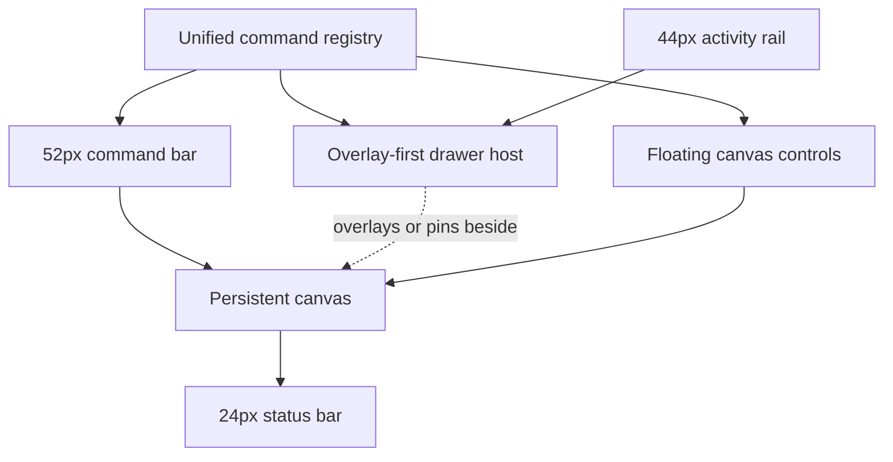

# ADR-001: Canvas-First Adaptive Editor Shell

| Field           | Value                                             |
| --------------- | ------------------------------------------------- |
| Status          | Approved                                          |
| Date            | 2026-07-26                                        |
| Decision owners | Diagram Studio maintainers                        |
| Related design  | [Diagram Studio Version 2](../01-DESIGN/DESIGN.md) |

## Implementation plan (step-by-step)

This plan is conditional on ADR approval and does not authorize implementation.

1. Establish reusable spacing, elevation, color, focus, density, and motion tokens.
2. Introduce the 52-pixel command bar, 44-pixel activity rail, flexible canvas region, and 24-pixel status bar while retaining current workflows.
3. Move Assets, Inspector, Layers, History, Validation, and Review into the drawer host.
4. Float the minimap and viewport controls above the canvas.
5. Add the command registry, palette, contextual actions, and overflow menus.
6. Add focus mode and responsive drawer behavior without unmounting the canvas.
7. Verify workflow parity, accessibility, canvas-area thresholds, and browser initialization.
8. Remove the old fixed shell only after parity and regression checks pass.

## Context

The current editor permanently reserves 280 pixels for assets, 320 pixels for the inspector, one-rem gaps and shell padding, a multi-row toolbar, a footer, and a separate minimap row. Below 1200 pixels, both side panels stack vertically with the canvas, consuming additional design height. Presentation mode lowers chrome opacity but leaves that chrome in layout.

The editor has a broad and capable command set, so simply deleting controls would trade space for lost capability. Version 2 needs a stable interaction architecture that makes advanced tools available without permanently occupying the design surface.

## Stakeholders (who needs this to be clear)

- Diagram makers who need maximum working area and predictable tools.
- Keyboard, low-vision, and reduced-motion users.
- Maintainers of `Editor.Client`, `DiagramEditorState`, and jsPlumb interop.
- Test authors responsible for workflow parity and browser behavior.
- Product reviewers deciding whether progressive disclosure is acceptable.

## Decision

Adopt a canvas-first adaptive editor shell:

- Persistent chrome is limited to a 52-pixel top command bar, 44-pixel activity rail, and 24-pixel status bar.
- Assets, Inspector, Layers, History, Validation, and Review use contextual drawers.
- Drawers overlay the canvas by default, may be pinned at 1280 pixels and wider, and resize between 280 and 420 pixels.
- The minimap, viewport controls, contextual selection actions, notifications, and focus-mode exit float inside the canvas region.
- A command registry supplies consistent behavior and availability to the top bar, command palette, contextual actions, shortcuts, and overflow menus.
- Responsive transitions keep the canvas component mounted and preserve viewport state.
- Focus management, visible focus, semantic landmarks, keyboard operation, reduced motion, and WCAG 2.2 AA contrast are acceptance requirements.

## Diagram



## Alternatives considered

### Option A

Keep the current fixed three-column shell and reduce padding and control sizes.

- Advantages: smallest implementation change; all controls remain visible.
- Disadvantages: sidebars still reserve 600 pixels, the toolbar remains command-dense, the minimap still consumes a row, and narrow layouts still stack panels.
- Rejected because it cannot meet the design-surface objective.

### Option B

Use a permanently docked professional-IDE layout with multiple resizable panels.

- Advantages: strong discoverability and familiar power-user behavior.
- Disadvantages: still prioritizes tool inventory over canvas space and requires complex docking state.
- Rejected as the default. Version 2 retains one optional pinned drawer per side on wide viewports.

### Option C

Use canvas-only radial/context menus with no persistent activity rail.

- Advantages: maximum visual space.
- Disadvantages: poor discoverability, weak keyboard semantics, and high interaction cost for repeated workflows.
- Rejected because a small labeled activity rail provides a better accessibility and learning anchor.

## Consequences

### Positive

- The canvas dominates the viewport in default and focus modes.
- Commands stay reachable without a multi-row toolbar.
- Advanced tools become task-oriented rather than one long inspector.
- One command definition reduces surface-to-surface behavior drift.
- The canvas can remain mounted across responsive and drawer transitions.

### Negative / risks

- Progressive disclosure may make advanced features harder to discover.
- Overlay drawers can obscure content.
- Focus restoration and keyboard behavior add implementation complexity.
- Command inventory and parity testing become mandatory.
- Maintaining overlay and pinned modes increases layout test combinations.

## Impact

### Code

- Refactor `EditorShell.razor` into workspace, command, drawer, and overlay components.
- Add a command registry that invokes existing `DiagramEditorState` workflows.
- Reorganize current inspector sections without moving domain logic into Razor components.
- Update `editor.css` to use viewport-bound regions and responsive drawer states.
- Keep `DiagramCanvas` mounted while shell state changes.

### Data / configuration

No diagram schema or sync contract change. Stable shell preferences follow ADR-002.

### Documentation

Update user guidance, keyboard shortcuts, control locations, responsive behavior, and focus/presentation semantics. Preserve the current architecture snapshot as historical concept evidence and document the approved target separately.

## Verification

### Objectives

- Prove the canvas-area thresholds.
- Prove every current workflow remains reachable.
- Prove drawers and responsive changes do not recreate or reset the canvas.
- Prove keyboard, focus, zoom, contrast, and reduced-motion behavior.

### Test environment

- Chromium-based browser with Playwright installed.
- Desktop viewports 1440 by 900 and 1280 by 720.
- Responsive checks at 1024 by 768 and 768 by 1024.
- Browser zoom at 100 and 200 percent.
- Normal and reduced-motion operating-system settings.

### Test commands

```powershell
dotnet test
dotnet test tests/Editor.E2E.Tests/Editor.E2E.Tests.csproj
```

Run the repository's eventual accessibility and visual-regression commands once defined in an approved feature plan.

### New or changed tests

- Canvas-region geometry assertions.
- Command inventory and workflow parity tests.
- Drawer open, close, pin, resize, and responsive transition tests.
- Canvas identity and viewport preservation checks.
- Keyboard-only and focus-return scenarios.
- Focus mode, presentation mode, reduced motion, and 200-percent zoom scenarios.

### Regression and analysis

Run existing core, host, and editor suites. Manually compare current and new command inventories. Inspect browser console errors and verify the editor-ready marker requires successful jsPlumb initialization.

## Rollout and migration

Deliver behind a temporary client feature flag only if the approved implementation plan needs side-by-side verification. Existing documents require no migration. Remove the old shell and temporary flag after parity, accessibility, and area gates pass. Rollback restores the old shell without modifying diagram data.

## References

- [Diagram Studio Version 2 design](../01-DESIGN/DESIGN.md)
- [Current architecture snapshot](../00-CONCEPT/CURRENT-ARCHITECTURE.md)
- [ADR-002: Separate workspace preferences from diagram data](ADR-002-separate-workspace-preferences-from-diagram-data.md)
- Current shell: `src/Editor.Client/Components/EditorShell.razor`
- Current layout: `src/Editor.Client/wwwroot/editor.css`

## Filing checklist

- [X] Decision is singular, durable, and marked Proposed.
- [X] Context includes current measurable layout constraints.
- [X] Three viable alternatives and tradeoffs are recorded.
- [X] Positive and negative consequences are explicit.
- [X] Mermaid syntax uses simple quoted labels.
- [X] Verification and rollback are defined.
- [X] Links are repository-relative and use forward slashes.
- [X] No implementation approval is implied.
