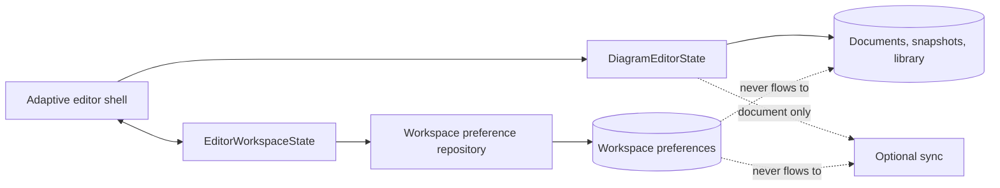

# ADR-002: Separate Workspace Preferences from Diagram Data

| Field           | Value                                             |
| --------------- | ------------------------------------------------- |
| Status          | Approved                                          |
| Date            | 2026-07-26                                        |
| Decision owners | Diagram Studio maintainers                        |
| Related design  | [Diagram Studio Version 2](../01-DESIGN/DESIGN.md) |

## Implementation plan (step-by-step)

This plan is conditional on ADR approval and does not authorize implementation.

1. Define the minimal versioned workspace preference record and explicit defaults.
2. Add `EditorWorkspaceState` for active drawers, pinning, widths, minimap, focus mode, density, and responsive adaptation.
3. Add a browser preference repository with debounced last-write-wins persistence.
4. Create a separate IndexedDB `workspace-preferences` store or dedicated preference database.
5. Initialize the shell from defaults before asynchronous preference restoration.
6. Clamp invalid widths, ignore unknown fields, and reset unsupported versions.
7. Add schema-isolation, failure, migration, and content-exclusion tests.

## Context

The version 2 shell introduces UI state that users reasonably expect to persist, including drawer pinning, drawer width, minimap visibility, and density. `DiagramDocument` is the durable contract used by local documents, snapshots, import/export, and optional server sync. Adding workspace choices to that aggregate would make presentation preferences portable as content, trigger unnecessary document revisions and autosaves, and risk compatibility across every current boundary.

The existing IndexedDB repository already stores whole diagram documents, snapshots, and reusable library fragments. Workspace preferences need browser persistence but not diagram ownership.

## Stakeholders (who needs this to be clear)

- Diagram makers who expect stable workspace preferences.
- Domain and persistence maintainers protecting document compatibility.
- Sync, import/export, and snapshot maintainers.
- Test authors verifying that preferences cannot leak into user content.

## Decision

Create a distinct `EditorWorkspaceState` and `IWorkspacePreferenceRepository`.

- Workspace state must not be added to `DiagramDocument` or `DiagramEditorState`.
- Stable browser-profile preferences are stored in a separate versioned record.
- Active drawer, command query, transient notifications, and focus mode are session-only.
- Preferences never appear in diagram JSON, snapshots, library fragments, exports, clipboard payloads, or sync requests.
- Preference loading and saving are nonblocking; defaults render first.
- Unknown fields are ignored, invalid values are clamped, and unsupported versions reset to defaults.
- Preference failure is warning-level and cannot prevent document editing.

## Diagram



## Alternatives considered

### Option A

Add workspace fields to `DiagramDocument`.

- Advantages: uses existing serialization and persistence.
- Disadvantages: changes a shared schema, increments document revisions for UI changes, leaks preferences into snapshots/exports/sync, and makes preferences document-specific.
- Rejected because workspace state is not diagram content.

### Option B

Keep all workspace state in Razor component fields with no persistence.

- Advantages: simplest design and no storage changes.
- Disadvantages: user preferences disappear on reload, responsive state becomes fragmented, and shell behavior is difficult to test consistently.
- Rejected because a dedicated state boundary improves resilience and testability.

### Option C

Use unversioned `localStorage` keys per control.

- Advantages: easy to implement.
- Disadvantages: no atomic preference record, weak migration behavior, scattered key ownership, and inconsistent validation.
- Rejected in favor of one versioned repository contract aligned with existing browser storage practices.

## Consequences

### Positive

- Existing diagram schema and all content boundaries remain compatible.
- Workspace changes do not create document revisions or autosaves.
- Preference corruption cannot corrupt a diagram.
- State transitions become independently testable.
- Future shell migrations have an explicit version boundary.

### Negative / risks

- A new client service and persistence path must be maintained.
- Preference restoration can cause visual movement if defaults and stored choices differ.
- Cross-tab preference updates are not automatically synchronized.
- Browser-site-data deletion still removes preferences.

## Impact

### Code

- Add a workspace state service and repository in `Editor.Client`.
- Keep UI-only properties out of `DiagramEditorState`.
- Register the service in the client composition root.
- Update the shell to render defaults immediately and apply restored preferences safely.

### Data / configuration

Add a versioned preference record containing only allow-listed UI fields. Prefer a separate store so existing document-store records and indexes remain untouched. No server configuration or network contract changes.

### Documentation

Document which settings persist, their scope, reset behavior, browser-storage implications, and separation from diagram exports and server sync.

## Verification

### Objectives

- Prove schema and payload separation.
- Prove resilient default behavior.
- Prove preference validation and migration.
- Prove workspace changes do not alter document revision or autosave.

### Test environment

- Browser test environment with IndexedDB enabled.
- IndexedDB blocked, unavailable, and corrupted-record simulations.
- Existing local documents and snapshots created before version 2.

### Test commands

```powershell
dotnet test
dotnet test tests/Editor.E2E.Tests/Editor.E2E.Tests.csproj
```

### New or changed tests

- Preference round-trip and version fallback unit tests.
- Invalid width and unknown-field tests.
- Repository failure and blocked-IndexedDB integration tests.
- JSON export, snapshot, clipboard, and sync-payload exclusion assertions.
- Document revision and autosave invariance tests during workspace-only changes.
- Reload behavior for stable versus session-only fields.

### Regression and analysis

Deserialize existing schema-version-2 diagrams and verify byte-equivalent logical content after open/save. Inspect IndexedDB object stores and network payloads. Run current document, snapshot, library, import/export, and sync suites.

## Rollout and migration

Create preferences lazily on first change. No diagram migration is permitted. If a preference schema cannot be read, reset that preference record only. Rollback may ignore or delete the separate preference record without touching user diagrams.

## References

- [Diagram Studio Version 2 design](../01-DESIGN/DESIGN.md)
- [ADR-001: Canvas-first adaptive editor shell](ADR-001-canvas-first-adaptive-editor-shell.md)
- [Current architecture snapshot](../00-CONCEPT/CURRENT-ARCHITECTURE.md)
- Current browser repository: `src/Editor.Client/Services/IndexedDbDocumentRepository.cs`
- Current document store: `src/Editor.Client/wwwroot/js/document-storage.js`

## Filing checklist

- [X] Decision is singular, durable, and marked Proposed.
- [X] Content and workspace ownership are explicit.
- [X] Three alternatives and tradeoffs are recorded.
- [X] Failure, migration, and rollback behavior are defined.
- [X] Verification covers leakage and compatibility risks.
- [X] Mermaid syntax uses simple quoted labels.
- [X] Links are repository-relative and use forward slashes.
- [X] No implementation approval is implied.
