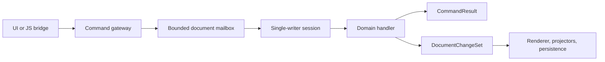

# ADR-003: Single-writer document session and typed command results

Status: Proposed
Date: 2026-07-29
Related Design: [.swe/01-DESIGN/DESIGN.md](../01-DESIGN/DESIGN.md)
Supersedes: None
Superseded by: None

## Implementation Plan

- [ ] Baseline the current command, notification, validation, and save timings.
- [ ] Define typed command, result, change-set, and problem contracts in a platform-neutral project.
- [ ] Implement one leased, bounded single-writer session per active document behind an adapter.
- [ ] Migrate a small command slice with legacy fallback and command-parity tests.
- [ ] Record unit, browser, endurance, and regression evidence before removing the facade path.

## Context

`DiagramEditorState` currently owns document mutation, selection, validation, history, persistence scheduling, catalog refresh, and synchronization state. A broad `Changed` event invalidates multiple consumers. The immutable `DiagramDocument` and `DiagramGraphStore` provide a useful foundation, but callers can reach multiple mutation styles and background save failures are not a typed outcome.

The system must retain local-first operation and schema version 2 while making command ordering, failure, cancellation, and revision behavior observable. This decision does not add collaboration or server authority.

## Stakeholders

| Role | Need |
| --- | --- |
| Diagram maker | Predictable command behavior and useful failures rather than hangs or silent no-ops. |
| Engineering | One safe mutation seam and an incremental migration path. |
| QA | A command-parity and result contract that can be asserted across input surfaces. |
| Operations | Correlated diagnostics without document content. |

## Decision

Adopt a bounded, single-writer `DocumentSession` per active document. All document edits enter through typed commands and return a correlated `CommandResult`; accepted commands publish ordered immutable `DocumentChangeSet` events.

Key points:

- Only a session may replace an authoritative document snapshot.
- UI, JavaScript bridge, hotkeys, and menus all call `IDocumentCommandGateway`; queries and UI state cannot mutate the aggregate.
- Expected business failures are `Rejected` results with stable codes; unexpected failures are contained and correlated.
- Sessions own order, expected revision checks, command de-duplication, and history policy; they do not own Razor, JavaScript, IndexedDB, or HTTP lifetimes.

## Diagram

## Alternatives Considered

### Keep the partial state facade and improve its `Changed` event

- Pros: Small initial edit surface.
- Cons: Leaves competing mutation styles, implicit side effects, and global invalidation intact.
- Rejected because it cannot establish an enforceable command/result contract.

### Let each UI component own a store and mutate the document directly

- Pros: Familiar component-local model.
- Cons: Racing edits, diverging undo behavior, and no central durability rule.
- Rejected because diagram consistency requires a single writer.

### Use a durable event store immediately

- Pros: Natural audit/history story.
- Cons: Adds schema, migration, storage, and recovery scope before interaction reliability is proven.
- Rejected for this version; typed commands/change sets allow a later decision without committing to event sourcing.

## Consequences

### Positive

- Defines one observable ordering and error boundary for all operations.
- Lets render, validation, persistence, and catalog work subscribe independently.
- Makes command parity and cancellation testable.

### Negative / Risks

- Introduces application-layer types and adapter work.
- A long command could delay the document mailbox.
- Mitigation: commands must be bounded/cancellable; long work becomes deferred work with explicit status, and queue metrics trigger investigation.

## Impact

### Code

- Add application contracts/session implementation and an adapter used by `DiagramEditorState` during migration.
- Move direct transformation functions and UI bridge callbacks behind command handlers one vertical slice at a time.
- Do not change `DiagramDocument` schema for this ADR.

### Data / Configuration

- Add command correlation and revision metadata only in memory/diagnostics initially.
- Configure mailbox capacity and bounded history policy with validated defaults.

### Documentation

- Update the design, phase/feature plans, command inventory, and testing guide with accepted command contracts.

## Verification

### Objectives

- Prove one document's commands execute in submission order and accepted results have monotonic revisions.
- Prove stale, invalid, cancelled, and thrown-handler cases yield safe outcomes.
- Prove migrated input surfaces create identical documents and result codes.

### Test Environment

- Unit tests use deterministic time and a fake command handler/projector.
- Integration tests run a browser client with IndexedDB disabled or injected separately; no external sync is required.

### Test Commands

- Build, test, formatting, and browser commands must be captured in the implementation feature from the current repository tooling; this ADR records no execution evidence.

### New or Changed Tests

| ID | Scenario | Level | Expected result |
| --- | --- | --- | --- |
| TST-003-01 | Concurrent move commands for one document | Unit | Ordered accepted revisions and valid final snapshot. |
| TST-003-02 | Stale or locked command | Unit | `Rejected` with stable code and unchanged snapshot. |
| TST-003-03 | Toolbar and bridge invoke the same command | Integration/E2E | Same result and serialized document. |
| TST-003-04 | Handler exception | Unit | Correlated problem; session remains usable if invariant holds. |

### Regression and Analysis

- Existing core command/concurrency, editor persistence, undo/redo, and browser drag tests stay green.
- Track queue wait, apply duration, and unhandled exceptions by correlation ID.

## Rollout and Migration

Feature-flag sessions per document and retain the legacy facade adapter until the selected command matrix and browser tests pass. Rollback routes the session adapter back to the legacy implementation; it must not alter stored records.

## References

- [V2 design](../01-DESIGN/DESIGN.md)
- `src/Editor.Client/Services/DiagramEditorState*.cs`
- `src/Diagrams.Core/Commands/DiagramCommands.cs`

## Filing Checklist

- [x] File is in `.swe/02-ADR/`.
- [x] Status is Proposed and no implementation approval is implied.
- [x] Includes decision, alternatives, consequences, Mermaid diagram, and verification.

