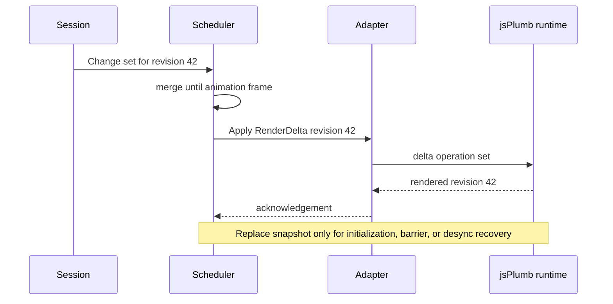

# ADR-004: Frame-coalesced renderer protocol with controlled full replacement

Status: Proposed
Date: 2026-07-29
Related Design: [.swe/01-DESIGN/DESIGN.md](../01-DESIGN/DESIGN.md)
Supersedes: None
Superseded by: None

## Implementation Plan

- [ ] Measure current full-render count/duration and JavaScript bridge errors on a reference diagram.
- [ ] Define versioned `RenderDelta`, `RenderSnapshot`, acknowledgement, and renderer-error contracts.
- [ ] Add a frame scheduler and implement one move/selection/viewport slice without full replacement.
- [ ] Add revision-gap recovery and operation-count E2E assertions.
- [ ] Migrate structural operations only after contract and endurance evidence pass.

## Context

`DiagramCanvas` commonly requests `RenderDocumentAsync` for state changes. The JS `renderDocument` path resets jsPlumb, clears the DOM, recreates graph objects, and repaints. Its advertised `applyPatch` currently delegates to a full render. Browser-originated drag and viewport paths avoid some rebuilds, but equivalent operations triggered from other surfaces do not share a first-class incremental protocol.

The renderer must be fast without becoming a second mutable document model. It must recover safely from adapter drift and preserve jsPlumb isolation.

## Stakeholders

| Role | Need |
| --- | --- |
| Diagram maker | Smooth edits, stable viewport, and no lost selection during ordinary commands. |
| Engineering | One documented .NET/JS contract instead of incidental function names and whole-document payloads. |
| QA | Observable difference between patch, replace, and recovery. |
| Accessibility users | No unnecessary focus loss or canvas reinitialization. |

## Decision

Adopt a revisioned renderer protocol with `ApplyAsync(RenderDelta)` as the normal path, `ReplaceAsync(RenderSnapshot)` only for initialization/recovery/barriers, and a frame scheduler that coalesces compatible deltas once per animation frame.

Key points:

- A change set projects to a delta classified by nodes, ports, groups, edges, selection, viewport, and rebuild barriers.
- The renderer acknowledges the highest rendered document revision; a revision gap or rejected delta creates a visible desynchronization state.
- The scheduler merges only same-document compatible deltas; it preserves remove/add order and replaces at most once during controlled recovery.
- JS bridge input is normalized and correlated before it becomes a document command. It may update visual preview state, but not durable document state directly.

## Diagram

## Alternatives Considered

### Continue full rendering and optimize the existing loops

- Pros: Fewer contract types initially.
- Cons: Reset/recreate work, viewport churn, and global coupling remain; performance scales poorly with graph size.
- Rejected because it cannot guarantee that simple edits avoid full replacement.

### Move the whole domain model into JavaScript

- Pros: Fewer interop calls.
- Cons: Two persistence/validation implementations or JS becomes hidden authority.
- Rejected because C# domain invariants and export/serialization must remain authoritative.

### Render each bridge event directly without scheduling

- Pros: Immediate implementation.
- Cons: Pointer/scroll floods and ordering races cause main-thread contention.
- Rejected because backpressure and revision acknowledgement are required.

## Consequences

### Positive

- Normal updates affect only needed browser resources and preserve canvas instance/viewport.
- Explicit acknowledgements make renderer drift detectable and testable.
- The JS bridge gains a stable, versioned contract.

### Negative / Risks

- Delta correctness is more complex than wholesale rebuild.
- Unsupported jsPlumb operations may require temporary replace barriers.
- Mitigation: use a conservative barrier classifier, differential renderer tests, operation counters, and one controlled recovery path.

## Impact

### Code

- Add renderer contracts/scheduler in the client/application boundary.
- Evolve `IJsPlumbAdapter`, `DiagramCanvas`, event bridge, and `diagram-editor.js`; retain `RenderDocumentAsync` as a compatibility/recovery adapter during rollout.
- Avoid direct component ownership of JS runtime state.

### Data / Configuration

- Render revision is runtime-only; it is not persisted in `DiagramDocument`.
- Configure only bounded frame budget and optional diagnostic operation counters.

### Documentation

- Document every exported JS method, payload, acknowledgement, and bridge event alongside compatibility tests.

## Verification

### Objectives

- Prove simple move, selection, and viewport operations do not call replace.
- Prove structural barrier/rejection triggers exactly one controlled replace and returns a useful error if it fails.
- Prove JS and .NET contracts remain aligned.

### Test Environment

- Browser E2E uses a fixed reference diagram and records renderer operation counts/revisions.
- Unit tests use a deterministic fake renderer and frame clock.

### Test Commands

- The implementation feature must record current build/test/format/browser commands and their results; none are claimed by this proposed ADR.

### New or Changed Tests

| ID | Scenario | Level | Expected result |
| --- | --- | --- | --- |
| TST-004-01 | Merge compatible deltas | Unit | Latest correct operation per element, preserved barriers. |
| TST-004-02 | Move/selection/viewport | E2E | No full replace; rendered revision acknowledges command revision. |
| TST-004-03 | Rejected delta | Integration | One replacement attempt and visible desync state on failure. |
| TST-004-04 | Contract map | Integration | Every adapter call maps to one exported JS function and payload schema. |

### Regression and Analysis

- Preserve existing drag no-rebuild behavior and all canvas command flows.
- Monitor full-replace count, render duration, revision lag, bridge errors, and focus loss.

## Rollout and Migration

Enable delta rendering only for the migrated command slice and retain full render as rollback. A rejected delta never changes the domain snapshot; disabling the flag restores the full renderer without data migration.

## References

- [V2 design](../01-DESIGN/DESIGN.md)
- `src/Editor.Client/Components/DiagramCanvas.razor`
- `src/Diagrams.Interop.JsPlumb/IJsPlumbAdapter.cs`
- `src/Diagrams.Interop.JsPlumb/wwwroot/js/diagram-editor.js`

## Filing Checklist

- [x] File is in `.swe/02-ADR/`.
- [x] Status is Proposed and no implementation approval is implied.
- [x] Includes decision, alternatives, consequences, Mermaid diagram, and verification.

