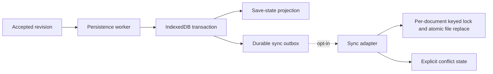

# ADR-005: Write-behind local persistence and per-document sync outbox

Status: Proposed
Date: 2026-07-29
Related Design: [.swe/01-DESIGN/DESIGN.md](../01-DESIGN/DESIGN.md)
Supersedes: None
Superseded by: None

## Implementation Plan

- [ ] Measure save duration, catalog refresh cost, error visibility, and server-lock contention.
- [ ] Introduce transactional document/summary records and explicit local save-state projection.
- [ ] Implement bounded write-behind for one document with injected IndexedDB failures.
- [ ] Add durable outbox and prototype keyed server locks behind disabled-by-default sync.
- [ ] Prove conflict choices, atomic writes, recovery, and rollback before removing current save path.

## Context

Current autosave waits 350ms then serializes the entire document, writes IndexedDB, refreshes the catalog, and optionally pushes to server. The task is not awaited by the caller, so non-cancellation failure has no command result path. The prototype server serializes all documents under one `SemaphoreSlim`, uses whole-file writes, and returns conflicts as a result payload without a resolution workflow.

The browser remains the authoritative default. Persistence must be reliable and visible without holding up an interaction or introducing a shared-service claim.

## Stakeholders

| Role | Need |
| --- | --- |
| Diagram maker | Accurate saved/unsaved state, safe retries, and no frozen editor during storage/network work. |
| Engineering | A durable commit point separate from rendering and catalog projection. |
| QA | Fault-injection coverage for storage, reload, network, and conflict conditions. |
| Future host operator | Per-document isolation and safe file behavior without claims of horizontal scale. |

## Decision

Persist accepted local revisions through a bounded write-behind worker and expose save state independently from command success. Feed optional synchronization only from a durable per-document outbox. Replace the server's global gate with keyed locks and atomic temporary-write/replace operations.

Key points:

- The accepted in-memory command result and durable local save are separate facts; UI exposes both.
- IndexedDB writes a document record and summary in one transaction; catalog projection updates from change events rather than reloading after every save.
- The worker coalesces superseded, not-yet-durable revisions only within one document and never silently discards the latest dirty revision.
- Sync stays disabled by default, uses idempotency keys, bounded retry/backoff, and halts on conflict until an explicit user decision.

## Diagram

## Alternatives Considered

### Keep save, catalog refresh, and sync in the command path

- Pros: Existing flow is straightforward to follow.
- Cons: Couples latency/failure domains and makes network or catalog cost part of every edit.
- Rejected because local interaction must not await optional remote work.

### Persist every pointer/bridge update immediately

- Pros: Minimal loss window.
- Cons: Excessive IndexedDB work, contention, and poor drag responsiveness.
- Rejected because accepted command revisions plus bounded debounce/coalescing give a controlled durability trade-off.

### Add a database and server queue now

- Pros: Stronger hosted durability options.
- Cons: Expands deployment, identity, migrations, and operational scope beyond a local-first reliability fix.
- Rejected; a future hosted decision requires separate architecture approval.

## Consequences

### Positive

- Editing remains responsive while saves/sync run independently.
- Save failures and backlog become visible, diagnosable states.
- Independent documents no longer contend through a global in-process lock.

### Negative / Risks

- An abrupt close can lose an accepted but not-yet-durable revision.
- Outbox/state management adds recovery complexity.
- Mitigation: short bounded debounce, visibility/disposal flush, explicit dirty state, manual save/export, transactional records, and fault injection.

## Impact

### Code

- Add `IDocumentRepository`, persistence worker, save-state projector, outbox, and sync adapter interfaces.
- Change `BrowserDocumentCatalogRepository` into an infrastructure adapter rather than a state-facade dependency.
- Update AppHost prototype storage with ID validation, keyed lock registry, atomic file replacement, and HTTP status mapping.

### Data / Configuration

- Add versioned IndexedDB stores for document records, summaries, outbox, and migration marker; retain existing records until verified migration/rollback horizon.
- Configure persistence debounce/queue and sync concurrency/retry limits with safe caps.

### Documentation

- Update recovery/user help text, prototype sync limitation notice, operations guidance, and future migration/runbook documentation.

## Verification

### Objectives

- Prove latest accepted revision is either durable or visibly dirty/failed.
- Prove save failure, reload, retry, outbox retry, and conflict do not block local editing or falsely report success.
- Prove independent server documents do not serialize behind one global lock and file writes are atomic from reader perspective.

### Test Environment

- Browser integration uses a controllable IndexedDB adapter.
- AppHost integration uses a temporary application data directory and fault-injected file operations.
- Sync tests use the prototype endpoint only; no external service is needed.

### Test Commands

- Current commands and exact results are to be recorded by the implementation feature; this ADR does not claim they have run.

### New or Changed Tests

| ID | Scenario | Level | Expected result |
| --- | --- | --- | --- |
| TST-005-01 | Save coalescing | Unit | Latest dirty revision persists; superseded pending revisions do not create false clean state. |
| TST-005-02 | IndexedDB failure | Integration | Document remains editable and reports failed/dirty with retry/export. |
| TST-005-03 | Concurrent distinct document pushes | AppHost integration | Per-document progress without global serialization. |
| TST-005-04 | Revision conflict | E2E | Sync pauses and presents explicit choices; neither version is overwritten. |
| TST-005-05 | Atomic write interruption | AppHost integration | Reader observes old complete or new complete file, never partial JSON. |

### Regression and Analysis

- Preserve document creation/open/save/reload, snapshot, library, import/export, and stale-conflict behavior while strengthening outcomes.
- Record durable lag, storage errors, sync backlog, retries, conflicts, and file recovery results.

## Rollout and Migration

Ship storage migration and worker behind a feature flag. Copy/validate one document at a time and retain original records; rollback reads the old store. Enable sync outbox only after local worker evidence passes and only when the user has explicitly enabled prototype sync.

## References

- [V2 design](../01-DESIGN/DESIGN.md)
- `src/Editor.Client/Services/IndexedDbDocumentRepository.cs`
- `src/Editor.Client/Services/DiagramEditorState.Catalog.cs`
- `src/AppHost/Services/ServerDocumentSyncStore.cs`

## Filing Checklist

- [x] File is in `.swe/02-ADR/`.
- [x] Status is Proposed and no implementation approval is implied.
- [x] Includes decision, alternatives, consequences, Mermaid diagram, and verification.
