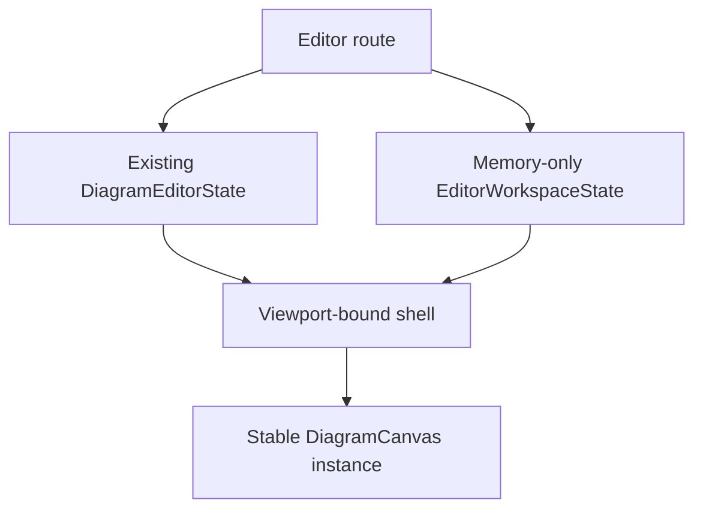

# Feature: Adaptive Shell Foundation

**Feature ID:** FEATURE-01
**Status:** Approved

Links:
Plan: [PLAN-01](../03-PLAN/PLAN-01-PHASE1-canvas-first-shell.md)
Modules: `src/Editor.Client/Components/EditorShell.razor`, `src/Editor.Client/Components/Workspace/`, `src/Editor.Client/Services/`, `src/Editor.Client/wwwroot/editor.css`
ADRs: [ADR-001](../02-ADR/ADR-001-canvas-first-adaptive-editor-shell.md), [ADR-002](../02-ADR/ADR-002-separate-workspace-preferences-from-diagram-data.md)

---

## Implementation plan (step-by-step)

- [ ] Capture baseline viewport geometry and canvas runtime identity in Playwright.
- [ ] Define CSS custom properties for shell dimensions, spacing, focus, elevation, and motion.
- [ ] Add a memory-only `EditorWorkspaceState` with safe defaults and responsive shell state.
- [ ] Split stable viewport landmarks from `EditorShell.razor` while keeping current content temporarily hosted.
- [ ] Implement the 52px command, 44px rail, flexible canvas, and 24px status regions.
- [ ] Keep `DiagramCanvas` mounted across shell-state and breakpoint changes.
- [ ] Add POS-101, NEG-101, EDGE-101, and INT-101 coverage.
- [ ] Run the listed build, test, format, and browser checks; record results in this artifact.

---

## Purpose

Give diagram makers a stable canvas-first frame that uses the viewport efficiently and provides the structural base for drawers and overlays without changing diagram data or workflows.

---

## Stakeholders (who needs this to be clear)

| Role            | What they need from this spec                                   |
| --------------- | --------------------------------------------------------------- |
| Product / Owner | Measurable canvas-space improvement and bounded Phase 1 scope   |
| Engineering     | Component, CSS, state, and canvas-lifecycle invariants          |
| DevOps / SRE    | No topology, server, or configuration change                    |
| QA              | Geometry, responsive, isolation, and runtime-identity scenarios |

---

## Scope

### In scope

- Viewport-bound shell landmarks and visual tokens.
- Memory-only shell state and breakpoint behavior.
- Stable canvas slot and compact region geometry.
- Semantic landmarks and basic keyboard focus for new controls.

### Out of scope

- Drawer content, final command grouping, command palette, focus mode, and preference persistence.
- Domain, IndexedDB content store, sync, export, or jsPlumb behavior changes.

---

## Business Rules

- R1.1-shell_geometry: persistent regions are 52px top, 44px activity rail, and 24px status.
- R1.1-canvas_area: the closed-drawer canvas region is at least 80 percent of a 1440x900 viewport.
- R1.1-stable_canvas: shell changes never unmount or reinitialize `DiagramCanvas`.
- R1.1-responsive_frame: narrowing the viewport never stacks tool inventory above or below the canvas.
- R1.1-data_isolation: shell-only state never touches document revision, autosave, export, snapshot, or sync data.
- At sub-1280px widths, future drawers are overlay-only.
- If shell state fails, defaults render and editing remains available.

---

## User Flows

### Primary flows

1. Open the canvas-first editor
   - Actor: Diagram maker
   - Trigger: Navigate to `/editor` or `/editor/{documentId}`.
   - Steps: Initialize existing editor state; render shell defaults; initialize canvas in the stable slot.
   - Result: Diagram is editable with target chrome dimensions and canvas area.
2. Resize the workspace
   - Actor: Diagram maker
   - Trigger: Resize across the 1280px boundary.
   - Steps: Shell state updates responsive eligibility; CSS adapts surrounding regions.
   - Result: Canvas instance, viewport, and selection persist.

### Edge cases

- Shell-state initialization failure → render safe defaults and continue.
- 1024x768 viewport → compact regions remain; no vertical panel stack.
- Repeated breakpoint crossing → no duplicate canvas initialization or leaked event subscription.
- Browser zoom at 200 percent → controls reflow without covering the entire canvas.

---

## System Behaviour

- Entry points: editor routes and viewport change events.
- Reads from: `DiagramEditorState` and browser viewport.
- Writes to: memory-only `EditorWorkspaceState`.
- Side effects / emitted events: shell change notification only.
- Idempotency: repeated identical viewport updates do not cause additional state changes.
- Error handling: log content-free warning and use defaults.
- Security / permissions: no new authorization boundary; no content in logs.
- Feature flags / toggles: pending PLAN-01 rollout decision.
- Performance / SLAs: geometry targets; no canvas remount; transition duration at most 150ms.
- Observability: deterministic shell and canvas-ready attributes for tests.

---

## Diagrams

---

## Verification

### Test environment

- Local or CI .NET 10 environment with AppHost.
- Fresh Playwright browser context and template-backed diagram.
- Chromium installed; target viewports 1440x900, 1280x720, and 1024x768.

### Test commands

- build: `dotnet build DiagramStudio.slnx`
- test: `dotnet test DiagramStudio.slnx`
- E2E: `dotnet test tests/Editor.E2E.Tests/Editor.E2E.Tests.csproj`
- format: `dotnet format DiagramStudio.slnx --verify-no-changes`

### Test flows

**Positive scenarios**

| ID      | Description      | Level | Expected result                               | Data / Notes           |
| ------- | ---------------- | ----- | --------------------------------------------- | ---------------------- |
| POS-101 | Open at 1440x900 | UI    | 52/44/24 regions and canvas area at least 80% | Measure bounding boxes |

**Negative scenarios**

| ID      | Description             | Level       | Expected result                  | Data / Notes                 |
| ------- | ----------------------- | ----------- | -------------------------------- | ---------------------------- |
| NEG-101 | Change shell-only state | Integration | No document revision or autosave | Observe document/store calls |

**Edge cases**

| ID       | Description                         | Level | Expected result                            | Data / Notes                        |
| -------- | ----------------------------------- | ----- | ------------------------------------------ | ----------------------------------- |
| EDGE-101 | Repeatedly cross 1280px breakpoint  | UI    | No panel stack or canvas remount           | Compare runtime marker and viewport |
| INT-101  | Drag/select after shell transitions | UI    | Existing canvas interaction remains usable | Template document                   |

### Test mapping

- Integration tests: NEG-101 state/data isolation.
- API tests: existing AppHost regression only; no new API.
- UI / E2E tests: POS-101, EDGE-101, INT-101.
- Unit tests: workspace defaults and idempotent viewport transition.
- Static analysis: solution build and `dotnet format --verify-no-changes`.

### Non-functional checks

- Performance / load: geometry measurement and no canvas reinitialization.
- Security / privacy: assert no diagram content in shell warning logs.
- Observability: shell-ready and canvas-ready markers transition only after their respective initialization.

---

## Definition of Done

- Behaviour matches R1.1 rules and flows.
- POS-101, NEG-101, EDGE-101, and INT-101 are automated and pass.
- Existing build and regression suites pass.
- Geometry, responsive, and canvas-identity evidence is recorded.
- No durable store, diagram schema, or sync payload changed.
- Component/CSS contracts and deferred drawer/command work are documented.

---

## References

- [PLAN-01](../03-PLAN/PLAN-01-PHASE1-canvas-first-shell.md)
- [Diagram Studio Version 2](../01-DESIGN/DESIGN.md)
- [ADR-001](../02-ADR/ADR-001-canvas-first-adaptive-editor-shell.md)
- [ADR-002](../02-ADR/ADR-002-separate-workspace-preferences-from-diagram-data.md)
- Current shell: `src/Editor.Client/Components/EditorShell.razor`
- Current layout: `src/Editor.Client/wwwroot/editor.css`
