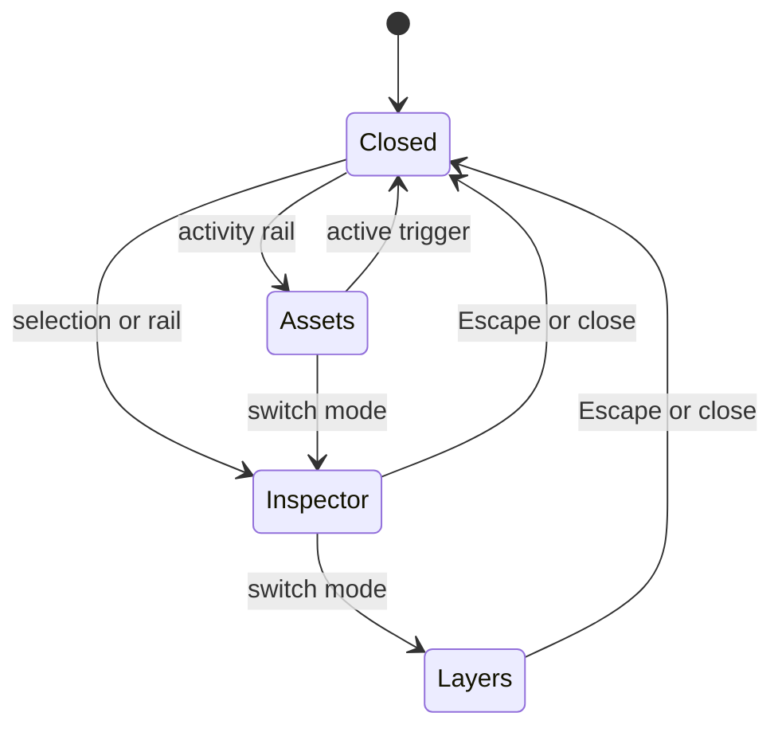

# Feature: Contextual Drawers

**Feature ID:** FEATURE-02
**Status:** Approved

Links:
Plan: [PLAN-01](../03-PLAN/PLAN-01-PHASE1-canvas-first-shell.md)
Modules: `src/Editor.Client/Components/Workspace/`, `src/Editor.Client/Components/Drawers/`, `src/Editor.Client/Services/EditorWorkspaceState.cs`, `src/Editor.Client/wwwroot/editor.css`
ADRs: [ADR-001](../02-ADR/ADR-001-canvas-first-adaptive-editor-shell.md), [ADR-002](../02-ADR/ADR-002-separate-workspace-preferences-from-diagram-data.md)

---

## Implementation plan (step-by-step)

- [ ] Inventory every current left-rail and inspector section and its state callback.
- [ ] Define drawer mode identifiers, availability, single-mode transition rules, and focus origin.
- [ ] Implement the activity rail and overlay drawer host on FEATURE-01.
- [ ] Move Assets/Library content into the Assets drawer without changing workflows.
- [ ] Move selection properties, Layers, Snapshots, Validation, and Review into task modes.
- [ ] Add Escape, close, repeated-trigger dismissal, accessible names, and focus return.
- [ ] Add responsive overlay conversion and canvas-preservation checks.
- [ ] Add POS-201, NEG-201, EDGE-201, and INT-201 coverage and record verification.

---

## Purpose

Return the 600 pixels permanently consumed by current sidebars to the design surface while preserving discoverable access to every existing tool-panel workflow.

---

## Stakeholders (who needs this to be clear)

| Role            | What they need from this spec                                   |
| --------------- | --------------------------------------------------------------- |
| Product / Owner | Complete tool inventory and discoverable activity-rail labels   |
| Engineering     | Drawer modes, state ownership, callbacks, and canvas invariants |
| DevOps / SRE    | No persistence, server, or deployment changes                   |
| QA              | Drawer workflow, focus, responsive, and parity scenarios        |

---

## Scope

### In scope

- Activity rail and one active contextual drawer.
- Assets/Library, Inspector, Layers, Snapshots, Validation, and Review modes.
- Overlay-first behavior, wide-layout pin eligibility, dismissal, and focus return.
- Existing state callbacks and availability semantics.

### Out of scope

- Persisted drawer state, multiple simultaneous drawers, freeform docking, and command palette.
- Final phase-2 roving-focus model or accessibility certification.
- Domain workflow changes.

---

## Business Rules

- R1.2-overlay_default: drawers overlay by default and cannot reserve canvas width below 1280px.
- R1.2-single_mode: only one drawer mode is active.
- R1.2-content_parity: every current left-rail and inspector capability has a mapped mode.
- R1.2-dismissal: Escape, close, or the active rail trigger dismisses and returns focus.
- R1.2-canvas_preservation: transitions preserve canvas instance, selection, and viewport.
- Unknown drawer identifiers produce a safe no-op and content-free warning.
- Selection-dependent controls keep current disabled/hidden semantics.
- Phase 1 drawer state is memory-only.

---

## User Flows

### Primary flows

1. Insert from Assets
   - Actor: Diagram maker
   - Trigger: Activate Assets on the activity rail.
   - Steps: Drawer opens; maker searches and inserts a stencil; drawer closes.
   - Result: Node is added through the existing state workflow; canvas state persists.
2. Inspect a selection
   - Actor: Diagram maker
   - Trigger: Select a node and activate Inspector.
   - Steps: Drawer renders current fields; maker edits a property.
   - Result: Existing mutation, validation, autosave, and canvas update occur.
3. Review document status
   - Actor: Diagram maker
   - Trigger: Activate Layers, Snapshots, Validation, or Review.
   - Steps: Current drawer is replaced by requested mode.
   - Result: At most one mode is visible and its current workflows remain available.

### Edge cases

- Unknown mode → no drawer state change; warning contains no document content.
- Selection clears while Inspector is open → selection fields disappear safely; drawer remains valid.
- Viewport narrows while pin-eligible → drawer becomes overlay without remounting canvas.
- Escape from a nested input → drawer closes only when the nested control has no higher-priority Escape behavior.

---

## System Behaviour

- Entry points: activity-rail buttons, selection/context triggers, Escape, close, and viewport changes.
- Reads from: `DiagramEditorState` projections and `EditorWorkspaceState`.
- Writes to: memory-only active drawer state; existing workflows write through `DiagramEditorState`.
- Side effects / emitted events: drawer-state notification and current editor mutations only.
- Idempotency: opening the active mode again closes it; repeated close is a no-op.
- Error handling: mode-level failure presents close/retry while retaining canvas access.
- Security / permissions: imported content remains text; no new sync exposure.
- Feature flags / toggles: inherit PLAN-01 rollout choice.
- Performance / SLAs: transition at most 150ms; no canvas reinitialization.
- Observability: content-free drawer mode/failure events in development diagnostics.

---

## Diagrams

---

## Verification

### Test environment

- FEATURE-01 shell running under local AppHost.
- Fresh Playwright context with a populated template document.
- Viewports 1440x900, 1280x720, and 1024x768.

### Test commands

- build: `dotnet build DiagramStudio.slnx`
- test: `dotnet test DiagramStudio.slnx`
- E2E: `dotnet test tests/Editor.E2E.Tests/Editor.E2E.Tests.csproj`
- format: `dotnet format DiagramStudio.slnx --verify-no-changes`

### Test flows

**Positive scenarios**

| ID      | Description                                | Level | Expected result                          | Data / Notes      |
| ------- | ------------------------------------------ | ----- | ---------------------------------------- | ----------------- |
| POS-201 | Open Assets, add node, dismiss with Escape | UI    | Node added; drawer closes; focus returns | Flowchart fixture |

**Negative scenarios**

| ID      | Description                                    | Level   | Expected result                            | Data / Notes                       |
| ------- | ---------------------------------------------- | ------- | ------------------------------------------ | ---------------------------------- |
| NEG-201 | Unknown mode and no-selection inspector action | Unit/UI | Safe no-op or disabled action; no mutation | Synthetic mode and empty selection |

**Edge cases**

| ID       | Description                    | Level | Expected result                                         | Data / Notes              |
| -------- | ------------------------------ | ----- | ------------------------------------------------------- | ------------------------- |
| EDGE-201 | Resize with drawer open        | UI    | Overlay adaptation; canvas/selection/viewport preserved | Compare runtime and state |
| INT-201  | Exercise each migrated section | UI    | Every current capability remains reachable              | Reviewed inventory matrix |

### Test mapping

- Integration tests: existing state workflow outcomes through drawer callbacks.
- API tests: no new API; run AppHost regression.
- UI / E2E tests: POS-201, EDGE-201, INT-201.
- Unit tests: transition table, invalid mode, and idempotent close.
- Static analysis: solution build and format verification.

### Non-functional checks

- Performance / load: repeated mode switching does not initialize another canvas.
- Security / privacy: drawer diagnostics contain mode identifiers only.
- Observability: failure state and close/retry behavior are inspectable.

---

## Definition of Done

- Behaviour matches all R1.2 rules and flows.
- POS-201, NEG-201, EDGE-201, and INT-201 are automated and pass.
- The current left-rail/inspector inventory has no unmapped capability.
- New triggers and drawer controls have accessible names, visible focus, and Escape behavior.
- No workspace preference is persisted.
- Existing document, snapshot, library, validation, review, and layer workflows pass.

---

## References

- [PLAN-01](../03-PLAN/PLAN-01-PHASE1-canvas-first-shell.md)
- [Diagram Studio Version 2](../01-DESIGN/DESIGN.md)
- [ADR-001](../02-ADR/ADR-001-canvas-first-adaptive-editor-shell.md)
- [ADR-002](../02-ADR/ADR-002-separate-workspace-preferences-from-diagram-data.md)
- Current shell: `src/Editor.Client/Components/EditorShell.razor`
- Current E2E tests: `tests/Editor.E2E.Tests/EditorSmokeTests.cs`
