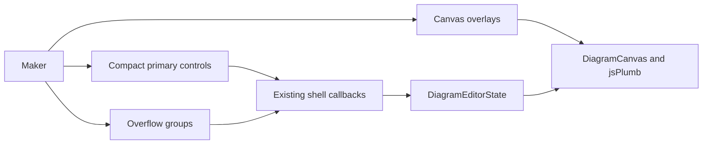

# Feature: Canvas Overlays and Transitional Command Parity

**Feature ID:** FEATURE-03
**Status:** Approved

Links:
Plan: [PLAN-01](../03-PLAN/PLAN-01-PHASE1-canvas-first-shell.md)
Modules: `src/Editor.Client/Components/EditorShell.razor`, `src/Editor.Client/Components/DiagramCanvas.razor`, `src/Editor.Client/Components/MiniMap.razor`, `src/Editor.Client/Components/Workspace/`, `tests/Editor.E2E.Tests/`
ADRs: [ADR-001](../02-ADR/ADR-001-canvas-first-adaptive-editor-shell.md)

---

## Implementation plan (step-by-step)

- [ ] Inventory every current top-toolbar and status action, availability rule, and state callback.
- [ ] Define Phase 1 primary, overflow, drawer, and canvas-overlay mappings.
- [ ] Move the minimap into a non-layout-reserving canvas overlay.
- [ ] Add floating Fit and Center Selection controls using current canvas/state methods.
- [ ] Implement the compact status region with access to all current status information.
- [ ] Implement the 52px compact command bar and temporary direct callback adapters.
- [ ] Add deterministic shell/canvas editor-ready markers and initialization failure behavior.
- [ ] Add POS-301, NEG-301, EDGE-301, and INT-301 tests; record full parity evidence.

---

## Purpose

Recover the vertical space consumed by the minimap row and multi-row toolbar while keeping all current editor commands reachable until Phase 2 introduces the unified command registry and palette.

---

## Stakeholders (who needs this to be clear)

| Role            | What they need from this spec                                          |
| --------------- | ---------------------------------------------------------------------- |
| Product / Owner | Reviewed command grouping and zero lost workflows                      |
| Engineering     | Direct-adapter boundary and readiness semantics                        |
| DevOps / SRE    | No new service; deterministic client readiness evidence                |
| QA              | Command inventory, availability, initialization, and overlay scenarios |

---

## Scope

### In scope

- Floating minimap, Fit, and Center Selection.
- Compact status and 52px command bar with overflow groups.
- One-to-one inventory of current toolbar/status workflows.
- Temporary direct calls to current state/shell methods.
- Deterministic editor-ready marker after successful jsPlumb initialization.

### Out of scope

- `IEditorCommandRegistry`, command palette, new command semantics, persisted minimap state, focus mode, and final presentation behavior.
- Incremental canvas rendering or jsPlumb feature changes.

---

## Business Rules

- R1.3-floating_controls: minimap and viewport controls reserve no grid row.
- R1.3-command_parity: every current command has exactly one documented Phase 1 primary location and may have additional shortcuts.
- R1.3-direct_adapter: controls call existing workflow methods and do not duplicate mutations.
- R1.3-ready_marker: editor-ready becomes true only after both shell and jsPlumb initialization succeed.
- R1.3-status_density: the 24px status region preserves access to template, element counts, validation, and sync status.
- Unavailable commands preserve current disabled semantics.
- Destructive and file actions retain explicit user gestures.
- Phase 1 mappings are explicitly temporary and replaceable by Phase 2.

---

## User Flows

### Primary flows

1. Navigate the diagram
   - Actor: Diagram maker
   - Trigger: Activate Fit or Center Selection, or expand the minimap.
   - Steps: Overlay invokes current canvas adapter; viewport changes.
   - Result: Diagram navigation succeeds without consuming a layout row.
2. Execute a secondary command
   - Actor: Diagram maker
   - Trigger: Open a compact-bar overflow group.
   - Steps: Choose snapshot, export, layout, group, review, presentation, or sync action.
   - Result: Existing callback and state behavior execute.
3. Observe readiness
   - Actor: Browser test or user
   - Trigger: Editor loads.
   - Steps: Shell initializes; jsPlumb initializes and renders.
   - Result: Ready marker becomes true only after both succeed.

### Edge cases

- No selection → Center Selection is disabled and does not call interop.
- Sync disabled → Push and Pull remain disabled.
- jsPlumb asset/init failure → ready remains false; actionable non-content error is shown.
- Overlay collision with an open drawer → overlay offsets or collapses without covering drawer controls.
- 200-percent zoom → commands reflow into overflow and canvas remains usable.

---

## System Behaviour

- Entry points: compact controls, overflow menus, minimap, status actions, and editor initialization.
- Reads from: `DiagramEditorState`, `DiagramCanvas`, and shell state.
- Writes to: existing state workflows and viewport interop only.
- Side effects / emitted events: existing mutations, downloads, sync requests, and viewport changes.
- Idempotency: Fit and status reads are repeatable; mutation commands retain current semantics.
- Error handling: existing state status plus non-content initialization feedback.
- Security / permissions: no new auth; imports/downloads remain explicit gestures; sync warning remains visible.
- Feature flags / toggles: inherit PLAN-01 rollout choice.
- Performance / SLAs: overlay controls do not reinitialize canvas; status fits 24px.
- Observability: `data-editor-ready` or equivalent deterministic marker; console free of unhandled initialization errors.

---

## Diagrams

---

## Verification

### Test environment

- FEATURE-01 and FEATURE-02 completed under local AppHost.
- Playwright Chromium with fresh browser contexts.
- Current Flowchart template and optional local sync endpoint.

### Test commands

- build: `dotnet build DiagramStudio.slnx`
- test: `dotnet test DiagramStudio.slnx`
- AppHost: `dotnet test tests/AppHost.Tests/AppHost.Tests.csproj`
- E2E: `dotnet test tests/Editor.E2E.Tests/Editor.E2E.Tests.csproj`
- format: `dotnet format DiagramStudio.slnx --verify-no-changes`

### Test flows

**Positive scenarios**

| ID      | Description                              | Level | Expected result                                           | Data / Notes            |
| ------- | ---------------------------------------- | ----- | --------------------------------------------------------- | ----------------------- |
| POS-301 | Fit, center, minimap, and inspect status | UI    | Viewport controls work; no minimap row; status accessible | Selected Flowchart node |

**Negative scenarios**

| ID      | Description                                               | Level | Expected result                          | Data / Notes |
| ------- | --------------------------------------------------------- | ----- | ---------------------------------------- | ------------ |
| NEG-301 | Center without selection and Push/Pull with sync disabled | UI    | Controls disabled; no interop or request | Fresh editor |

**Edge cases**

| ID       | Description                                | Level          | Expected result                                         | Data / Notes               |
| -------- | ------------------------------------------ | -------------- | ------------------------------------------------------- | -------------------------- |
| EDGE-301 | jsPlumb initialization fails               | Integration/UI | Ready remains false; actionable error; no false success | Intercept module request   |
| INT-301  | Execute reviewed current command inventory | UI             | All workflows reachable with unchanged outcomes         | Inventory-driven E2E cases |

### Test mapping

- Integration tests: jsPlumb asset publication and readiness failure.
- API tests: existing sync suite for unchanged Push/Pull behavior.
- UI / E2E tests: POS-301, NEG-301, EDGE-301, INT-301.
- Unit tests: mapping inventory uniqueness/completeness if represented as data.
- Static analysis: solution build and format verification.

### Non-functional checks

- Performance / load: overlay interaction acknowledgment within 100ms on reference hardware.
- Security / privacy: no content in readiness/error logs; sync remains disabled by default.
- Observability: ready marker and intercepted-failure assertions.

---

## Definition of Done

- Behaviour matches all R1.3 rules and flows.
- POS-301, NEG-301, EDGE-301, and INT-301 are automated and pass.
- Every current toolbar/status workflow appears in the reviewed mapping and parity evidence.
- Minimap and viewport controls reserve no layout row.
- Ready marker cannot report success before jsPlumb initialization.
- Existing AppHost, core, and editor suites pass with live Chromium.
- Phase 2 replacement boundary for temporary adapters is documented.

---

## References

- [PLAN-01](../03-PLAN/PLAN-01-PHASE1-canvas-first-shell.md)
- [Diagram Studio Version 2](../01-DESIGN/DESIGN.md)
- [ADR-001](../02-ADR/ADR-001-canvas-first-adaptive-editor-shell.md)
- Current shell: `src/Editor.Client/Components/EditorShell.razor`
- Current minimap: `src/Editor.Client/Components/MiniMap.razor`
- Current canvas: `src/Editor.Client/Components/DiagramCanvas.razor`
- Current E2E tests: `tests/Editor.E2E.Tests/EditorSmokeTests.cs`
