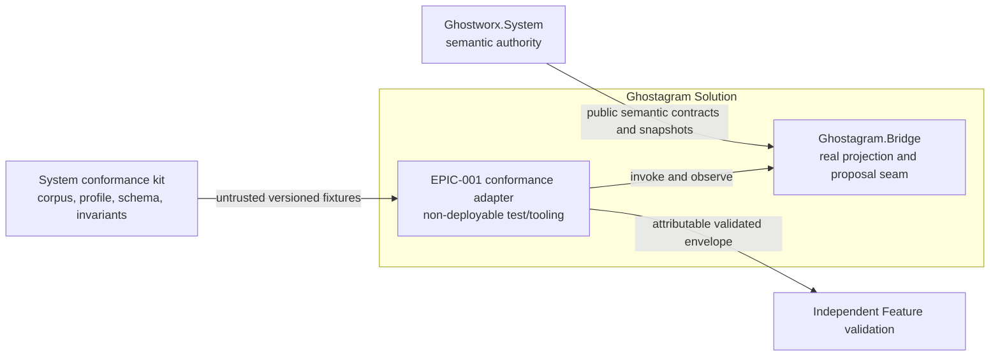
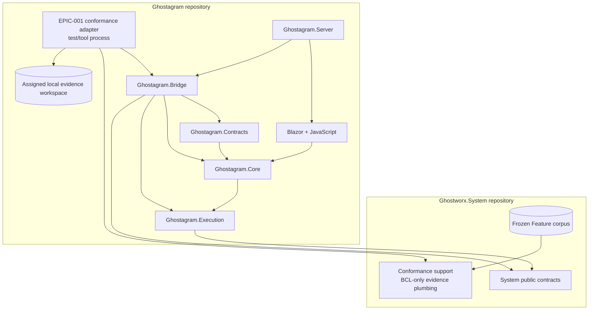
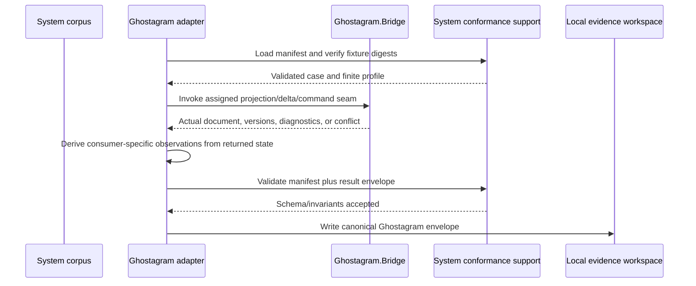
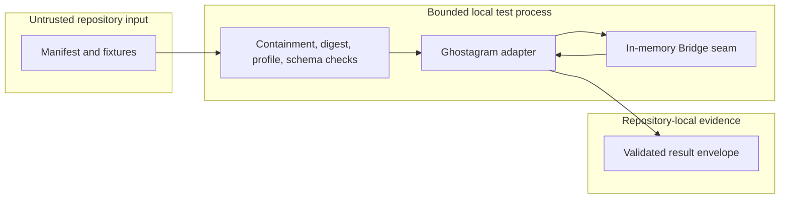
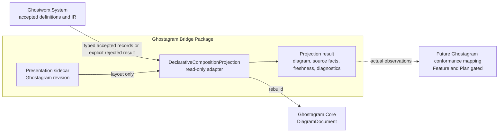
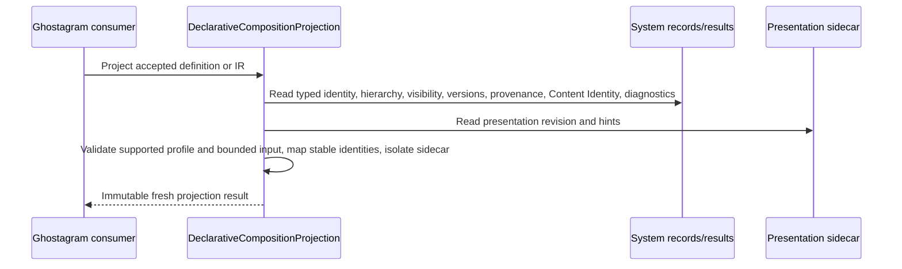
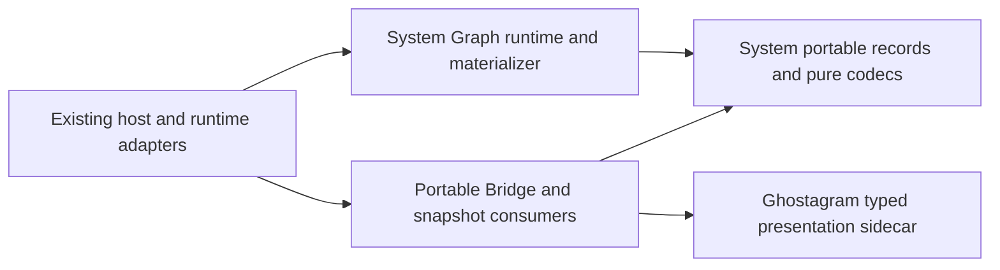
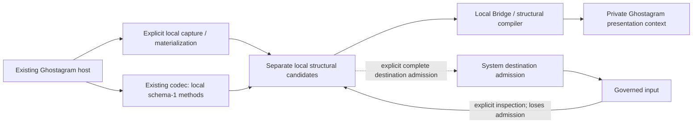

# Ghostagram Solution Architecture

> Revision 3 is the current Target candidate. The [legacy-local boundary reconciliation](#epic-002-legacy-local-boundary-reconciliation) supersedes only the earlier F004 statements identified below. [Revision 2](SOLUTION-ARCHITECTURE-REVISION-002.md) is preserved byte-exact (SHA256 `c748ab83defec7f7453168f75a90458dd22c48cc700f5e0dff69e1da06dce1cc`). Prior approvals apply to their historical revisions; revision 3 awaits independent approval and remains Target.

## 1. Decision and Status

This artifact defines the canonical Ghostagram Solution Target. Sections 1 through 16 and the preserved approval record in Section 18 retain the independently accepted EPIC-001 consumer-conformance Target and its post-Plan reconciliation. Section 17 adds the EPIC-002 read-only Declarative Component Composition projection as a separately reviewed Target slice; it does not replace or promote the EPIC-001 history.

The EPIC-001 slice consumes the conformance corpora through Ghostagram's real projection boundary. It adds one reusable, child-owned conformance adapter over the existing `Ghostagram.Bridge` projection, delta, and expected-revision command seams. The adapter is evidence infrastructure: it does not become a semantic authority, production runtime, deployable service, UI feature, or live operational projection client.

The independently accepted FEATURE-001 through FEATURE-003 Plan amendments now allocate the bounded Ghostagram adapter mapping, tests, per-Feature evidence workspace, and independent local Validation through this Target. Exact project, module, API, and file placement remains a child Design decision. Implementation remains gated by an accepted Design; FEATURE-002 and FEATURE-003 source, tests, adapter mapping, Evidence, and Validation also remain gated by exact FEATURE-001 delivery Evidence and independently Accepted Validation. Plan reconciliation and independent confirmation do not promote this Target to `Implemented` or `Current`.

### Architectural thesis

- `Ghostworx.System` remains the sole owner of semantic meaning, frozen corpora, profiles, result schemas, invariants, and expected semantic outcomes.
- Ghostagram exercises its existing Bridge behavior and reports what that behavior actually observed; it never relabels a System producer run as a Ghostagram result.
- Semantic graph state and the Ghostagram presentation sidecar remain separately owned and separately revisioned.
- One non-deployable runner is reused across FEATURE-001 through FEATURE-003 through Feature-specific invocation mappings, not copied semantic implementations.
- Missing, failed, malformed, skewed, or unsupported cases remain explicit and block the applicable acceptance obligation.

## 2. Scope and Boundaries

### In scope

- A reusable Ghostagram-owned conformance adapter and runner boundary for EPIC-001 Features 001-003.
- Invocation of the public Bridge seams represented by `IGraphDiagramProjection`, `IGraphDiagramDeltaProjector`, and `IGraphDiagramCommandAdapter`.
- Manifest and fixture loading, digest verification, result-envelope construction, schema validation, and invariant validation through the System-owned conformance support boundary.
- Ghostagram-specific observations for identity, origin, semantic revision, presentation revision, presentation-field exclusion, expected-revision conflict, invalidation/freshness, projection rebuilding, and version skew when assigned by a Feature profile.
- Deterministic result emission into the assigned `.swe/implementations/EPIC-001/FEATURE-00N/` evidence workspace.

### Out of scope

- Any duplicate Graph, Variable, Semantic Link, vocabulary, validation, migration, compatibility, or failure-category implementation.
- UI or browser acceptance, JavaScript rendering, the Blazor Laboratory, interactive sessions, MCP/HTTP behavior, or SignalR delivery.
- The Server-owned live operational Projection Port or Control Port, live runtime overlays, runtime/observability authority, or operational mutation.
- Production providers, credentials, protected registries, policy, deployment, package publication, persistence of protected/runtime fields, or external mutation.
- Source, tests, Design, Evidence, Validation, staging, commit, release, or architecture promotion as part of this reconciliation itself; delivery follows the accepted Plan gates.

### Boundary rules

1. Production dependencies point inward from Ghostagram to System contracts; System production packages never depend on Ghostagram or its adapter.
2. The adapter calls the same public Bridge behavior used by Ghostagram. It may not reproduce an expected outcome from the corpus instead of executing that behavior.
3. A projection is rebuildable consumer state. It cannot mint, retarget, tombstone, resolve, authorize, or otherwise own canonical semantic state.
4. Presentation layout, waypoints, viewport, selection, and presentation revision remain Ghostagram-owned sidecar data and cannot enter portable System definitions.
5. The accepted Plans defer physical project placement to the child Designs. Any change to authority, dependency direction, public Bridge semantics, or production deployment requires architecture revision and independent re-review.

## 3. Governing Inputs and Traceability

| Artifact | Status | Relevance |
|---|---|---|
| [EPIC-001 Concept](../../../.swe/epics/001-semantic-system-foundation/CONCEPT.md) (`CONCEPT-EPIC-001`) | Accepted | Establishes System semantic authority and Ghostagram as a projection consumer. |
| [EPIC-001 Architecture Impact](../../../.swe/epics/001-semantic-system-foundation/ARCHITECTURE-IMPACT.md) (`ARCH-IMPACT-EPIC-001`) | Accepted | Assigns the Ghostagram Bridge, persistence, and presentation boundary to this Solution. |
| [Ghostworx Platform Architecture](../../../architecture/PLATFORM-ARCHITECTURE.md#epic-001-consumer-conformance-adapters) (`ARCH-PLATFORM-GHOSTWORX`) | Target, independently approved | Authorizes child architecture for the reusable conformance adapter and preserves all Solution authorities. |
| [ADR-003](../../../architecture/decisions/ADR-003-bootstrap-child-architecture-before-implementation-planning.md) | Accepted | Permits architecture-only bootstrap before an amended Plan allocates child implementation. |
| [FEATURE-001](../../../.swe/epics/001-semantic-system-foundation/features/001-trusted-semantic-graph-foundation/FEATURE.md) | Accepted | Requires real Ghostagram graph projection and expected-revision conformance evidence. |
| [FEATURE-002](../../../.swe/epics/001-semantic-system-foundation/features/002-graph-native-variable-system/FEATURE.md) | Accepted | Requires projection consumption without implicit resolution, private-locator leakage, or semantic duplication. |
| [FEATURE-003](../../../.swe/epics/001-semantic-system-foundation/features/003-governed-semantic-links/FEATURE.md) | Accepted | Requires link/backreference projection, origin and revision preservation, freshness, and non-authority evidence. |
| [FEATURE-001 Plan](../../../.swe/epics/001-semantic-system-foundation/features/001-trusted-semantic-graph-foundation/IMPLEMENTATION-PLAN.md) (`IMPL-PLAN-EPIC-001-FEATURE-001`) | Accepted amendment | Allocates the real Bridge projection/delta/command/presentation seam, FEATURE-001 mapping and tests, `.swe/implementations/EPIC-001/FEATURE-001/`, envelope, Evidence, and independent local Validation. |
| [FEATURE-002 Plan](../../../.swe/epics/001-semantic-system-foundation/features/002-graph-native-variable-system/IMPLEMENTATION-PLAN.md) (`IMPL-PLAN-EPIC-001-FEATURE-002`) | Accepted amendment | Allocates the Bridge Variable projection mapping and `.swe/implementations/EPIC-001/FEATURE-002/`, gated on independently Accepted FEATURE-001 Validation. |
| [FEATURE-003 Plan](../../../.swe/epics/001-semantic-system-foundation/features/003-governed-semantic-links/IMPLEMENTATION-PLAN.md) (`IMPL-PLAN-EPIC-001-FEATURE-003`) | Accepted amendment | Allocates the Bridge Semantic Link/backreference projection mapping and `.swe/implementations/EPIC-001/FEATURE-003/`, gated on exact FEATURE-001 Evidence and independently Accepted Validation. |

## 4. Solution Context

### External elements

| Element | Relationship | Contract owner |
|---|---|---|
| `Ghostworx.System` public contracts | Supplies authoritative semantic records, graph snapshots, changes, transactions, and versioned contract types consumed by Bridge. | `ghostworx-system` |
| System conformance kit | Supplies the frozen corpus, manifest, profile, digests, envelope schema, validation, and invariants. | `ghostworx-system` |
| Portfolio integration and independent validation | Consumes attributable Ghostagram envelopes and decides whether the Feature obligation is met. | `ghostworx` portfolio |
| Ghostagram developers and CI | Execute the repository-native, non-interactive runner after a Plan allocates it. | `ghostagram` |

### System context diagram



**Question answered:** Which authority supplies meaning, which boundary Ghostagram executes, and where the evidence goes?

**Arrow semantics:** Solid arrows are compile-time/test-input or result flows, not runtime control or ownership transfer.

**Omissions:** UI, live projection, provider hosting, deployment, and downstream Feature implementation are intentionally absent.

## 5. Logical Solution Decomposition

| Unit | Type | Responsibility | EPIC-001 relationship | Deployment unit? |
|---|---|---|---|---:|
| `Ghostagram.Contracts` | Library | Portable diagram commands and transport-shaped records. | Supplies Ghostagram operation records used by the command seam; owns no System semantics. | No |
| `Ghostagram.Core` | Library | Diagram document and presentation datatypes. | Holds the rebuildable projection output. | No |
| `Ghostagram.Execution` | Library | Catalog, compiler, and neutral execution contracts. | Existing dependency path to System Core; execution behavior is outside this adapter. | No |
| `Ghostagram.Bridge` | Library | Projects System graph snapshots plus presentation sidecars and applies revision-checked diagram proposals through System graph transactions. | Required real consumer seam. | No |
| `Ghostagram.Blazor` and JavaScript runtime | UI library/runtime | Browser projection, geometry, and interaction proposals. | Excluded from conformance-adapter execution. | Browser assets only |
| `Ghostagram.Server` | Host | Persistence, commands, layout, sessions, HTTP/MCP/SignalR, and Laboratory composition. | Existing composition proof only; not the adapter entry point and not Server participant evidence. | Yes |
| EPIC-001 conformance adapter | Target test/tooling unit | Loads assigned System corpora, invokes Bridge, records observations, and emits validated Ghostagram envelopes. | Reusable evidence boundary for Features 001-003. Exact project/path awaits each child Design. | No |

### Container view



**Dependency rule:** The adapter may depend on Bridge and the System conformance support boundary in test/tooling. Bridge production code continues to depend only on Ghostagram libraries and System public contracts. The UI and Server do not become dependencies of the adapter.

## 6. The Conformance Adapter Boundary

### 6.1 Reused real seams

| Concern | Existing public seam | Required observation |
|---|---|---|
| Full semantic projection | `IGraphDiagramProjection.Project(GraphSnapshot, GraphPresentationSnapshot)` | Projected canonical IDs, relationships, origin/revision fields, diagnostics, and explicit exclusion of presentation/private fields from semantic state. |
| Projection freshness and invalidation | `IGraphDiagramDeltaProjector.Project(GraphChangeBatch, DiagramDocument, GraphSnapshot, GraphPresentationSnapshot)` | Version advancement, incremental operation batch, or explicit `RequiresFullProjection` fallback without fabricated freshness. |
| Revision-safe proposal interpretation | `IGraphDiagramCommandAdapter.Apply(GraphDiagramCommand)` | Separate expected graph-version and expected diagram-revision acceptance/conflict, stable category, all-or-nothing state, and returned authoritative projection. |
| Presentation ownership | `IGraphPresentationStore` and `GraphPresentationSnapshot` | Independent presentation revision and rebuildable layout/viewport/selection state. |

The adapter must call these seams directly. Calling a System producer runner and changing `Participant` to `ghostagram` is invalid. Calling browser or Server endpoints would test a different boundary and add environment-dependent behavior that the platform Target explicitly excludes.

### 6.2 Feature reuse

The runner has one common lifecycle and a small Feature-specific invocation mapping selected by the manifest/profile. The mapping translates a System-owned case into one of the Bridge calls above, captures only values returned by that call or the resulting authoritative snapshots, and formats those observations through the shared envelope support. It does not decide semantic validity independently.

| Feature | Ghostagram behavior exercised | Fail-closed rule |
|---|---|---|
| FEATURE-001 | Definition projection, canonical identity/origin and revisions, presentation-field exclusion, projection/mirror behavior, expected-revision conflict, skew, and freshness/full-reprojection behavior. | Any case that cannot reach an existing Bridge seam is `unsupported` or `missing`; System producer output cannot substitute. |
| FEATURE-002 | Projection of System-owned Variable definition/reference identity, mode, revision, public provenance and invalidation facts without implicit resolution or protected-locator persistence. | If the accepted corpus cannot execute through the real existing Bridge seam, record `unsupported` and return the Plan/Target to review; the bounded allocation does not silently authorize a Bridge extension. |
| FEATURE-003 | Projection and rebuild of canonical Semantic Link/backreference identity, endpoint origin/roles, link and observation revisions, freshness/invalidation, and presentation-field exclusion. | A projected link cannot mint or mutate canonical identity; unsupported Bridge representation remains explicit. |

Later Feature mappings may reuse the runner and envelope plumbing only after the applicable System capability has exact delivery Evidence and the previous Feature gate is independently accepted. Reuse is not evidence that FEATURE-002 or FEATURE-003 behavior already exists.

### 6.3 Integration catalog

| ID | Producer | Consumer | Pattern / format | Owner | Versioning and failure |
|---|---|---|---|---|---|
| INT-01 | System conformance kit | Ghostagram adapter | File-based manifest and JSON fixtures | System | Exact corpus/profile/schema/digest; malformed or skewed input fails explicitly. |
| INT-02 | Ghostagram adapter | `Ghostagram.Bridge` | In-process public .NET calls | Ghostagram | Compiled contract version; conflict/unsupported outcomes remain observable. |
| INT-03 | Ghostagram adapter | Child evidence workspace | Canonical JSON result envelope | Envelope schema: System; observations: Ghostagram | Schema and invariants must pass before the result is eligible evidence. |
| INT-04 | Child evidence workspace | Portfolio validation | Repository-relative locator | Portfolio | Missing or invalid locator blocks acceptance. |

## 7. Data Ownership and Consistency

| Data | Source of truth | Writers | Ghostagram adapter treatment |
|---|---|---|---|
| Semantic definitions, identities, vocabularies, revisions, Variables, and Semantic Links | `Ghostworx.System` contracts and the relevant semantic authority | System-governed mechanisms only | Read/execute through public contracts; never redefine or persist private fields. |
| Frozen corpus, manifest, profile, limits, expected categories, schema, and invariants | `ghostworx-system` | System conformance owner | Treat as untrusted input; verify containment, digests, profile, schema, and bounds before use. |
| Presentation sidecar | Ghostagram | Bridge presentation store | Ephemeral per conformance run; independently revisioned from graph state, with no persistence allocated by these Plans. |
| Projected `DiagramDocument` | Rebuildable Ghostagram projection | Bridge projection | Observation only; not a semantic source of truth. |
| Result observations and envelope | Ghostagram adapter | Adapter after actual Bridge execution | Record returned categories/fields exactly; validate before writing. |
| Feature acceptance decision | Portfolio independent validator | Validator only | Adapter supplies evidence and cannot approve itself. |

The command seam is the only mutation path used by proposal cases. It checks `ExpectedGraphVersion` before opening a presentation transaction and checks `ExpectedDiagramRevision` at the presentation commit boundary. A successful command commits System graph changes and presentation changes as one adapter operation and returns a fresh authoritative projection. Either conflict returns the current graph version, presentation revision, and authoritative projection without accepting the proposal.

## 8. Runtime Scenarios

### 8.1 Successful case



### 8.2 Unsupported, failed, or invalid case

If no allocated Bridge behavior can execute a case, the adapter records `unsupported` with the requested operation and actual support status. If execution disagrees with the expected outcome, the case is `failed`. Missing cases are `missing`. Malformed corpus content, path escape, digest mismatch, invalid limits, schema failure, private-data leakage, deadline/cancellation failure, or envelope-invariant failure aborts eligible evidence production and surfaces a deterministic diagnostic. None of these paths mutates external systems or turns into a pass.

### 8.3 Expected-revision conflict

The adapter captures a baseline graph version and presentation revision, submits a proposal with the case-specified expected values, and observes `Accepted`, `Code`, returned versions, graph changes, and the authoritative document from `IGraphDiagramCommandAdapter`. It compares semantic and presentation state before and after through authoritative snapshots. A graph-version conflict and a diagram-revision conflict remain distinct observations.

### 8.4 Freshness and full reprojection

The adapter projects a baseline, applies or consumes the System-owned change assigned by the case, and passes the actual `GraphChangeBatch`, current diagram, authoritative snapshot, and presentation snapshot to the delta projector. Version discontinuity or a non-direct projection path must request full projection. The runner then rebuilds from the authoritative snapshots and verifies that canonical identity and revisions are retained without treating old presentation state as fresh semantic state.

## 9. Deployment, Trust, and Security

The adapter is a local test/tool process executed from repository-native build/test automation. It requires no listener, network endpoint, browser, Server process, credential, provider, production data, or deployed resource.



Security controls are fail-closed:

- resolve fixture paths beneath the declared corpus root and reject absolute or escaping paths;
- verify every declared digest before execution;
- use only synthetic, non-secret inputs and no ambient production configuration;
- enforce profile limits, finite deadlines, bounded diagnostic/detail size, and cancellation where the exercised seam supports it;
- exclude credentials, endpoints, private locators, payloads, stack traces, and absolute machine paths from public observations;
- write only to the future Plan-assigned local evidence workspace;
- validate both the System-owned schema and invariant rules before reporting an envelope as eligible evidence.

## 10. Reliability, Determinism, and Operability

| Quality | Target measure | Verification mechanism |
|---|---|---|
| Attribution | Every envelope identifies `ghostagram`, participant/runner version, exact corpus/profile/schema/contract/vocabulary versions, corpus/profile digests, environment, interval, and every case. | System schema plus invariant validation. |
| Completeness | Exactly one result exists for every manifest case; missing and unsupported lists exactly match statuses. | Manifest/envelope cross-validation. |
| Determinism | Identical source revision, corpus, profile, and environment produce equivalent case statuses, categories, diagnostics, and observed fields; timestamps/environment metadata may differ. | Repeat-run comparison in future adapter tests. |
| Boundedness | Every declared profile limit is positive and finite; no case waits beyond its accepted deadline or emits unbounded public detail. | Boundary, timeout, cancellation, and invariant tests. |
| State safety | Failed, unsupported, conflict, cancellation, and malformed-input cases do not corrupt canonical graph or presentation state. | Before/after authoritative snapshot assertions. |
| Automation | The runner is non-interactive and returns non-zero when eligible evidence cannot be produced. | Repository-native CI invocation. |

Operational output is deliberately small: a concise console summary, process exit status, and a canonical JSON envelope. No long-running health endpoint, telemetry backend, alert, runbook, deployment topology, HA, or disaster-recovery mechanism applies to this non-deployable evidence tool.

## 11. Architectural Decisions

| ID | Decision | Rationale | Consequence |
|---|---|---|---|
| AD-GRAM-001 | Reuse the public Bridge projection, delta, and command seams. | They are the real Ghostagram interpretation boundary already consuming System graph contracts. | Conformance remains attributable and exercises production behavior instead of a parallel model. |
| AD-GRAM-002 | Use one runner lifecycle with Feature-specific invocation mappings. | Corpus loading, bounds, envelope construction, and validation are stable across EPIC-001 while observable consumer behavior differs by Feature. | Reuse stays small; each Feature still emits separate evidence and remains prerequisite-gated. |
| AD-GRAM-003 | Keep the adapter non-deployable and independent of UI and Server endpoints. | UI/live projection behavior is excluded and would add environmental coupling unrelated to semantic conformance. | No browser or server is required; UI and operational claims receive no evidence from this runner. |
| AD-GRAM-004 | Preserve separate System graph version and Ghostagram presentation revision. | The current Bridge already enforces dual expected revisions and keeps presentation in a sidecar. | Conflict categories and freshness can be tested without transferring semantic authority. |
| AD-GRAM-005 | Consume System-owned evidence plumbing rather than copy it. | The platform assigns corpus, schema, digest, envelope, and invariants to System. | The accepted Plans require the child Designs to choose a portable test/tooling consumption mechanism; Ghostagram owns only invocation and observation. |

No local ADR is required for these bounded decisions. Create and independently review one if a later Plan introduces a new public Bridge contract, production dependency, deployment unit, data authority, or live operational integration.

## 12. Verification Strategy

After the applicable accepted amended Plan and accepted child Design open implementation, verification must include:

- focused Bridge contract tests for actual full projection, delta fallback/freshness, and dual expected-revision behavior;
- runner tests for manifest containment/digests, exact case coverage, statuses, observed categories, private-field exclusion, bounds, cancellation/deadline, and non-zero failure exit;
- System-owned schema and invariant validation of every emitted envelope;
- a dependency fitness check proving System production packages do not reference Ghostagram and Ghostagram production packages do not reference conformance support;
- repository-native Release build and the closest Bridge/adapter tests;
- `git diff --check`, link validation, and preservation of unrelated worktree changes.

Browser validation is neither required nor sufficient for this adapter because the Target excludes UI and live projection. Any later renderer or interactive behavior change must pass Ghostagram's separate browser-sensitive validation gates.

## 13. Evolution, Sequencing, and Change Rules

1. Preserve the accepted Target and accepted Plan locators in the reconciliation record below.
2. Obtain independent confirmation of this post-Plan reconciliation before any child Design relies on it.
3. Create and independently accept the applicable child Design in the Plan-assigned workspace; each Design chooses exact project/module/API/file placement without broadening allocation.
4. Implement the common runner plus FEATURE-001 mapping, emit attributable FEATURE-001 evidence, and obtain independent local and portfolio acceptance.
5. Only after exact FEATURE-001 delivery Evidence and independently Accepted Validation, implement the FEATURE-002 and FEATURE-003 mappings. Each Feature uses its own corpus and envelope and may expose a genuinely unsupported Bridge capability.

The runner lifecycle and evidence plumbing may evolve independently of Feature-specific invocation mappings when schema compatibility is preserved. A corpus, profile, contract, envelope schema, Bridge public seam, authority, or dependency-direction change requires coordinated review. A new runtime service, UI dependency, provider, persistence authority, or live Projection/Control Port is a solution-breaking scope expansion for this Target.

## 14. Current Baseline and Known Divergence

| Target fact | Current evidence | Divergence |
|---|---|---|
| Real full projection | [`GraphDiagramProjection`](../src/Ghostagram.Bridge/Projection.cs) projects System `GraphSnapshot` plus `GraphPresentationSnapshot` and records graph/presentation revisions. | No EPIC-001 conformance mapping or attributable envelope exists. |
| Real freshness seam | [`GraphDiagramDeltaProjector`](../src/Ghostagram.Bridge/Projection.cs) emits versioned operation batches and requests full projection on incompatible version/path. | No corpus-driven invalidation/freshness evidence exists. |
| Real proposal seam | [`GraphDiagramCommandAdapter`](../src/Ghostagram.Bridge/CommandAdapter.cs) enforces expected graph and diagram revisions and returns authoritative state. | No frozen-corpus runner exercises it as the Ghostagram participant. |
| Server composition | [`GraphWorkspaceService`](../src/Ghostagram.Server/GraphWorkspaces/GraphWorkspaceService.cs) composes projection, presentation store, and command adapter. | It is not the conformance entry point and cannot substitute for a Ghostagram envelope. |
| System evidence support | The current [conformance support project](../../ghostworx-system/tests/Ghostworx.System.Graph.Conformance.Support/) supplies BCL-only corpus and envelope support for FEATURE-001. | A stable cross-repository consumption mechanism and FEATURE-002/003 corpora remain child Design and upstream-delivery work under the accepted Plans. |
| Adapter delivery | None. FEATURE-001 independent Validation remains blocked on external consumer evidence. | Plan allocation now exists; child Design, implementation, tests, Evidence, and independent local Validation remain pending. |

The existing [solution assessment](../docs/architecture/solution-architecture-assessment.md) remains useful current-state evidence for the wider product. It is advisory and does not override this canonical Target or expand the EPIC-001 adapter scope.

## 15. Risks

| ID | Risk | Mitigation | Status |
|---|---|---|---|
| RK-01 | A case is answered from corpus expectations instead of Bridge execution. | Require actual returned Bridge state for every observation; detect relabeled or missing execution as failed/missing. | Open |
| RK-02 | Future Variable or Semantic Link corpora need a projection behavior the current Bridge cannot express. | Record `unsupported`; return the accepted Plan/Target to review before any broader Bridge change. | Open |
| RK-03 | Test/tooling copies System semantic rules or envelope validation. | Consume the System-owned support boundary and keep mappings limited to invocation plus observation. | Open |
| RK-04 | Presentation data leaks into portable semantic records or public result details. | Assert semantic state equality/exclusion and run shared private-data/schema invariants before writing. | Open |
| RK-05 | Current cross-repository project references make the runner machine-layout-dependent. | Each accepted child Design must select a portable build/test consumption mechanism without changing dependency direction. | Open |
| RK-06 | Reuse is mistaken for advance completion of FEATURE-002/003. | Preserve the sequential Feature gates and emit separate corpus/profile-specific envelopes only after upstream delivery evidence exists. | Open |

## 16. Post-Plan Reconciliation

### Exact accepted Plan locators

```yaml
feature_001_plan:
  repository: "ghostworx"
  artifact_id: "IMPL-PLAN-EPIC-001-FEATURE-001"
  path: ".swe/epics/001-semantic-system-foundation/features/001-trusted-semantic-graph-foundation/IMPLEMENTATION-PLAN.md"
  revision: "None"
feature_002_plan:
  repository: "ghostworx"
  artifact_id: "IMPL-PLAN-EPIC-001-FEATURE-002"
  path: ".swe/epics/001-semantic-system-foundation/features/002-graph-native-variable-system/IMPLEMENTATION-PLAN.md"
  revision: "None"
feature_003_plan:
  repository: "ghostworx"
  artifact_id: "IMPL-PLAN-EPIC-001-FEATURE-003"
  path: ".swe/epics/001-semantic-system-foundation/features/003-governed-semantic-links/IMPLEMENTATION-PLAN.md"
  revision: "None"
```

### Reconciliation result

| Feature | Plan-assigned Ghostagram boundary | Local workspace | Gate and result |
|---|---|---|---|
| FEATURE-001 | Existing `Ghostagram.Bridge` projection, delta, command, and presentation seams plus a test/tooling-only mapping, tests, envelope, Evidence, and independent local Validation. | `.swe/implementations/EPIC-001/FEATURE-001/` | Aligned. An independently accepted child Design must choose physical placement before source or tests change. |
| FEATURE-002 | Existing Bridge projection seam plus the Variable identity/mode/revision/provenance, invalidation/freshness, locator-exclusion, no-implicit-resolution, and skew mapping. | `.swe/implementations/EPIC-001/FEATURE-002/` | Aligned and source-closed until exact FEATURE-001 Evidence and independently Accepted Validation; unsupported Bridge behavior returns to Plan/architecture review. |
| FEATURE-003 | Existing Bridge projection seam plus canonical link/origin/endpoint-role/revision, backreference freshness/invalidation, presentation-exclusion, and skew mapping. | `.swe/implementations/EPIC-001/FEATURE-003/` | Aligned and source-closed until exact FEATURE-001 Evidence and independently Accepted Validation; no second authority or runtime meaning is introduced. |

The accepted amendments are coherent with AD-GRAM-001 through AD-GRAM-005 and require no authority, dependency, data-ownership, public Bridge, deployment, or live-projection change. They allocate only the smallest real-seam adapter mapping, tests, Feature-specific envelope, repository-local Evidence, and independent local Validation. Exact project/module/API/file placement remains deferred to each accepted child Design.

All original exclusions remain binding: no UI/browser acceptance, Blazor Laboratory, SignalR, Server runtime Projection Port, live operational view, persistence, protected/runtime state, provider, policy, deployment, relabeled System output, or copied System semantics. The common runner does not satisfy any Feature by reuse alone, and missing, failed, unsupported, skewed, or invalid evidence remains explicit. Architecture lifecycle remains `Target`; this reconciliation supplies no implementation or promotion evidence.

### Reconciliation Confirmation Record

| Field | Value |
|---|---|
| Mode | auto-approve |
| Author | dennis-ritchie (`ghostagram_architecture`, delegated Ghostagram solution architect) |
| Approver | elon-musk |
| Decision | Accepted |
| Recorded | 2026-08-28T13:56:03.8848974-04:00 |
| Evidence | Exact Plan locators and workspaces align with the existing Bridge projection, delta, command, and presentation seams. FEATURE-002/003 remain fail-closed, evidence stays Feature-specific, and no UI, SignalR, live projection, persistence, runtime authority, deployment, copied semantics, or relabeled System execution was introduced. |
| Bypass reason | None |

## 17. EPIC-002 Declarative Composition Projection Target

### 17.1 Decision, lifecycle, and entry gate

Ghostagram will consume accepted System Component Definitions and Composition IR through one read-only, rebuildable projection boundary. `Ghostworx.System` remains the sole semantic and compiler authority. Ghostagram owns only projection interpretation, presentation identity and revision, bounded consumer diagnostics, explicit freshness/skew state, and attributable projection-conformance observations.

This is a pre-Feature P50 Target refinement under [ADR-008](../../../architecture/decisions/ADR-008-pre-feature-child-target-architecture-assignment.md). The exact `repos/ghostagram` assignment is Solution `change`, Package `change`, and Module `change`. The local [governance](../AGENTS.md) and [context](../CONTEXT.md) reconciliations are independently Accepted. Feature: `Pending`. Implementation Plan: `Pending`. This Target authorizes no Design, source, tests, dependency change, Evidence, Validation, deployment, publication, staging, commit, or external mutation.

The overall solution lifecycle remains `Target`. Approval of this EPIC-002 slice is architecture acceptance only; it is not implementation, conformance, runtime-readiness, release, or promotion evidence.

### 17.2 Governing inputs and exact locators

| Artifact | Lifecycle | Ghostagram constraint |
|---|---|---|
| [EPIC-002](../../../.swe/epics/002-declarative-composition-model/EPIC.md) (`EPIC-002`) | Accepted | One definition-only Feature family; no runtime, dispatch, transport, provider, or materialization ownership. |
| [EPIC-002 Concept](../../../.swe/epics/002-declarative-composition-model/CONCEPT.md) (`CONCEPT-EPIC-002`) | Accepted | Preserve recursive Component identity, containment, supervision, encapsulation, requirements, declared surfaces, compatibility, and strict definition/runtime separation. |
| [EPIC-002 Architecture Impact](../../../.swe/epics/002-declarative-composition-model/ARCHITECTURE-IMPACT.md) (`ARCH-IMPACT-EPIC-002`) | Accepted | Assign Ghostagram Solution/Package/Module `change` for a read-only definition projection; exclude Execution, Server, Blazor, SignalR, and operational projection scope. |
| [Platform Target](../../../architecture/PLATFORM-ARCHITECTURE.md#epic-002-parent-architecture-assignment) (`ARCH-PLATFORM-GHOSTWORX`) | Target, independently approved | Depend inward on System's accepted records/results and keep presentation outside semantic Content Identity. |
| [ADR-008](../../../architecture/decisions/ADR-008-pre-feature-child-target-architecture-assignment.md) (`ADR-008`) | Accepted | Permit only this exact Target architecture with the Plan recorded as Pending and require post-Plan reconciliation. |
| [Declarative Component Composition](../../../architecture/contracts/DECLARATIVE-COMPONENT-COMPOSITION.md) (`CONTRACT-DECLARATIVE-COMPONENT-COMPOSITION`) | Accepted | Preserve normative identity, visibility, version/profile, provenance, Content Identity, diagnostics, finite limits, and failure meaning without copying compiler semantics. |
| [ADR-005](../../../architecture/decisions/ADR-005-componentmodel-port-definition-and-port-interaction-ownership.md) (`ADR-005`) | Accepted | `IPort` and `IControl` remain non-executable EPIC-002 definitions; EPIC-005 owns interaction semantics. |
| [Semantic Graph and Federation](../../../architecture/contracts/SEMANTIC-GRAPH-AND-FEDERATION.md) | Accepted | Preserve canonical Semantic Addresses, origin, and exact revisions; do not mint a second identity authority. |
| [Variable Definition and Resolution](../../../architecture/contracts/VARIABLE-DEFINITION-AND-RESOLUTION.md) | Accepted | Project `VariableRequirement` and `VariableAssignment` without `VariableBinding`, provider locator, credential, resolved value, or implicit resolution. |

### 17.3 Solution boundary

**In scope**

- Read-only projection of accepted Component Definitions and accepted Composition IR into rebuildable `DiagramDocument` state.
- Preservation of canonical Component and declaration identities, exact source revisions, parent/constituent hierarchy, explicit visibility and exports, requirements/assignments, capability/operation/`IPort`/`IControl` definition meaning, implementation-reference identity, contract/compiler/profile versions, provenance, Content Identity, bounded diagnostics, and projection freshness.
- Ghostagram-owned presentation sidecars for layout, waypoints, viewport, selection, color, collapsed state, and presentation revision, keyed without changing portable System records.
- Explicit `fresh`, `stale`, `unsupported`, `skewed`, and `failed` consumer outcomes and full-reprojection behavior when freshness cannot be proved.
- Attributable Ghostagram projection-conformance observations from the real projection seam after an Accepted Feature and Plan allocate delivery.

**Out of scope**

- Authoritative definition or IR editing, compilation, migration semantics, identity minting, validation authority, compatibility reinterpretation, or Content Identity generation.
- `VariableBinding` access, provider selection, value resolution, credentials, private locators, resolved payloads, runtime state, or executable behavior.
- Port Binding, Contract, Channel, envelope, route, transport, middleware, dispatch, authorization, retry, backpressure, cancellation, correlation, runtime coordination, or EPIC-005 interaction ownership.
- Instance materialization, activation, placement, scheduling, live supervision, lifecycle, health, runtime overlays, or EPIC-010 ownership.
- `Ghostagram.Execution`, palette definitions, `Ghostagram.Server`, Blazor, JavaScript, SignalR, MCP/HTTP endpoints, persistence services, live operational Projection/Control Ports, deployment, or browser behavior.
- Semantic mutation through the existing graph command adapter. Authoritative Component definition editing remains unavailable unless a separately Accepted System-owned command, expected-revision, validation, and conflict contract plus separate architecture, Feature, and Plan allocate it.

### 17.4 Exact Package and Module assignment

| Structural scope | Selected boundary | Responsibility | Current-source grounding | Explicit exclusions |
|---|---|---|---|---|
| Package | `Ghostagram.Bridge` | Own the adapter from System-owned Component Definition/Composition IR records to Ghostagram-owned projection results and presentation sidecars. | The existing [`GraphDiagramProjection`](../src/Ghostagram.Bridge/Projection.cs) already projects an authoritative System snapshot into `DiagramDocument`, records graph and presentation revisions, emits bounded projection diagnostics, and keeps mutation outside projection. `Ghostagram.Bridge` already references System public contracts and `Ghostagram.Core`. | The Package does not become a compiler, System record owner, runtime, Server endpoint, UI host, or operational projection client. Its unrelated existing Execution dependency does not authorize the new module to consume Execution contracts. |
| Module | `DeclarativeCompositionProjection` within `Ghostagram.Bridge` | Consume typed, already validated System definitions/IR; produce one immutable read-only projection result with a rebuildable diagram, source/version/provenance/Content Identity facts, presentation revision, freshness state, and bounded redacted diagnostics. Own the future real-seam conformance mapping for this behavior. | [`IGraphDiagramProjection`](../src/Ghostagram.Bridge/BridgeContracts.cs) and [`GraphDiagramDeltaProjector`](../src/Ghostagram.Bridge/Projection.cs) establish the local projection/freshness pattern; [`DiagramDocument`](../src/Ghostagram.Core/DiagramModel.cs) supplies rebuildable presentation state with extension metadata. | No dependency on `Ghostagram.Execution`, palette persistence, Server, Blazor, SignalR, runtime/materialization types, or the graph command adapter for semantic edits. No copied System validation/compiler/migration logic. |

The later Package architect owns `architecture/packages/Ghostagram.Bridge/PACKAGE-ARCHITECTURE.md`; the later Module architect owns `architecture/packages/Ghostagram.Bridge/modules/DeclarativeCompositionProjection/MODULE-ARCHITECTURE.md`. Those artifacts may refine API shape, file placement, and internal collaborators, but they may not select another authority or widen the assigned Package/Module scope. If accepted Feature or Plan discovery requires a production change in `Ghostagram.Core`, `Ghostagram.Execution`, `Ghostagram.Server`, Blazor, or another Package, acceptance stops and returns to portfolio P40/P50 before delivery planning proceeds.

No local ADR is required for this selection. It applies the accepted parent contract to the existing Bridge projection seam without changing authority, dependency direction, deployment, data ownership, or a public cross-solution contract. A later proposal to add authoritative editing, a new public System command, a deployable or live integration, or another Package requires a separately reviewed decision.

### 17.5 Logical and integration view



**Question answered:** Which exact Ghostagram boundary consumes System definition meaning, and which state remains Ghostagram-owned?

**Relationship semantics:** System-to-projection is a read-only in-process contract dependency. Sidecar-to-projection supplies presentation hints only. Projection-to-Core constructs consumer state. The dashed conformance flow is future test/tooling observation, not runtime traffic or current delivery.

**Omissions:** Authoring commands, compiler internals, interaction routing, Execution, Server hosting, UI rendering, live projection, persistence, and materialization are intentionally absent.

| Integration | Producer | Consumer | Contract and versioning | Failure behavior |
|---|---|---|---|---|
| EP2-INT-01 | `Ghostworx.System` | `DeclarativeCompositionProjection` | Typed Component Definition or Composition IR plus exact contract/compiler/profile/canonicalization versions, provenance, and Content Identity. System owns compatibility and validation meaning. | Unsupported or incompatible version/profile is `skewed` or `unsupported`; no best-effort reinterpretation. Rejected System compilation remains rejected and yields no accepted-IR projection. |
| EP2-INT-02 | Ghostagram presentation sidecar | `DeclarativeCompositionProjection` | Ghostagram-only presentation identity/revision keyed to stable projected identities. | Missing or incompatible sidecar data is ignored or diagnosed and a deterministic default layout is rebuilt; semantic content is unchanged. |
| EP2-INT-03 | `DeclarativeCompositionProjection` | Ghostagram consumer | Immutable projection result containing `DiagramDocument`, exact source facts, presentation revision, freshness, and bounded diagnostics. | Failure returns no projection that can be mistaken for fresh accepted state. Last-known diagrams, when retained by a caller, remain explicitly stale. |
| EP2-INT-04 | Future System corpus/profile | Future Ghostagram conformance mapping | System-owned corpus/schema/invariants; Ghostagram-owned real-seam observations. | Missing, failed, malformed, private-field-leaking, skewed, unsupported, or non-attributable cases cannot satisfy acceptance. |

### 17.6 Projection contract and data ownership

The solution-level projection result must preserve the facts below. Exact CLR type names, encodings, ID-mapping algorithm, and file placement remain Package/Module architecture and Design choices.

| Projection fact | Required meaning | Owner |
|---|---|---|
| Source identity | Root definition/IR domain, canonical Semantic Address, exact revision, and source-set identity | System |
| Compatibility identity | Contract, compiler when applicable, profile, canonicalization profile, and extension policy versions | System |
| Content Identity | System-issued algorithm/profile/digest and predecessor lineage when supplied | System |
| Hierarchy and visibility | Parent/constituent structure, explicit exports, and opaque/private boundaries without inferred transitive exposure | System meaning, Ghostagram rendering |
| Declared surfaces | Capabilities, operations, `IPort`, and `IControl` as non-executable descriptive surfaces | System meaning, Ghostagram rendering |
| Requirements and assignments | Public `VariableRequirement` and `VariableAssignment` identity/reference facts only | System meaning, Ghostagram rendering |
| Projection identity | Collision-checked deterministic mapping from canonical source identity to diagram elements, always retaining the canonical identity separately | Ghostagram |
| Presentation sidecar | Layout, waypoints, selection, viewport, color, collapsed state, and presentation revision | Ghostagram |
| Freshness | Source Content Identity/revision correlated with the produced projection and presentation revision | Ghostagram observation over System facts |
| Diagnostics | Stable source categories/codes retained without reinterpretation plus separately identified bounded Ghostagram projection diagnostics | System and Ghostagram, distinctly attributed |

The module consumes typed System contracts or a System-governed exchange reader; it does not parse portable bytes into competing semantic records. It never widens visibility. It projects only the declarations and fields present in the System-approved consumer view, preserves explicit export boundaries, and represents unavailable private structure as opaque rather than inferring or exposing it.

Projected `IPort` and `IControl` declarations are read-only descriptive surfaces. They must not register interactive connectors, create routes, enable diagram connection semantics, invoke controls, or reuse local execution contracts as ComponentModel meaning. The current [`IExecutionComponentActivator`](../src/Ghostagram.Execution/ExecutionContracts.cs) is a runtime prototype and is outside this module. The current [`PaletteNodeDefinitionSnapshot`](../src/Ghostagram.Server/Persistence/PaletteCatalogModels.cs) is presentation/catalog state and is not a System Component Definition.

Presentation may be retained across a rebuild only for collision-free stable projected identities that still refer to the same canonical declarations under the accepted compatibility result. A source revision, Content Identity, profile, visibility, or identity mismatch makes the prior projection stale until a full projection succeeds. EPIC-002 allocates no authoritative incremental change feed, so full reprojection is the normative recovery. Incremental projection is permitted only after an accepted System-owned revision/change contract proves equivalent identity, visibility, provenance, and freshness behavior.

### 17.7 Runtime, trust, and failure scenarios

#### Accepted definition or IR projection



The result contains no runtime instance, route, executable delegate, authorization, selected provider, resolved Variable value, or materialization instruction. Rebuilding the same supported source and sidecar inputs yields an equivalent diagram and diagnostics except for explicitly non-semantic consumer metadata.

#### Rejected, skewed, stale, or failed input

- A rejected System compilation result does not produce an accepted-IR diagram; the projection reports the source rejection distinctly from any Ghostagram failure.
- Unsupported contract/profile/canonicalization versions and incompatible extensions fail explicitly as `skewed` or `unsupported`; Ghostagram does not reinterpret them.
- A source revision or Content Identity discontinuity invalidates freshness. The caller may display a last-known diagram only with an explicit stale marker while requesting full reprojection.
- Bounds exceeded, cancellation, deadline expiry, malformed projection input, identity collision, private-field leakage, or presentation merge failure yields a bounded redacted Ghostagram diagnostic and no fresh result.
- Failures do not mutate System definitions/IR, Graph/Variable history, bindings, prior accepted IR, or the caller's presentation sidecar.

Inputs are untrusted until the System contract's schema, compatibility, content-identity, provenance, and finite-profile checks have succeeded and Ghostagram's projection bounds have been enforced. Public projection state excludes credentials, provider-private locators, `VariableBinding`, resolved payloads, protected tenant context, private endpoints, stack traces, runtime handles, and non-exported declaration details. The boundary is an in-process library seam and introduces no network listener, secret, deployment unit, durable semantic store, HA/DR obligation, or operational control plane.

### 17.8 Quality scenarios and verification duties

| ID | Quality | Scenario | Target response | Future verification after Feature and Plan acceptance |
|---|---|---|---|---|
| EP2-Q-01 | Authority | A definition and local palette record use similar names and fields. | Only the System record supplies semantic identity/meaning; palette state may affect presentation only. | Negative dependency and mapping tests. |
| EP2-Q-02 | Encapsulation | A nested constituent owns non-exported operations, ports, controls, or requirements. | The external projection does not expose or imply them and preserves an opaque boundary. | System corpus negative fixtures plus actual projection observation. |
| EP2-Q-03 | Determinism | Equivalent accepted IR is projected repeatedly with the same sidecar revision. | Equivalent element mapping, hierarchy, declared facts, freshness, and bounded diagnostics result. | Repeat-run and authoring-order permutation tests. |
| EP2-Q-04 | Freshness | Source revision or Content Identity changes or skips an unsupported transition. | The old view becomes explicitly stale and full reprojection is required; no fabricated delta or fresh marker. | Revision/content-identity discontinuity tests. |
| EP2-Q-05 | Separation | Layout, selection, viewport, color, or collapsed state changes. | Only Ghostagram presentation revision/state changes; System records and Content Identity remain unchanged. | Sidecar isolation and round-trip tests. |
| EP2-Q-06 | Non-execution | Projected `IPort`, `IControl`, Operation, or Implementation Reference is selected. | No connector, dispatch, activation, load, provider selection, route, or runtime action is available from this module. | API/dependency fitness checks and negative interaction tests. |
| EP2-Q-07 | Failure containment | Input is malformed, over limit, cancelled, incompatible, or leaks a protected field. | One explicit bounded failure, no fresh partial projection, no source or sidecar mutation, and no sensitive detail leakage. | Boundary, deadline, cancellation, redaction, and state non-mutation tests. |
| EP2-Q-08 | Attribution | A future conformance run exercises the projection. | The envelope identifies `ghostagram`, the real module/runner, exact corpus/profile/schema/digests, source revision, every case, observed fields, and missing/failed/unsupported lists. | System schema/invariant validation and independent local Validation. |

Architecture fitness rules must prove that `DeclarativeCompositionProjection` depends only on accepted System public contracts plus Ghostagram Bridge/Core presentation abstractions; System production packages do not depend on Ghostagram; the new module does not depend on Execution, Server, Blazor, SignalR, palette persistence, or operational projection contracts; and no command path is exposed for semantic definition editing.

### 17.9 Current baseline, divergence, and evolution

| Target fact | Current evidence | Divergence |
|---|---|---|
| Authoritative-snapshot projection pattern | [`GraphDiagramProjection`](../src/Ghostagram.Bridge/Projection.cs) consumes System `GraphSnapshot`, emits `DiagramDocument`, and records graph/presentation revisions and projection diagnostics. | It projects EPIC-001 Graph snapshots, not Component Definitions or Composition IR. |
| Explicit freshness recovery | [`GraphDiagramDeltaProjector`](../src/Ghostagram.Bridge/Projection.cs) requests full projection when authoritative version/path assumptions fail. | No EPIC-002 source revision/Content Identity correlation or composition freshness result exists. |
| Presentation separation | [`GraphPresentationSnapshot`](../src/Ghostagram.Bridge/BridgeContracts.cs) separately owns node/group layout, waypoints, viewport, selection, and revision. | No composition-specific sidecar keying/compatibility rule or projection identity exists. |
| Rebuildable consumer model | [`DiagramDocument`](../src/Ghostagram.Core/DiagramModel.cs) is an immutable diagram aggregate with extension metadata. | No definition/IR projection result preserves all required identity, hierarchy, visibility, profile, provenance, Content Identity, and failure facts. |
| EPIC-002 package/module | None. | Ghostagram.Bridge Package and DeclarativeCompositionProjection Module Targets exist; their current revision 2 gates are recorded below. No composition source, tests, conformance envelope, Evidence or Validation exists. |

The current graph command adapter, palette/catalog model, Execution compiler/activator, Server graph workspace, Blazor/JavaScript renderer, SignalR sessions, and live operational projection remain unchanged and outside this Target slice. Their existence is feasibility or neighboring-product evidence, not Component definition/IR architecture or delivery evidence.

After an EPIC-002 Feature and adjacent Implementation Plan are independently Accepted, the Solution architect must reconcile their exact allocation, acceptance criteria, integration paths, Package/Module locators, conformance duties, and evidence workspaces against this Target before Design. A material mismatch, another affected Package, an authoritative editing requirement, a runtime/interaction/Server seam, or an ownership/dependency change returns to portfolio P40/P50 and independent architecture review. The Plan cannot silently override this Target.

### 17.10 Solution decisions

| ID | Decision | Rationale | Consequence |
|---|---|---|---|
| AD-GRAM-EP2-001 | Place the read-only composition projection in the existing `Ghostagram.Bridge` Package. | Bridge is already the child-owned System-to-diagram translation boundary and owns projection freshness/presentation separation patterns. | No second adapter Package or semantic model is introduced. |
| AD-GRAM-EP2-002 | Create one `DeclarativeCompositionProjection` Module inside Bridge. | Definition/IR projection, freshness, diagnostics, sidecar isolation, and conformance observation form one cohesive responsibility. | Package and Module architects receive one exact bounded target; API/file details remain theirs. |
| AD-GRAM-EP2-003 | Use full reprojection as the normative recovery path. | The accepted parent contract allocates no authoritative incremental composition-change feed. | Stale or skewed state is explicit; no consumer-invented delta semantics. |
| AD-GRAM-EP2-004 | Render declared surfaces as non-executable read-only meaning. | ADR-005 assigns interaction semantics to EPIC-005, and local Execution/palette contracts are not ComponentModel authority. | No connector, route, dispatch, control, activation, or implementation loading is implied by the diagram. |
| AD-GRAM-EP2-005 | Keep authoritative definition editing absent. | The parent contract requires a separately accepted System command/revision/validation/conflict contract and portfolio allocation. | Only presentation sidecars may change locally; semantic editing is a future governed decision. |

### 17.11 EPIC-002 approval record

| Field | Value |
|---|---|
| Mode | auto-approve |
| Author | solution-architect (`epic002_ghostagram_solution_architecture`) |
| Approver | elon-musk (`epic002_concept_approval`) |
| Decision | Accepted |
| Recorded | `2026-08-29T05:20:02.5951909-04:00` |
| Evidence | Independent cycle-zero `$swe-architect -review` verified accepted parent inputs and child governance/context, exact `Ghostagram.Bridge` Package and `DeclarativeCompositionProjection` Module assignment, Plan Pending, post-Plan reconciliation, and architecture-only exclusions. Current source confirms the real projection, delta/freshness, presentation-sidecar, and immutable diagram seams. The Target explicitly isolates Bridge's pre-existing Execution dependency from the new Module; preserves System identity, visibility, provenance, Content Identity, diagnostics, and freshness; prohibits authoritative editing and graph-command reuse; and excludes Execution, Server, UI, SignalR, EPIC-005 interaction, and EPIC-010 materialization behavior. |
| Bypass reason | None |

## 18. Preserved EPIC-001 Approval Record

| Field | Value |
|---|---|
| Mode | auto-approve |
| Author | dennis-ritchie (`ghostagram_architecture`, delegated Ghostagram solution architect) |
| Approver | elon-musk |
| Decision | Accepted |
| Recorded | 2026-08-28T13:27:01.0334962-04:00 |
| Evidence | ARCH-SOLUTION-GHOSTAGRAM correctly anchors conformance to existing public Bridge contracts. Current indexed source confirms GraphDiagramProjection, GraphDiagramDeltaProjector, and GraphDiagramCommandAdapter, including separate graph/presentation revisions, full-reprojection fallback, and revision-checked proposals. The Target excludes UI, browser, SignalR, Server runtime projection, deployment, and protected state. Existing unrelated Ghostagram modifications remain untouched; the architecture is additive and untracked. |
| Bypass reason | None |

## EPIC-002 Layered Foundation Reconciliation

### Accepted authority and revision scope

This revision follows Accepted [EPIC-002 revision 2](../../../.swe/epics/002-declarative-composition-model/EPIC.md), [CONCEPT-EPIC-002 revision 2](../../../.swe/epics/002-declarative-composition-model/CONCEPT.md), [ARCH-IMPACT-EPIC-002 revision 2](../../../.swe/epics/002-declarative-composition-model/ARCHITECTURE-IMPACT.md), the [Platform layered Target amendment](../../../architecture/PLATFORM-ARCHITECTURE.md), human-Accepted [ADR-009](../../../architecture/decisions/ADR-009-epic-002-definition-packaging-and-planning-gates.md), and accepted Graph/composition contract revisions. The independent parent decisions are recorded in [REVIEW-EPIC-002-LAYERED-PLANNING](../../../architecture/reviews/EPIC-002-LAYERED-PLANNING-REVIEW.md). The author is consumer_planning; Justin explicitly named independent @elon-musk as approver. No bypass is used.

The exact foundation handoff is [FEATURE-004](../../../.swe/epics/002-declarative-composition-model/features/004-layered-system-definition-foundation/FEATURE.md) and [IMPL-PLAN-EPIC-002-FEATURE-004](../../../.swe/epics/002-declarative-composition-model/features/004-layered-system-definition-foundation/IMPLEMENTATION-PLAN.md), repository ghostworx, revision 1. It assigns this child workspace [.swe/implementations/EPIC-002/FEATURE-004/](../.swe/implementations/EPIC-002/FEATURE-004/). Detailed Feature/Plan approval is separate from this Target review.

### Scope and current evidence

FEATURE-004 updates existing Ghostagram Bridge, Execution, host persistence and test/conformance references affected by the System foundation. It does not add FEATURE-003 composition projection, visual redesign, semantic editing, live operational projection, control or runtime capabilities.

Current Bridge and Execution projects reference System Core; GraphCompiler places `DiagramNode`, `DiagramPort` collections and projected-edge objects in Graph snapshot metadata. The refactor replaces semantic metadata crossing that boundary with `GraphSemanticValue`. Ghostagram-only objects remain in a typed local sidecar/intermediate representation keyed to canonical graph identities. System snapshot algorithms receive only portable records; adapters join their returned identities back to the local representation. This preserves existing Ghostagram behavior without teaching System about diagram objects.

Portable projection/compiler consumers depend on the narrowest System portable owners and pure snapshot/codec ports. Mutable stores, legacy object participation and explicit graph materialization belong to outward Ghostagram adapters/host wiring referencing System Graph runtime mechanisms. Public codecs return immutable documents/snapshots. Materialization supplies explicit authority, graph/profile, finite bounds and strong retention for portable graph documents; no implicit shared graph is introduced. Existing command/persistence adapters may use runtime interfaces only at that outward boundary; pure projection paths cannot depend back on them.

The Solution layering is UI/presentation -> projection/Bridge -> portable System meaning, with local presentation sidecars. Existing operational host/adapters wire concrete mechanisms outward. Future Server Projection/Control Ports remain separately governed.

### Allocation and verification

Retain the `Ghostagram.Bridge` Package and `DeclarativeCompositionProjection` Module for FEATURE-003. FEATURE-004's existing Execution/host reference and sidecar changes are bounded Solution integration work, not new formal composition packages/modules. Direct in-repository source/reference updates and intentional source/binary breaks are permitted; no forwarders, shims or migration framework are required.

Ghostagram owns its portions of F004 AC-007 and AC-009: a short affected-project/reference map, changed-project builds, existing relevant Bridge/Execution/persistence/Graph/Variable/Link checks, and focused typed-metadata/sidecar/dependency regression checks against the same System checkout. No bespoke F004 conformance envelope is needed. F003 AC-001 through AC-007 retain producer-bound real-projection conformance and visible read-only verification.



### Design and delivery gates

F004 Design requires Accepted FEATURE-004, its Plan and this applicable Target revision; consumer Design finalizes against the accepted System F004 Design. Consumer reference work can use that same System checkout/build outputs after accepted local Designs without waiting for F004 to accept itself. F004 portfolio acceptance requires the System and all three consumer Evidence and independent local Validation records.

The composition allocation is [FEATURE-003](../../../.swe/epics/002-declarative-composition-model/features/003-ghostagram-composition-projection/FEATURE.md), with [IMPL-PLAN-EPIC-002-FEATURE-003](../../../.swe/epics/002-declarative-composition-model/features/003-ghostagram-composition-projection/IMPLEMENTATION-PLAN.md). Its revision 2 detailed approval and this Target reconciliation must be Accepted before Design. The accepted local F004 Design and accepted System F001 Design freeze establish the Design inputs. F003 source delivery waits for F004 and F001 portfolio acceptance, producer Evidence/independent Validation, and the accepted producer manifest/envelope.

Architecture approval keeps lifecycle Target. Source, tests, Evidence, Validation and architecture promotion are subsequent phases. Earlier P50 Pending statements describe the historical bootstrap only; these current locators and distinct Design/delivery gates govern EPIC-002. A material conflict returns to the owning architecture/Plan before dependent work.

### Revision 2 Approval Record

| Field | Value |
|---|---|
| Mode | auto-approve |
| Author | consumer_planning |
| Approver | elon-musk (`/root/elon_musk_approval`) |
| Decision | Accepted |
| Recorded | 2026-09-06T22:51:12+00:00 |
| Evidence | [Independent @elon-musk review](../../../architecture/reviews/EPIC-002-LAYERED-PLANNING-REVIEW.md#consumer-solution-targets-revision-2). Identity-keyed local sidecars remove CLR presentation objects from portable snapshots while preserving existing behavior. F004 refactor, F003 projection and Design/delivery gates remain separate. No conditions; lifecycle remains Target. |
| Bypass reason | None |

## EPIC-002 Legacy Local Boundary Reconciliation

Revision 3 implementation evidence also fixes the existing host mutation seam: Bridge-created nodes use System `GraphNode` with deferred transaction registration and initial metadata, so System owns rollback rather than a Bridge-owned mutable-node substitute. The named General policy and explicit compilation handle apply the receiving compiler's finite limits. Schema-1 null governance fields and empty vocabulary/reference arrays retain their historical shape. These observed changes are backtracked in Ghostagram F004 Design revision 2 and its Evidence; this Target revision is independently Accepted; lifecycle remains Target.


### Authority, evidence and scope

This revision consumes Accepted [CONTRACT-SEMANTIC-GRAPH-FEDERATION revision 3](../../../architecture/contracts/SEMANTIC-GRAPH-AND-FEDERATION.md#revision-3-legacy-local-persistence-boundary), repository `ghostworx`, path `architecture/contracts/SEMANTIC-GRAPH-AND-FEDERATION.md`, SHA256 `19a94d39d14d7c48cd6c3460ed039e9606a9e09436bf40686ab0a4f628701760`. It also consumes Accepted [DESIGN-EPIC-002-FEATURE-004-GHOSTWORX-SYSTEM revision 3](../../ghostworx-system/.swe/implementations/EPIC-002/FEATURE-004/DESIGN.md#revision-3-repair-cycle-1-separate-local-candidates-from-governed-records), repository `ghostworx-system`, path `.swe/implementations/EPIC-002/FEATURE-004/DESIGN.md`, accepted by independent `elon-musk` at `2026-09-07T09:26:45Z` after repair cycle 1, reviewed SHA256 `95460aa9b61b2eb825ed62757e86a4989f40ce8845aac99e29dd5ba4b7813c50`. Final accepted file SHA256 is `563711439a2e5f15810d72b622bfb82cd8c0cc1f5f7a241ec7235180a1d69432` after status-only transcription. Its six accepted System Target successors remain authoritative for System ownership.

The local [boundary findings](../.swe/implementations/EPIC-002/FEATURE-004/checks/source-ready/persistence-boundary-findings.md) compare actual baseline System source and Ghostagram host calls. The old host saved schema 1, retained custom-kind equality and extensions, included complete available history, and tolerated only unavailable retained history. A schema-2 conformance profile cannot preserve those facts. Existing diagnostic baselines and implementation source are evidence inputs, not approval or completed delivery.

This amendment refines only existing F004 AC-007/AC-009 consumers. It supersedes revision 2's broad statements that every existing graph projection/compiler/runtime snapshot is an admitted portable record and that host persistence necessarily uses the governed codec. It does not alter F003 composition input authority, semantics, module allocation, or delivery gates. The existing accepted Epic/Concept/impact assessment, ADR-009 and Feature/Plan revision-1 locators above continue to govern the assignment.

### Representation and dependency boundary

- System D0-D3 governed records retain full destination admission. A GraphLocal candidate cannot be wrapped, cast, subclassed, reprofiled or exposed through a governed snapshot/history accessor to imply admission.
- The existing local graph projection, delta, command and compilation paths consume the separate immutable Graph.Serialization `GraphLocalSnapshot`, local node/relationship and local change/history families. They share scalar IDs/kinds and `GraphSemanticValue` data, not governed aggregate admission. Projection functions remain free of live-store calls; an outward immutable structural DTO is not a runtime store.
- Already governed input may enter local inspection through the owner's explicit one-way conversion, which loses admission status. Any reverse use requires `GraphDestinationAdmission` and complete destination checks, including origin, qualified vocabulary, revisions/history, values, extensions and bounds. Ghostagram does not supply an identity alias or infer trust from namespace text.
- Existing command/host wiring references Graph.Runtime for local stores, transactions, guarded capture and explicit materialization. Local projection reads the immutable candidate only. Runtime metadata ingress keeps its separately owned normalization policy; the pure projection path does not normalize arbitrary CLR values.
- Execution uses System's local structural algorithms and a private Ghostagram sidecar keyed by node/edge IDs. An explicit immutable `GraphCompilationInput` carries the local snapshot and frozen sidecar together. Direct and two-step diagram compilation retain fingerprint, nodes/properties/types, port endpoints, diagnostics and inferred-guard parity. Source and previous-output mutation cannot change captured input. No hidden cache or diagram object enters System metadata.

### Local persistence and finite capacity

The host selects `IGraphLocalDocumentCodec` on the existing `GraphJsonSerializer` engine and explicit `GraphLocalExchangeContext`. Capture uses `CaptureLocal` with complete history and `AllowUnavailableSnapshotFallback`; only unavailable retained history permits snapshot-only output. `MaterializeLocal` uses a fresh explicitly supplied empty strong-retention target and factory, with atomic unchanged-state failure. Local validation/provenance is not semantic authority. The caller chooses limits, origin and local mode independently of input bytes. Future/schema-2 input is not silently downgraded.

Schema-1 bytes, absent authority/profile fields, existing custom and already-qualified kind identities, graph IDs/revisions, metadata, opaque extensions and supported v0-to-v1 migration retain their historical meaning. There is no host migration to a new wire profile. `GraphLocalLimits.PersistenceV1` preserves the existing codec defaults: 4 MiB input, 100,000 nodes, 250,000 relationships, 100,000 history batches, 1,024 metadata entries/extensions and existing nested-value/parse rules. These maxima do not promise that every combination fits a single document. Typed runtime CLR ingress remains governed by its prior independent value limits.

For in-memory diagram authoring, revision 3 proposes an explicit finite **general local structural capacity** of 100,000 nodes and 250,000 relationships, supplied through the owner's `GraphLocalLimits` value and exposed by the local compiler API with a named General default. This is a new reviewed finite policy where the old diagram adapter had no graph-count ceiling; it is not a claim of unbounded parity. It preserves practical behavior above 256 nodes/1,024 edges and permits caller-supplied finite structural limits. It is not `ConformanceSmall`, a negotiated compatibility profile or a vocabulary grant. Other local structural/value bounds must be named truthfully in Design revision 2, derived from their actual owners rather than silently imported from a small semantic profile. A failed capacity check returns no partial snapshot, sidecar or compilation.

### Verification and phase gates

Retain all existing passing observations and the original diagnostic baseline. Add source-grounded checks for schema-1 exact/absent-field shape, custom-kind descriptor save/reload/edit, node/document extensions, complete history and history-unavailable-only fallback, unchanged governed v2/profile behavior, invalid origin/vocabulary admission without partial output, and source/provenance preservation. Capacity tests assert exact General defaults, exercise a real default input above 256 nodes and 1,024 edges, and use reachable exact/plus-one/invalid smaller caller limits; Design identifies any default-only implementation branch requiring additional coverage. Preserve the existing handle parity and nested immutability tests.

Independent approval accepts this Target only. Review Solution before Package; the F003 Module's governing-input and exclusion rules remain unchanged. Ghostagram F004 Design revision 2 requires these applicable accepted successors and the accepted System revision-3 seam before affected implementation. Source/tests are frozen while authoring/reviewing these artifacts; builds additionally require the parent's shared slot. Complete Evidence and independent local Validation still precede portfolio acceptance or architecture promotion.



### Revision 3 Approval Record

| Field | Value |
|---|---|
| Mode | auto-approve |
| Author | ghostagram_bridge (delegated child author) |
| Approver | elon-musk (`/root/elon_bootstrap_diagnosis`) |
| Decision | Accepted; cycle 0, no conditions |
| Recorded | 2026-09-07T10:23:15Z |
| Evidence | [Independent decision transcription](../.swe/implementations/EPIC-002/FEATURE-004/checks/candidate-release/target-review-decision.json); reviewed SHA-256 `6edcde8945e63d6c16821c7007bad72af98a66dc1c84903f6c528bbdedd64d8b`. Architecture acceptance only; no delivery Validation or lifecycle promotion. |
| Bypass reason | None |
