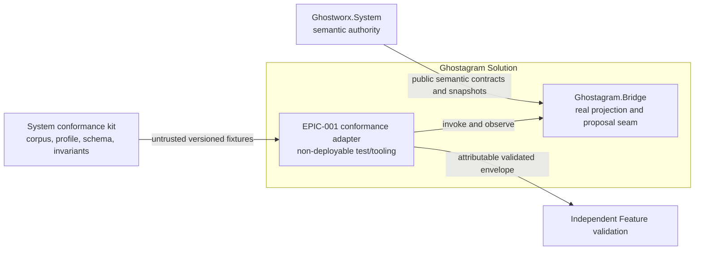
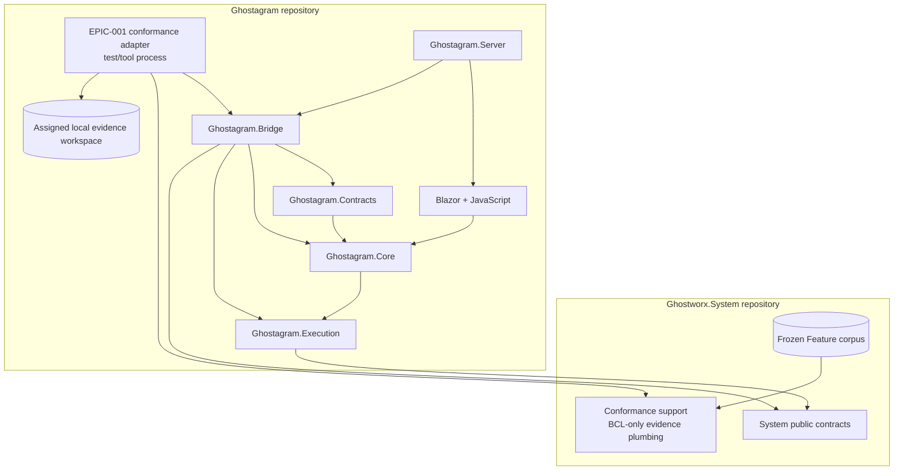
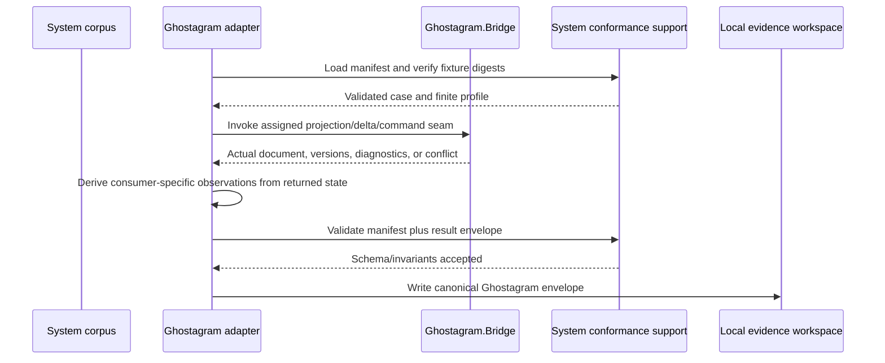
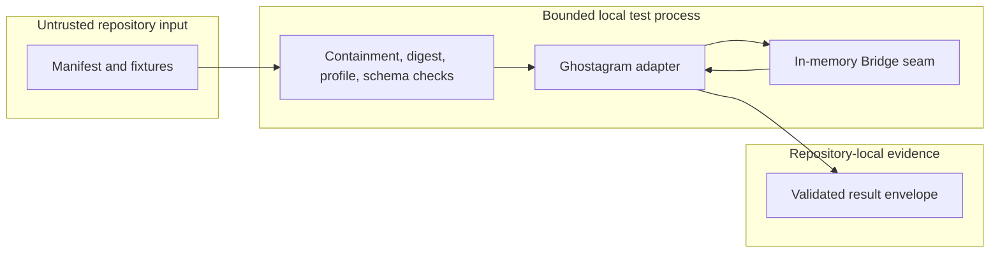

# Ghostagram Solution Architecture

## 1. Decision and Status

This artifact defines the Ghostagram Solution Target needed to consume the EPIC-001 conformance corpora through Ghostagram's real projection boundary. It adds one reusable, child-owned conformance adapter over the existing `Ghostagram.Bridge` projection, delta, and expected-revision command seams. The adapter is evidence infrastructure: it does not become a semantic authority, production runtime, deployable service, UI feature, or live operational projection client.

The independently accepted FEATURE-001 through FEATURE-003 Plan amendments now allocate the bounded Ghostagram adapter mapping, tests, per-Feature evidence workspace, and independent local Validation through this Target. Exact project, module, API, and file placement remains a child Design decision. Implementation remains gated by an accepted Design; FEATURE-002 and FEATURE-003 source, tests, adapter mapping, Evidence, and Validation also remain gated by exact FEATURE-001 delivery Evidence and independently Accepted Validation. Plan reconciliation and independent confirmation do not promote this Target to `Implemented` or `Current`.

### Architectural thesis

- `Ghostworx.System` remains the sole owner of semantic meaning, frozen corpora, profiles, result schemas, invariants, and expected semantic outcomes.
- Ghostagram exercises its existing Bridge behavior and reports what that behavior actually observed; it never relabels a System producer run as a Ghostagram result.
- Semantic graph state and the Ghostagram presentation sidecar remain separately owned and separately revisioned.
- One non-deployable runner is reused across FEATURE-001 through FEATURE-003 through Feature-specific invocation mappings, not copied semantic implementations.
- Missing, failed, malformed, skewed, or unsupported cases remain explicit and block the applicable acceptance obligation.

## 2. Scope and Boundaries

### In scope

- A reusable Ghostagram-owned conformance adapter and runner boundary for EPIC-001 Features 001-003.
- Invocation of the public Bridge seams represented by `IGraphDiagramProjection`, `IGraphDiagramDeltaProjector`, and `IGraphDiagramCommandAdapter`.
- Manifest and fixture loading, digest verification, result-envelope construction, schema validation, and invariant validation through the System-owned conformance support boundary.
- Ghostagram-specific observations for identity, origin, semantic revision, presentation revision, presentation-field exclusion, expected-revision conflict, invalidation/freshness, projection rebuilding, and version skew when assigned by a Feature profile.
- Deterministic result emission into the assigned `.swe/implementations/EPIC-001/FEATURE-00N/` evidence workspace.

### Out of scope

- Any duplicate Graph, Variable, Semantic Link, vocabulary, validation, migration, compatibility, or failure-category implementation.
- UI or browser acceptance, JavaScript rendering, the Blazor Laboratory, interactive sessions, MCP/HTTP behavior, or SignalR delivery.
- The Server-owned live operational Projection Port or Control Port, live runtime overlays, runtime/observability authority, or operational mutation.
- Production providers, credentials, protected registries, policy, deployment, package publication, persistence of protected/runtime fields, or external mutation.
- Source, tests, Design, Evidence, Validation, staging, commit, release, or architecture promotion as part of this reconciliation itself; delivery follows the accepted Plan gates.

### Boundary rules

1. Production dependencies point inward from Ghostagram to System contracts; System production packages never depend on Ghostagram or its adapter.
2. The adapter calls the same public Bridge behavior used by Ghostagram. It may not reproduce an expected outcome from the corpus instead of executing that behavior.
3. A projection is rebuildable consumer state. It cannot mint, retarget, tombstone, resolve, authorize, or otherwise own canonical semantic state.
4. Presentation layout, waypoints, viewport, selection, and presentation revision remain Ghostagram-owned sidecar data and cannot enter portable System definitions.
5. The accepted Plans defer physical project placement to the child Designs. Any change to authority, dependency direction, public Bridge semantics, or production deployment requires architecture revision and independent re-review.

## 3. Governing Inputs and Traceability

| Artifact | Status | Relevance |
|---|---|---|
| [EPIC-001 Concept](../../../.swe/epics/001-semantic-system-foundation/CONCEPT.md) (`CONCEPT-EPIC-001`) | Accepted | Establishes System semantic authority and Ghostagram as a projection consumer. |
| [EPIC-001 Architecture Impact](../../../.swe/epics/001-semantic-system-foundation/ARCHITECTURE-IMPACT.md) (`ARCH-IMPACT-EPIC-001`) | Accepted | Assigns the Ghostagram Bridge, persistence, and presentation boundary to this Solution. |
| [Ghostworx Platform Architecture](../../../architecture/PLATFORM-ARCHITECTURE.md#epic-001-consumer-conformance-adapters) (`ARCH-PLATFORM-GHOSTWORX`) | Target, independently approved | Authorizes child architecture for the reusable conformance adapter and preserves all Solution authorities. |
| [ADR-003](../../../architecture/decisions/ADR-003-bootstrap-child-architecture-before-implementation-planning.md) | Accepted | Permits architecture-only bootstrap before an amended Plan allocates child implementation. |
| [FEATURE-001](../../../.swe/epics/001-semantic-system-foundation/features/001-trusted-semantic-graph-foundation/FEATURE.md) | Accepted | Requires real Ghostagram graph projection and expected-revision conformance evidence. |
| [FEATURE-002](../../../.swe/epics/001-semantic-system-foundation/features/002-graph-native-variable-system/FEATURE.md) | Accepted | Requires projection consumption without implicit resolution, private-locator leakage, or semantic duplication. |
| [FEATURE-003](../../../.swe/epics/001-semantic-system-foundation/features/003-governed-semantic-links/FEATURE.md) | Accepted | Requires link/backreference projection, origin and revision preservation, freshness, and non-authority evidence. |
| [FEATURE-001 Plan](../../../.swe/epics/001-semantic-system-foundation/features/001-trusted-semantic-graph-foundation/IMPLEMENTATION-PLAN.md) (`IMPL-PLAN-EPIC-001-FEATURE-001`) | Accepted amendment | Allocates the real Bridge projection/delta/command/presentation seam, FEATURE-001 mapping and tests, `.swe/implementations/EPIC-001/FEATURE-001/`, envelope, Evidence, and independent local Validation. |
| [FEATURE-002 Plan](../../../.swe/epics/001-semantic-system-foundation/features/002-graph-native-variable-system/IMPLEMENTATION-PLAN.md) (`IMPL-PLAN-EPIC-001-FEATURE-002`) | Accepted amendment | Allocates the Bridge Variable projection mapping and `.swe/implementations/EPIC-001/FEATURE-002/`, gated on independently Accepted FEATURE-001 Validation. |
| [FEATURE-003 Plan](../../../.swe/epics/001-semantic-system-foundation/features/003-governed-semantic-links/IMPLEMENTATION-PLAN.md) (`IMPL-PLAN-EPIC-001-FEATURE-003`) | Accepted amendment | Allocates the Bridge Semantic Link/backreference projection mapping and `.swe/implementations/EPIC-001/FEATURE-003/`, gated on exact FEATURE-001 Evidence and independently Accepted Validation. |

## 4. Solution Context

### External elements

| Element | Relationship | Contract owner |
|---|---|---|
| `Ghostworx.System` public contracts | Supplies authoritative semantic records, graph snapshots, changes, transactions, and versioned contract types consumed by Bridge. | `ghostworx-system` |
| System conformance kit | Supplies the frozen corpus, manifest, profile, digests, envelope schema, validation, and invariants. | `ghostworx-system` |
| Portfolio integration and independent validation | Consumes attributable Ghostagram envelopes and decides whether the Feature obligation is met. | `ghostworx` portfolio |
| Ghostagram developers and CI | Execute the repository-native, non-interactive runner after a Plan allocates it. | `ghostagram` |

### System context diagram



**Question answered:** Which authority supplies meaning, which boundary Ghostagram executes, and where the evidence goes?

**Arrow semantics:** Solid arrows are compile-time/test-input or result flows, not runtime control or ownership transfer.

**Omissions:** UI, live projection, provider hosting, deployment, and downstream Feature implementation are intentionally absent.

## 5. Logical Solution Decomposition

| Unit | Type | Responsibility | EPIC-001 relationship | Deployment unit? |
|---|---|---|---|---:|
| `Ghostagram.Contracts` | Library | Portable diagram commands and transport-shaped records. | Supplies Ghostagram operation records used by the command seam; owns no System semantics. | No |
| `Ghostagram.Core` | Library | Diagram document and presentation datatypes. | Holds the rebuildable projection output. | No |
| `Ghostagram.Execution` | Library | Catalog, compiler, and neutral execution contracts. | Existing dependency path to System Core; execution behavior is outside this adapter. | No |
| `Ghostagram.Bridge` | Library | Projects System graph snapshots plus presentation sidecars and applies revision-checked diagram proposals through System graph transactions. | Required real consumer seam. | No |
| `Ghostagram.Blazor` and JavaScript runtime | UI library/runtime | Browser projection, geometry, and interaction proposals. | Excluded from conformance-adapter execution. | Browser assets only |
| `Ghostagram.Server` | Host | Persistence, commands, layout, sessions, HTTP/MCP/SignalR, and Laboratory composition. | Existing composition proof only; not the adapter entry point and not Server participant evidence. | Yes |
| EPIC-001 conformance adapter | Target test/tooling unit | Loads assigned System corpora, invokes Bridge, records observations, and emits validated Ghostagram envelopes. | Reusable evidence boundary for Features 001-003. Exact project/path awaits each child Design. | No |

### Container view



**Dependency rule:** The adapter may depend on Bridge and the System conformance support boundary in test/tooling. Bridge production code continues to depend only on Ghostagram libraries and System public contracts. The UI and Server do not become dependencies of the adapter.

## 6. The Conformance Adapter Boundary

### 6.1 Reused real seams

| Concern | Existing public seam | Required observation |
|---|---|---|
| Full semantic projection | `IGraphDiagramProjection.Project(GraphSnapshot, GraphPresentationSnapshot)` | Projected canonical IDs, relationships, origin/revision fields, diagnostics, and explicit exclusion of presentation/private fields from semantic state. |
| Projection freshness and invalidation | `IGraphDiagramDeltaProjector.Project(GraphChangeBatch, DiagramDocument, GraphSnapshot, GraphPresentationSnapshot)` | Version advancement, incremental operation batch, or explicit `RequiresFullProjection` fallback without fabricated freshness. |
| Revision-safe proposal interpretation | `IGraphDiagramCommandAdapter.Apply(GraphDiagramCommand)` | Separate expected graph-version and expected diagram-revision acceptance/conflict, stable category, all-or-nothing state, and returned authoritative projection. |
| Presentation ownership | `IGraphPresentationStore` and `GraphPresentationSnapshot` | Independent presentation revision and rebuildable layout/viewport/selection state. |

The adapter must call these seams directly. Calling a System producer runner and changing `Participant` to `ghostagram` is invalid. Calling browser or Server endpoints would test a different boundary and add environment-dependent behavior that the platform Target explicitly excludes.

### 6.2 Feature reuse

The runner has one common lifecycle and a small Feature-specific invocation mapping selected by the manifest/profile. The mapping translates a System-owned case into one of the Bridge calls above, captures only values returned by that call or the resulting authoritative snapshots, and formats those observations through the shared envelope support. It does not decide semantic validity independently.

| Feature | Ghostagram behavior exercised | Fail-closed rule |
|---|---|---|
| FEATURE-001 | Definition projection, canonical identity/origin and revisions, presentation-field exclusion, projection/mirror behavior, expected-revision conflict, skew, and freshness/full-reprojection behavior. | Any case that cannot reach an existing Bridge seam is `unsupported` or `missing`; System producer output cannot substitute. |
| FEATURE-002 | Projection of System-owned Variable definition/reference identity, mode, revision, public provenance and invalidation facts without implicit resolution or protected-locator persistence. | If the accepted corpus cannot execute through the real existing Bridge seam, record `unsupported` and return the Plan/Target to review; the bounded allocation does not silently authorize a Bridge extension. |
| FEATURE-003 | Projection and rebuild of canonical Semantic Link/backreference identity, endpoint origin/roles, link and observation revisions, freshness/invalidation, and presentation-field exclusion. | A projected link cannot mint or mutate canonical identity; unsupported Bridge representation remains explicit. |

Later Feature mappings may reuse the runner and envelope plumbing only after the applicable System capability has exact delivery Evidence and the previous Feature gate is independently accepted. Reuse is not evidence that FEATURE-002 or FEATURE-003 behavior already exists.

### 6.3 Integration catalog

| ID | Producer | Consumer | Pattern / format | Owner | Versioning and failure |
|---|---|---|---|---|---|
| INT-01 | System conformance kit | Ghostagram adapter | File-based manifest and JSON fixtures | System | Exact corpus/profile/schema/digest; malformed or skewed input fails explicitly. |
| INT-02 | Ghostagram adapter | `Ghostagram.Bridge` | In-process public .NET calls | Ghostagram | Compiled contract version; conflict/unsupported outcomes remain observable. |
| INT-03 | Ghostagram adapter | Child evidence workspace | Canonical JSON result envelope | Envelope schema: System; observations: Ghostagram | Schema and invariants must pass before the result is eligible evidence. |
| INT-04 | Child evidence workspace | Portfolio validation | Repository-relative locator | Portfolio | Missing or invalid locator blocks acceptance. |

## 7. Data Ownership and Consistency

| Data | Source of truth | Writers | Ghostagram adapter treatment |
|---|---|---|---|
| Semantic definitions, identities, vocabularies, revisions, Variables, and Semantic Links | `Ghostworx.System` contracts and the relevant semantic authority | System-governed mechanisms only | Read/execute through public contracts; never redefine or persist private fields. |
| Frozen corpus, manifest, profile, limits, expected categories, schema, and invariants | `ghostworx-system` | System conformance owner | Treat as untrusted input; verify containment, digests, profile, schema, and bounds before use. |
| Presentation sidecar | Ghostagram | Bridge presentation store | Ephemeral per conformance run; independently revisioned from graph state, with no persistence allocated by these Plans. |
| Projected `DiagramDocument` | Rebuildable Ghostagram projection | Bridge projection | Observation only; not a semantic source of truth. |
| Result observations and envelope | Ghostagram adapter | Adapter after actual Bridge execution | Record returned categories/fields exactly; validate before writing. |
| Feature acceptance decision | Portfolio independent validator | Validator only | Adapter supplies evidence and cannot approve itself. |

The command seam is the only mutation path used by proposal cases. It checks `ExpectedGraphVersion` before opening a presentation transaction and checks `ExpectedDiagramRevision` at the presentation commit boundary. A successful command commits System graph changes and presentation changes as one adapter operation and returns a fresh authoritative projection. Either conflict returns the current graph version, presentation revision, and authoritative projection without accepting the proposal.

## 8. Runtime Scenarios

### 8.1 Successful case



### 8.2 Unsupported, failed, or invalid case

If no allocated Bridge behavior can execute a case, the adapter records `unsupported` with the requested operation and actual support status. If execution disagrees with the expected outcome, the case is `failed`. Missing cases are `missing`. Malformed corpus content, path escape, digest mismatch, invalid limits, schema failure, private-data leakage, deadline/cancellation failure, or envelope-invariant failure aborts eligible evidence production and surfaces a deterministic diagnostic. None of these paths mutates external systems or turns into a pass.

### 8.3 Expected-revision conflict

The adapter captures a baseline graph version and presentation revision, submits a proposal with the case-specified expected values, and observes `Accepted`, `Code`, returned versions, graph changes, and the authoritative document from `IGraphDiagramCommandAdapter`. It compares semantic and presentation state before and after through authoritative snapshots. A graph-version conflict and a diagram-revision conflict remain distinct observations.

### 8.4 Freshness and full reprojection

The adapter projects a baseline, applies or consumes the System-owned change assigned by the case, and passes the actual `GraphChangeBatch`, current diagram, authoritative snapshot, and presentation snapshot to the delta projector. Version discontinuity or a non-direct projection path must request full projection. The runner then rebuilds from the authoritative snapshots and verifies that canonical identity and revisions are retained without treating old presentation state as fresh semantic state.

## 9. Deployment, Trust, and Security

The adapter is a local test/tool process executed from repository-native build/test automation. It requires no listener, network endpoint, browser, Server process, credential, provider, production data, or deployed resource.



Security controls are fail-closed:

- resolve fixture paths beneath the declared corpus root and reject absolute or escaping paths;
- verify every declared digest before execution;
- use only synthetic, non-secret inputs and no ambient production configuration;
- enforce profile limits, finite deadlines, bounded diagnostic/detail size, and cancellation where the exercised seam supports it;
- exclude credentials, endpoints, private locators, payloads, stack traces, and absolute machine paths from public observations;
- write only to the future Plan-assigned local evidence workspace;
- validate both the System-owned schema and invariant rules before reporting an envelope as eligible evidence.

## 10. Reliability, Determinism, and Operability

| Quality | Target measure | Verification mechanism |
|---|---|---|
| Attribution | Every envelope identifies `ghostagram`, participant/runner version, exact corpus/profile/schema/contract/vocabulary versions, corpus/profile digests, environment, interval, and every case. | System schema plus invariant validation. |
| Completeness | Exactly one result exists for every manifest case; missing and unsupported lists exactly match statuses. | Manifest/envelope cross-validation. |
| Determinism | Identical source revision, corpus, profile, and environment produce equivalent case statuses, categories, diagnostics, and observed fields; timestamps/environment metadata may differ. | Repeat-run comparison in future adapter tests. |
| Boundedness | Every declared profile limit is positive and finite; no case waits beyond its accepted deadline or emits unbounded public detail. | Boundary, timeout, cancellation, and invariant tests. |
| State safety | Failed, unsupported, conflict, cancellation, and malformed-input cases do not corrupt canonical graph or presentation state. | Before/after authoritative snapshot assertions. |
| Automation | The runner is non-interactive and returns non-zero when eligible evidence cannot be produced. | Repository-native CI invocation. |

Operational output is deliberately small: a concise console summary, process exit status, and a canonical JSON envelope. No long-running health endpoint, telemetry backend, alert, runbook, deployment topology, HA, or disaster-recovery mechanism applies to this non-deployable evidence tool.

## 11. Architectural Decisions

| ID | Decision | Rationale | Consequence |
|---|---|---|---|
| AD-GRAM-001 | Reuse the public Bridge projection, delta, and command seams. | They are the real Ghostagram interpretation boundary already consuming System graph contracts. | Conformance remains attributable and exercises production behavior instead of a parallel model. |
| AD-GRAM-002 | Use one runner lifecycle with Feature-specific invocation mappings. | Corpus loading, bounds, envelope construction, and validation are stable across EPIC-001 while observable consumer behavior differs by Feature. | Reuse stays small; each Feature still emits separate evidence and remains prerequisite-gated. |
| AD-GRAM-003 | Keep the adapter non-deployable and independent of UI and Server endpoints. | UI/live projection behavior is excluded and would add environmental coupling unrelated to semantic conformance. | No browser or server is required; UI and operational claims receive no evidence from this runner. |
| AD-GRAM-004 | Preserve separate System graph version and Ghostagram presentation revision. | The current Bridge already enforces dual expected revisions and keeps presentation in a sidecar. | Conflict categories and freshness can be tested without transferring semantic authority. |
| AD-GRAM-005 | Consume System-owned evidence plumbing rather than copy it. | The platform assigns corpus, schema, digest, envelope, and invariants to System. | The accepted Plans require the child Designs to choose a portable test/tooling consumption mechanism; Ghostagram owns only invocation and observation. |

No local ADR is required for these bounded decisions. Create and independently review one if a later Plan introduces a new public Bridge contract, production dependency, deployment unit, data authority, or live operational integration.

## 12. Verification Strategy

After the applicable accepted amended Plan and accepted child Design open implementation, verification must include:

- focused Bridge contract tests for actual full projection, delta fallback/freshness, and dual expected-revision behavior;
- runner tests for manifest containment/digests, exact case coverage, statuses, observed categories, private-field exclusion, bounds, cancellation/deadline, and non-zero failure exit;
- System-owned schema and invariant validation of every emitted envelope;
- a dependency fitness check proving System production packages do not reference Ghostagram and Ghostagram production packages do not reference conformance support;
- repository-native Release build and the closest Bridge/adapter tests;
- `git diff --check`, link validation, and preservation of unrelated worktree changes.

Browser validation is neither required nor sufficient for this adapter because the Target excludes UI and live projection. Any later renderer or interactive behavior change must pass Ghostagram's separate browser-sensitive validation gates.

## 13. Evolution, Sequencing, and Change Rules

1. Preserve the accepted Target and accepted Plan locators in the reconciliation record below.
2. Obtain independent confirmation of this post-Plan reconciliation before any child Design relies on it.
3. Create and independently accept the applicable child Design in the Plan-assigned workspace; each Design chooses exact project/module/API/file placement without broadening allocation.
4. Implement the common runner plus FEATURE-001 mapping, emit attributable FEATURE-001 evidence, and obtain independent local and portfolio acceptance.
5. Only after exact FEATURE-001 delivery Evidence and independently Accepted Validation, implement the FEATURE-002 and FEATURE-003 mappings. Each Feature uses its own corpus and envelope and may expose a genuinely unsupported Bridge capability.

The runner lifecycle and evidence plumbing may evolve independently of Feature-specific invocation mappings when schema compatibility is preserved. A corpus, profile, contract, envelope schema, Bridge public seam, authority, or dependency-direction change requires coordinated review. A new runtime service, UI dependency, provider, persistence authority, or live Projection/Control Port is a solution-breaking scope expansion for this Target.

## 14. Current Baseline and Known Divergence

| Target fact | Current evidence | Divergence |
|---|---|---|
| Real full projection | [`GraphDiagramProjection`](../src/Ghostagram.Bridge/Projection.cs) projects System `GraphSnapshot` plus `GraphPresentationSnapshot` and records graph/presentation revisions. | No EPIC-001 conformance mapping or attributable envelope exists. |
| Real freshness seam | [`GraphDiagramDeltaProjector`](../src/Ghostagram.Bridge/Projection.cs) emits versioned operation batches and requests full projection on incompatible version/path. | No corpus-driven invalidation/freshness evidence exists. |
| Real proposal seam | [`GraphDiagramCommandAdapter`](../src/Ghostagram.Bridge/CommandAdapter.cs) enforces expected graph and diagram revisions and returns authoritative state. | No frozen-corpus runner exercises it as the Ghostagram participant. |
| Server composition | [`GraphWorkspaceService`](../src/Ghostagram.Server/GraphWorkspaces/GraphWorkspaceService.cs) composes projection, presentation store, and command adapter. | It is not the conformance entry point and cannot substitute for a Ghostagram envelope. |
| System evidence support | The current [conformance support project](../../ghostworx-system/tests/Ghostworx.System.Graph.Conformance.Support/) supplies BCL-only corpus and envelope support for FEATURE-001. | A stable cross-repository consumption mechanism and FEATURE-002/003 corpora remain child Design and upstream-delivery work under the accepted Plans. |
| Adapter delivery | None. FEATURE-001 independent Validation remains blocked on external consumer evidence. | Plan allocation now exists; child Design, implementation, tests, Evidence, and independent local Validation remain pending. |

The existing [solution assessment](../docs/architecture/solution-architecture-assessment.md) remains useful current-state evidence for the wider product. It is advisory and does not override this canonical Target or expand the EPIC-001 adapter scope.

## 15. Risks

| ID | Risk | Mitigation | Status |
|---|---|---|---|
| RK-01 | A case is answered from corpus expectations instead of Bridge execution. | Require actual returned Bridge state for every observation; detect relabeled or missing execution as failed/missing. | Open |
| RK-02 | Future Variable or Semantic Link corpora need a projection behavior the current Bridge cannot express. | Record `unsupported`; return the accepted Plan/Target to review before any broader Bridge change. | Open |
| RK-03 | Test/tooling copies System semantic rules or envelope validation. | Consume the System-owned support boundary and keep mappings limited to invocation plus observation. | Open |
| RK-04 | Presentation data leaks into portable semantic records or public result details. | Assert semantic state equality/exclusion and run shared private-data/schema invariants before writing. | Open |
| RK-05 | Current cross-repository project references make the runner machine-layout-dependent. | Each accepted child Design must select a portable build/test consumption mechanism without changing dependency direction. | Open |
| RK-06 | Reuse is mistaken for advance completion of FEATURE-002/003. | Preserve the sequential Feature gates and emit separate corpus/profile-specific envelopes only after upstream delivery evidence exists. | Open |

## 16. Post-Plan Reconciliation

### Exact accepted Plan locators

```yaml
feature_001_plan:
  repository: "ghostworx"
  artifact_id: "IMPL-PLAN-EPIC-001-FEATURE-001"
  path: ".swe/epics/001-semantic-system-foundation/features/001-trusted-semantic-graph-foundation/IMPLEMENTATION-PLAN.md"
  revision: "None"
feature_002_plan:
  repository: "ghostworx"
  artifact_id: "IMPL-PLAN-EPIC-001-FEATURE-002"
  path: ".swe/epics/001-semantic-system-foundation/features/002-graph-native-variable-system/IMPLEMENTATION-PLAN.md"
  revision: "None"
feature_003_plan:
  repository: "ghostworx"
  artifact_id: "IMPL-PLAN-EPIC-001-FEATURE-003"
  path: ".swe/epics/001-semantic-system-foundation/features/003-governed-semantic-links/IMPLEMENTATION-PLAN.md"
  revision: "None"
```

### Reconciliation result

| Feature | Plan-assigned Ghostagram boundary | Local workspace | Gate and result |
|---|---|---|---|
| FEATURE-001 | Existing `Ghostagram.Bridge` projection, delta, command, and presentation seams plus a test/tooling-only mapping, tests, envelope, Evidence, and independent local Validation. | `.swe/implementations/EPIC-001/FEATURE-001/` | Aligned. An independently accepted child Design must choose physical placement before source or tests change. |
| FEATURE-002 | Existing Bridge projection seam plus the Variable identity/mode/revision/provenance, invalidation/freshness, locator-exclusion, no-implicit-resolution, and skew mapping. | `.swe/implementations/EPIC-001/FEATURE-002/` | Aligned and source-closed until exact FEATURE-001 Evidence and independently Accepted Validation; unsupported Bridge behavior returns to Plan/architecture review. |
| FEATURE-003 | Existing Bridge projection seam plus canonical link/origin/endpoint-role/revision, backreference freshness/invalidation, presentation-exclusion, and skew mapping. | `.swe/implementations/EPIC-001/FEATURE-003/` | Aligned and source-closed until exact FEATURE-001 Evidence and independently Accepted Validation; no second authority or runtime meaning is introduced. |

The accepted amendments are coherent with AD-GRAM-001 through AD-GRAM-005 and require no authority, dependency, data-ownership, public Bridge, deployment, or live-projection change. They allocate only the smallest real-seam adapter mapping, tests, Feature-specific envelope, repository-local Evidence, and independent local Validation. Exact project/module/API/file placement remains deferred to each accepted child Design.

All original exclusions remain binding: no UI/browser acceptance, Blazor Laboratory, SignalR, Server runtime Projection Port, live operational view, persistence, protected/runtime state, provider, policy, deployment, relabeled System output, or copied System semantics. The common runner does not satisfy any Feature by reuse alone, and missing, failed, unsupported, skewed, or invalid evidence remains explicit. Architecture lifecycle remains `Target`; this reconciliation supplies no implementation or promotion evidence.

### Reconciliation Confirmation Record

| Field | Value |
|---|---|
| Mode | auto-approve |
| Author | dennis-ritchie (`ghostagram_architecture`, delegated Ghostagram solution architect) |
| Approver | elon-musk |
| Decision | Accepted |
| Recorded | 2026-08-28T13:56:03.8848974-04:00 |
| Evidence | Exact Plan locators and workspaces align with the existing Bridge projection, delta, command, and presentation seams. FEATURE-002/003 remain fail-closed, evidence stays Feature-specific, and no UI, SignalR, live projection, persistence, runtime authority, deployment, copied semantics, or relabeled System execution was introduced. |
| Bypass reason | None |

## 17. Approval Record

| Field | Value |
|---|---|
| Mode | auto-approve |
| Author | dennis-ritchie (`ghostagram_architecture`, delegated Ghostagram solution architect) |
| Approver | elon-musk |
| Decision | Accepted |
| Recorded | 2026-08-28T13:27:01.0334962-04:00 |
| Evidence | ARCH-SOLUTION-GHOSTAGRAM correctly anchors conformance to existing public Bridge contracts. Current indexed source confirms GraphDiagramProjection, GraphDiagramDeltaProjector, and GraphDiagramCommandAdapter, including separate graph/presentation revisions, full-reprojection fallback, and revision-checked proposals. The Target excludes UI, browser, SignalR, Server runtime projection, deployment, and protected state. Existing unrelated Ghostagram modifications remain untouched; the architecture is additive and untracked. |
| Bypass reason | None |
