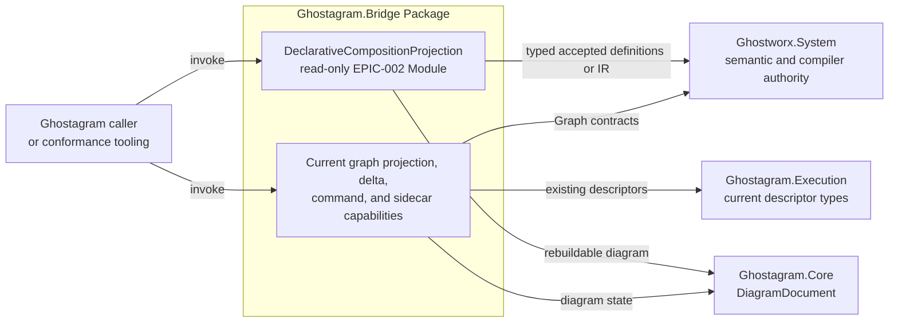
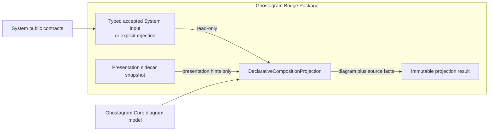
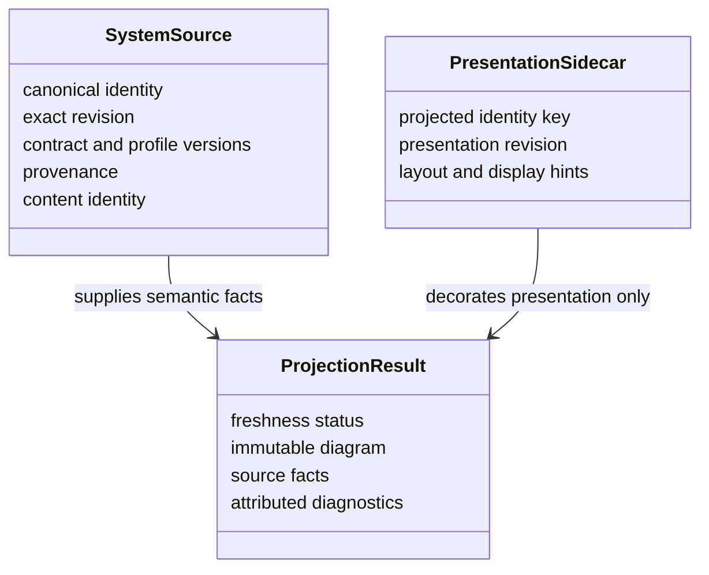
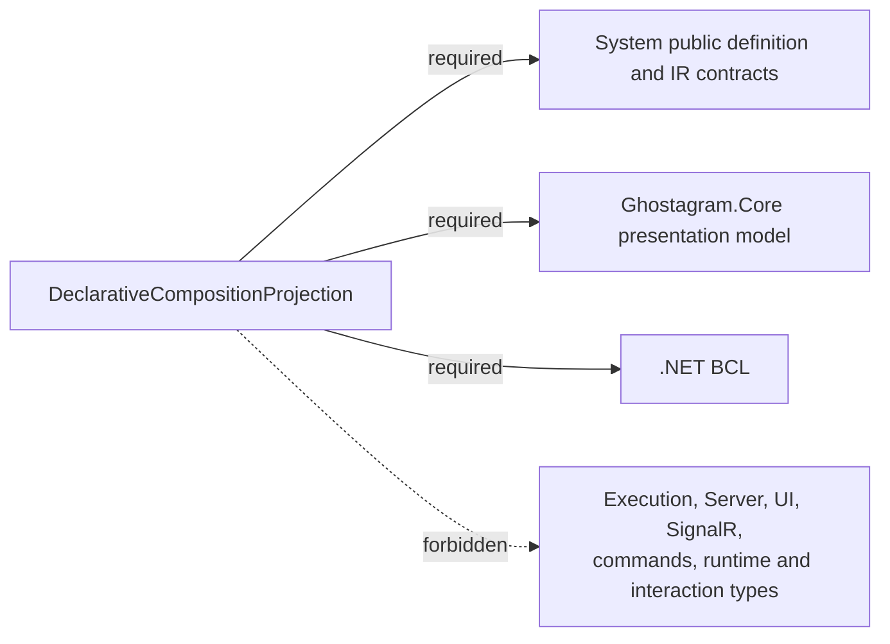
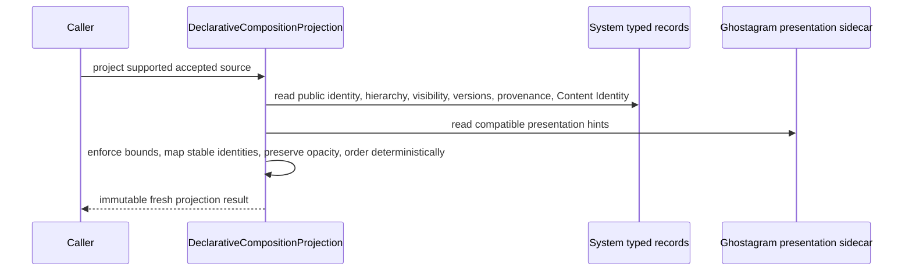
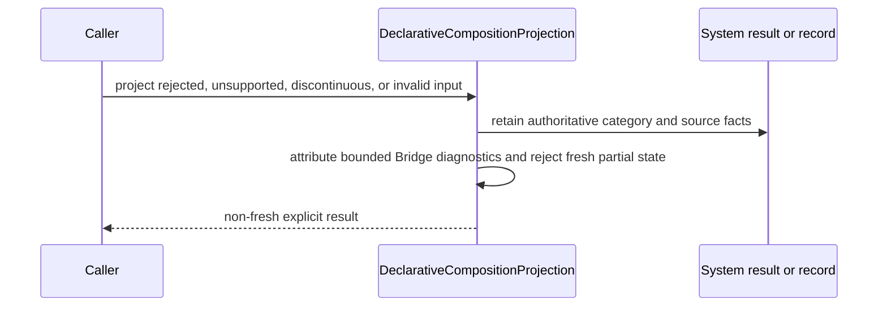
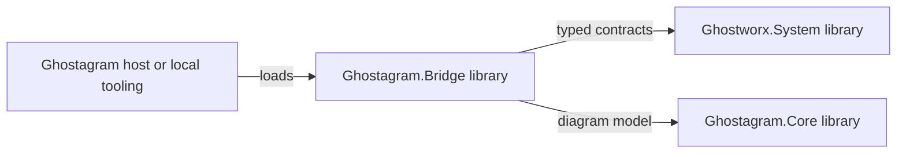

# Ghostagram.Bridge Package Architecture

> Revision 2 is the current Target amendment. The [layered foundation reconciliation](#epic-002-layered-foundation-reconciliation) below replaces the historical P50 Feature/Plan-Pending and delivery sequencing statements. Earlier approval records apply only to their named baseline; revision 2 requires its own independent approval. No implementation or promotion is claimed.

## 1. Purpose

### 1.1 Summary

`Ghostagram.Bridge` is Ghostagram's in-process translation boundary between System-owned semantic records and Ghostagram-owned diagram presentation. Today the library projects authoritative `GraphSnapshot` state into immutable `DiagramDocument` state, produces graph-change operation batches with explicit full-reprojection fallback, interprets revision-checked graph diagram proposals, and owns an independently revisioned presentation sidecar and its strict serializer. This Target adds one bounded EPIC-002 responsibility: read-only projection of accepted System Component Definitions and Composition IR through the `DeclarativeCompositionProjection` Module. System remains the sole semantic, validation, compiler, compatibility, and Content Identity authority.

### 1.2 Scope

**In scope**

- Preserve the existing graph projection, graph delta/fallback, graph command-adapter, presentation-sidecar, profile-mapping, and serialization behavior as current package capabilities.
- Add exactly one formal EPIC-002 Module, `DeclarativeCompositionProjection`, at `architecture/packages/Ghostagram.Bridge/modules/DeclarativeCompositionProjection/MODULE-ARCHITECTURE.md`.
- Consume typed, already validated System Component Definition or Composition IR records and explicit System rejection results.
- Produce immutable, rebuildable diagram projection results that preserve public System identity, hierarchy, visibility, versions, provenance, Content Identity, diagnostics, and freshness while isolating Ghostagram presentation state.
- Supply a future real-seam conformance observation boundary after an Accepted Feature and Implementation Plan allocate delivery.

**Out of scope**

- Authoritative definition or IR authoring, mutation, validation, compilation, migration semantics, compatibility reinterpretation, or Content Identity generation.
- Reuse of `GraphDiagramCommandAdapter` or any other command path for Component Definition edits.
- `Ghostagram.Execution`, palette/catalog behavior, `Ghostagram.Server`, Blazor, JavaScript, SignalR, MCP/HTTP, persistence services, or live operational Projection/Control Ports.
- EPIC-005 Port interaction, routing, dispatch, transport, middleware, control execution, or authorization.
- EPIC-010 materialization, activation, runtime lifecycle, placement, supervision execution, or operational state.
- Source, API, project, namespace, and file placement decisions before an Accepted Feature, Plan, reconciled Target, and Accepted Design.

### 1.3 Package Boundary

- **Compilation/build boundary:** the current [`Ghostagram.Bridge.csproj`](../../../src/Ghostagram.Bridge/Ghostagram.Bridge.csproj) .NET library and its public contracts.
- **Public consumption boundary:** in-process .NET APIs consumed by Ghostagram hosts, tests, and future conformance tooling.
- **Configuration boundary:** constructor-supplied mapping profiles and finite presentation/projection policies; no ambient provider or production configuration.
- **Lifetime boundary:** caller-owned library objects and immutable results within a host process; the Package owns no process or listener.
- **Ownership boundary:** Ghostagram owns projection and presentation meaning; `Ghostworx.System` owns all source semantic meaning.

### 1.4 Stakeholders

| Stakeholder | Primary concern | Uses this document for |
|---|---|---|
| Ghostagram consumers | Stable read-only projection behavior and explicit freshness | Integration and upgrade decisions |
| System contract owners | No semantic duplication or reverse dependency | Contract evolution and conformance |
| Ghostagram maintainers | Cohesive dependency direction and sidecar isolation | Design and change review |
| Independent validators | Real-seam, attributable evidence | Future Feature acceptance |

## 2. Architectural Drivers

### 2.1 Responsibilities

| ID | Responsibility | Architectural consequence |
|---|---|---|
| R-01 | Preserve System semantic meaning in a Ghostagram projection | The new Module consumes only accepted System public records/results and never reconstructs compiler rules. |
| R-02 | Keep portable semantic state separate from presentation | Layout, waypoints, selection, viewport, color, collapsed state, and presentation revision remain Ghostagram sidecar data. |
| R-03 | Make freshness and failure explicit | Results distinguish `fresh`, `stale`, `unsupported`, `skewed`, and `failed`; no failed path returns a fresh partial projection. |
| R-04 | Remain non-executable | Declared operations, `IPort`, `IControl`, and Implementation References are rendered as descriptive facts only. |

### 2.2 Quality Goals

| Priority | Quality attribute | Package-specific meaning | Evidence / measure |
|---|---|---|---|
| 1 | Authority integrity | System identity, visibility, compatibility, and diagnostics are preserved without reinterpretation. | Negative dependency/mapping tests and System-owned conformance invariants. |
| 2 | Determinism | Equivalent accepted input plus equivalent sidecar state yields equivalent projection structure and diagnostics. | Repeat-run and authoring-order permutation tests. |
| 3 | Failure containment | Skew, limits, cancellation, deadline, identity collision, or protected-field leakage yields no fresh partial result or source mutation. | Boundary, redaction, cancellation, and before/after state tests. |
| 4 | Evolvability | Unsupported contract/profile changes fail explicitly and full reprojection remains the safe recovery. | Compatibility matrix and discontinuity tests. |

### 2.3 Constraints and Assumptions

- The Package targets the repository's current .NET runtime and builds as an in-process library.
- The current project references `Ghostagram.Contracts`, `Ghostagram.Core`, `Ghostagram.Execution`, and `Ghostworx.System.Core`.
- The pre-existing Execution reference supports existing descriptor/profile presentation behavior only. It grants no dependency authority to `DeclarativeCompositionProjection`.
- The new Module may depend on accepted System public definition/IR contracts and Ghostagram Bridge/Core presentation abstractions only.
- No authoritative EPIC-002 incremental change contract exists; full reprojection is normative recovery.
- Feature and Implementation Plan are `Pending`. Source/API placement and exact finite values remain deferred.

### 2.4 Non-Goals

- Converting the Bridge into a compiler, runtime, service, authoring authority, or semantic store.
- Treating the current graph command adapter, diagram ports, Execution descriptors, or palette records as ComponentModel meaning.
- Claiming that current graph projection implements the EPIC-002 composition projection.

## 3. Context and Ecosystem

### 3.1 External Context

| External element | Role | Direction | Contract / dependency | Required? |
|---|---|---|---|---|
| `Ghostworx.System` | Semantic and compiler authority | Bridge depends inward | Accepted public Component Definition, Compilation Result, Composition IR, diagnostics, versions, provenance, Content Identity | Yes for EPIC-002 |
| `Ghostagram.Core` | Rebuildable presentation model | Bridge depends inward | `DiagramDocument` and diagram records | Yes |
| Ghostagram host or tooling | Caller/consumer | Calls Bridge | Public package projection results | Yes |
| System conformance kit | Future evidence input and validator | Tooling depends inward | Corpus, profile, schema, invariants, expected identities | Feature/Plan gated |
| `Ghostagram.Execution` | Current descriptor/profile dependency | Existing Bridge depends inward | Pre-existing presentation descriptors only | Existing behavior only; forbidden to the new Module |

### 3.2 Package Context Diagram

**View notes**

- **Question answered:** Which external authorities and models may each package responsibility consume?
- **Arrows:** Compile-time contract dependency and in-process invocation, never authority transfer.
- **Boundary:** Hosting, UI, Server, SignalR, operational projection, and runtime materialization are omitted.
- **Invariant:** The `DCP` node has no path to Execution or the current command capability.

### 3.3 Dependency Classification

| Dependency | Classification | Architectural reason | Replacement strategy |
|---|---|---|---|
| System public contracts | Core | Supply canonical source meaning and explicit results | Contract-version adaptation only through System-governed compatible readers; never copied records. |
| `Ghostagram.Core` | Core | Supplies immutable rebuildable diagram state | Adapt through Bridge-owned projection mapping; do not move semantic authority into Core. |
| `Ghostagram.Contracts` | Current core | Supplies existing diagram operation records | Not used to authorize semantic editing by the new Module. |
| `Ghostagram.Execution` | Current adapter dependency | Supplies existing node descriptors/profile types | Forbidden to the new Module; isolate with architecture fitness checks. |
| System conformance kit | Test/tooling | Validates attributable observations | Future Design selects portable consumption after Plan acceptance. |

## 4. Architecture Strategy

### 4.1 Organizing Principles

- Depend inward on System records; never recreate their identity, validation, compatibility, or failure rules.
- Keep source semantics, projection identity, presentation sidecars, and caller-retained last-known views separately owned.
- Map only explicit public declarations and exports; unavailable private structure remains opaque.
- Prefer immutable inputs/results and full reconstruction over consumer-invented semantic deltas.
- Preserve System diagnostic category/code and attribute Bridge diagnostics separately.
- Keep non-executable declared surfaces visually descriptive and interaction-disabled.

### 4.2 Architectural Style and Patterns

| Pattern / style | Applied to | Reason | Consequence |
|---|---|---|---|
| Anti-corruption adapter | System records to Ghostagram diagram | Prevents presentation concerns from contaminating portable semantics | Mapping is explicit and one-way. |
| Immutable projection | EPIC-002 result | Supports deterministic comparison and safe freshness reasoning | Failure returns a distinct result rather than mutating a partial diagram. |
| Presentation sidecar | Layout and interaction state | Keeps display choices outside System Content Identity | Sidecar compatibility is checked independently. |
| Fail-closed compatibility | Version/profile/extension handling | Prevents silent semantic reinterpretation | Unsupported or skewed input is explicit. |

### 4.3 Dependency Rules

1. `DeclarativeCompositionProjection` may depend only on accepted System public definition/IR/result contracts, Ghostagram Bridge/Core presentation abstractions, and the BCL.
2. It must not reference `Ghostagram.Execution`, palette/catalog types, `Ghostagram.Server`, Blazor, JavaScript, SignalR, MCP/HTTP, operational projection, or materialization/runtime types.
3. It must not call or expose `IGraphDiagramCommandAdapter`, `GraphDiagramCommandAdapter`, graph transactions, or diagram-operation proposals for semantic definition editing.
4. System production packages must never depend on `Ghostagram.Bridge` or any Ghostagram type.
5. Public projection results preserve canonical System identity separately from deterministic Ghostagram projection identity.
6. A new dependency, affected Package, or authoritative editing requirement returns to portfolio P40/P50 before Feature acceptance.

## 5. Package Composition

### 5.1 Formal Module Inventory

| Module | Responsibility | Depends on | Exposes | Lifecycle |
|---|---|---|---|---|
| `DeclarativeCompositionProjection` | Read accepted Component Definition/Composition IR meaning and produce immutable rebuildable diagram, source facts, presentation revision, freshness, and bounded attributed diagnostics | System public contracts; Bridge/Core presentation abstractions; BCL | Read-only projection request/result families and future conformance observation seam; exact API names deferred | Target; architecture path `modules/DeclarativeCompositionProjection/MODULE-ARCHITECTURE.md` |

This is the only formal Module assigned to this Package for EPIC-002. The existing graph projection, delta projector, graph command adapter, presentation store, profile mappers, and sidecar serializer remain current package capabilities; this artifact does not retroactively rename them as additional architecture Modules.

### 5.2 Internal Building-Block Diagram

**View notes**

- **Elements:** Conceptual responsibilities, not source files or proposed CLR type names.
- **Arrows:** Allowed data/dependency flow.
- **Key invariant:** Only the System input supplies semantic meaning; sidecar input cannot change it.
- **Omissions:** Existing graph-specific capabilities, commands, UI, runtime, persistence, and exact API placement.

### 5.3 Key Contract Families

| Contract family | Owner | Role | Stability | Consumer impact |
|---|---|---|---|---|
| Typed Component Definition / Composition IR / Compilation Result | System | Authoritative source input and explicit rejection meaning | System-versioned | Unsupported versions fail explicitly. |
| Presentation sidecar input | Ghostagram Bridge | Optional layout and display hints keyed to stable projected identity | Package-versioned | May be ignored or diagnosed without changing semantic output. |
| Projection result | `DeclarativeCompositionProjection` | Immutable diagram plus source/version/provenance/Content Identity facts, presentation revision, freshness, and diagnostics | Target; exact API deferred | A non-fresh status cannot be mistaken for accepted current state. |
| Projection diagnostic | System or Bridge, distinctly attributed | Bounded category/code and redacted context | Stable categories after Design | Consumers preserve source attribution. |

## 6. Public API and Compatibility

### 6.1 API Families

| API family | Purpose | Primary consumers | Stability level | Notes |
|---|---|---|---|---|
| Full definition projection | Project one supported accepted definition view into a rebuildable diagram result | Ghostagram hosts and tooling | Target | Read-only; no command surface. |
| Full IR projection | Project one supported accepted Composition IR into a rebuildable diagram result | Ghostagram hosts and tooling | Target | Preserves exact compiler/profile/canonicalization and Content Identity facts. |
| Explicit failure/rejection projection | Report rejected, unsupported, skewed, stale, or failed source without a fresh partial diagram | Ghostagram hosts and tooling | Target | System and Bridge diagnostics remain separately attributed. |
| Conformance observation | Expose actual projection facts to future test/tooling | Independent validation | Feature/Plan gated | Cannot relabel a System producer run. |

Exact CLR type names, overloads, namespaces, source files, and package-public visibility are Design decisions after Plan acceptance.

### 6.2 Public vs Internal Boundary

- **Public surface:** the smallest immutable request/result contracts needed for read-only projection and explicit status/diagnostics.
- **Internal surface:** identity mapping, visibility traversal, sidecar merge, deterministic ordering, redaction, and finite-bound enforcement.
- **Dynamic exposure:** no reflection-based loading, runtime activation, executable extension, or provider discovery.
- **Command exposure:** none for Component Definition or Composition IR mutation.

### 6.3 Compatibility and Evolution

- Source and binary compatibility policy follows the repository's future accepted package-version policy; this Target does not assign a release.
- Behavioral compatibility requires the same supported System source meaning to retain identity, visibility, attribution, and fail-closed status behavior.
- Serialization compatibility applies only to Ghostagram presentation sidecars; System portable-record compatibility remains System-owned.
- Breaking changes include visibility widening, identity remapping without lineage, failure-to-success reinterpretation, executable meaning, or dependency on a forbidden runtime/interaction surface.
- Unsupported contract, compiler, canonicalization, profile, or extension versions never fall back to best-effort interpretation.

## 7. Model and State

### 7.1 Conceptual Model

### 7.2 State Ownership

| State | Owner | Lifetime | Mutation authority | Persistence |
|---|---|---|---|---|
| Component Definition, Compilation Result, Composition IR | System | Versioned immutable record | System-governed mechanisms only | System-owned |
| Projection result | Caller over Bridge result | Immutable result lifetime | None | Rebuildable; caller may retain last-known state only with explicit status |
| Presentation sidecar | Ghostagram | Independently revisioned | Ghostagram presentation operations | Strict sidecar serialization is available; durable store is caller-owned |
| Projection diagnostics | System or Bridge, attributed | Result lifetime | Producer of the diagnostic | Bounded result data only |

### 7.3 Core Invariants

1. A fresh result identifies the exact source revision/Content Identity and presentation revision used to build it.
2. Private or non-exported constituent declarations never appear or become inferable in the public projection.
3. `VariableBinding`, resolved payloads, credentials, private locators, runtime handles, and provider state never enter public projection state.
4. A rejected or failed input produces no diagram labeled as a fresh accepted projection.
5. Presentation changes never alter System identity, semantic equivalence, or Content Identity.
6. Selecting a projected declared surface cannot connect, dispatch, invoke, activate, load, or control anything through this Module.

## 8. Dependency Architecture

### 8.1 Dependency Diagram

The dashed edge denotes a prohibited dependency, not an optional integration.

### 8.2 Transitive Dependency Policy

- System implementation-only types and consumer-local presentation types do not leak across each other's public contract boundaries.
- The Package's pre-existing project-level Execution reference is a known coarse assembly dependency. The new Module must remain type- and call-graph independent of it through architecture fitness checks selected in Design.
- If that isolation cannot be proved within the current build boundary, the accepted Feature/Plan must return to architecture review before selecting a physical split; this Target does not silently allocate another Package.
- No native, network, provider, or dynamically loaded dependency is permitted for the new Module.

## 9. Runtime Architecture

### 9.1 Accepted Definition or IR Projection

The operation is side-effect free with respect to System records and caller-owned sidecar state.

### 9.2 Rejected, Skewed, Stale, or Failed Input

Full reprojection is the normative recovery after any source revision, Content Identity, profile, visibility, or projection-identity discontinuity. Incremental composition projection is unavailable until a separately accepted System revision/change contract proves equivalent semantics.

### 9.3 Concurrency and Failure

- Inputs and results are immutable; projection implementations should be reentrant and must not depend on mutable ambient state.
- Sidecar snapshots are read at one explicit presentation revision; merging does not mutate the supplied snapshot.
- Cancellation and deadline propagate through bounded traversal and mapping once exact APIs are assigned.
- Identity collision, bound exhaustion, cancellation, deadline, private-field leakage, incompatible sidecar data, or mapping failure returns one explicit non-fresh result with bounded redacted diagnostics.
- No failure mutates System state, Graph/Variable history, bindings, prior accepted IR, or presentation sidecars.

## 10. Integration and Extension

| Integration | Direction | Mechanism | Contract owner | Optional? |
|---|---|---|---|---|
| System definition/IR input | System to Bridge | Typed in-process public records/results | System | No for EPIC-002 |
| Ghostagram presentation sidecar | Ghostagram to Bridge | Immutable snapshot/hints | Ghostagram Bridge | Yes |
| Diagram result | Bridge to caller | Immutable Ghostagram Core model plus projection facts | Bridge/Core | No |
| Conformance corpus/validation | System kit to Ghostagram tooling | Future file/test-tooling boundary | System schema; Ghostagram observations | Feature/Plan gated |

Extension rules are fail-closed: compatible unknown System extensions may be preserved only through a System-approved typed or opaque consumer view; Bridge never interprets executable meaning. Presentation profiles may affect rendering only and cannot widen visibility, change canonical identity, create interaction behavior, or alter System diagnostics.

## 11. Cross-Cutting Concerns

### 11.1 Error Handling and Observability

- Preserve System failure category/code, affected public identity, and version facts without converting failure to success.
- Emit Bridge projection failures in a distinct namespace/category with bounded redacted detail.
- Include source identity/revision, compatibility versions, Content Identity, presentation revision, freshness status, and correlation where supplied.
- Do not emit stack traces, credentials, protected tenant context, private locators, resolved values, runtime handles, or non-exported declarations.

### 11.2 Performance and Bounds

- Projection work is bounded by a positive finite profile covering recursion depth, declarations, references, exports, requirements, declared surfaces, strings, document size, diagnostics, and wall-clock/cancellation behavior.
- Traversal and ordering targets linear or `O(n log n)` work in projected records and relationships; no unbounded recursive or quadratic fallback is acceptable without measured justification.
- Caching is caller-owned and may never substitute stale data for a fresh result. Full reprojection remains authoritative recovery.

### 11.3 Security and Trust

- Typed input remains untrusted until System compatibility/content-identity validation and Bridge projection bounds have succeeded.
- Projection identity is deterministic and collision-checked while retaining canonical System identity separately.
- No Semantic Address, declared surface, Implementation Reference, or diagram element grants access, authorization, connection, invocation, or execution rights.
- The Package introduces no listener, secret, network trust boundary, deployment identity, or operational control plane.

### 11.4 Persistence and Serialization

- System definitions and IR are never persisted by this Package as authoritative state.
- Current `GraphPresentationJsonSerializer` demonstrates strict deterministic serialization of the separately durable graph presentation sidecar; it is baseline evidence, not the EPIC-002 portable-record format.
- Composition-specific sidecar schema/keying and migration remain Design choices after Feature/Plan acceptance.
- A last-known projection may be retained only with explicit stale/source-fact labeling and can never become a semantic source of truth.

## 12. Packaging, Distribution, and Hosting

| Artifact | Purpose | Consumer | Versioned? |
|---|---|---|---:|
| `Ghostagram.Bridge` library assembly | In-process projection, sidecar, and current graph bridge behavior | Ghostagram hosts and tooling | Repository/package policy |
| Future conformance result | Attributable real-seam observations | Independent validation | By System-owned schema/profile |

- **Build project:** `src/Ghostagram.Bridge/Ghostagram.Bridge.csproj`.
- **Target framework:** current repository target `net10.0`.
- **Generated/native assets:** none allocated.
- **Deployment status:** in-process library; not a sidecar process, service, endpoint, worker, or browser asset.
- **Release status:** no release, publication, version bump, or compatibility claim is authorized by this Target.

## 13. Architectural Decisions

| ID | Decision | Status | Rationale | Consequence / trade-off | ADR |
|---|---|---|---|---|---|
| AD-BRIDGE-EP2-001 | Add exactly one `DeclarativeCompositionProjection` Module to the existing Bridge Package. | Accepted by parent Solution Target and independent Package review; lifecycle remains `Target` | Projection, freshness, diagnostics, sidecar isolation, and conformance observation form one cohesive responsibility. | Keeps one bounded handoff; exact API/source placement remains deferred. | Parent AD-GRAM-EP2-001/002 |
| AD-BRIDGE-EP2-002 | Depend inward on typed System records/results and never copy compiler or compatibility semantics. | Target | Preserves one semantic authority. | Unsupported versions fail explicitly. | ADR-008 and parent contract |
| AD-BRIDGE-EP2-003 | Use full reprojection as normative recovery. | Target | No accepted System incremental composition-change contract exists. | Potentially more work, but no consumer-invented delta semantics. | Parent AD-GRAM-EP2-003 |
| AD-BRIDGE-EP2-004 | Keep graph command editing and declared-surface interaction outside the Module. | Target | Existing graph proposals and Execution types do not authorize Component Definition mutation or EPIC-005 behavior. | The new projection is read-only and non-executable. | ADR-005 and parent AD-GRAM-EP2-004/005 |

No Package-local ADR is required for these parent-aligned decisions. A public cross-solution contract change, authoritative edit command, new dependency direction, new Package, or deployable/live integration requires renewed architecture assessment and independent review.

## 14. Quality and Verification

| ID | Scenario | Expected response | Future verification after Feature and Plan acceptance |
|---|---|---|---|
| Q-01 | A private constituent surface is present in source records. | It is absent or opaque in the public projection and cannot be inferred. | System negative corpus plus real projection observation. |
| Q-02 | Equivalent accepted IR and sidecar input are projected repeatedly. | Equivalent diagram identity, hierarchy, facts, freshness, and diagnostics. | Repeat/permutation tests. |
| Q-03 | Source revision or Content Identity changes discontinuously. | Prior view is stale and full reprojection is required. | Discontinuity tests. |
| Q-04 | Layout or selection changes. | Only presentation revision/state changes. | Sidecar isolation tests. |
| Q-05 | A projected `IPort`, `IControl`, Operation, or Implementation Reference is selected. | No connector, dispatch, activation, load, route, or control is available. | API and dependency fitness tests. |
| Q-06 | Input is over limit, cancelled, incompatible, or contains protected data. | Explicit bounded non-fresh failure; no source/sidecar mutation or sensitive detail. | Boundary, cancellation, redaction, and state tests. |
| Q-07 | Conformance tooling runs the real seam. | Envelope identifies `ghostagram`, exact corpus/profile/schema/digests, source revision, every case, observations, and explicit missing/failed/unsupported lists. | System schema/invariant validation plus independent local Validation. |

Architecture checks must prove the new Module has no type or call dependency on Execution, commands, Server, UI, SignalR, operational projection, EPIC-005 interaction, or EPIC-010 materialization surfaces. Repository-native Release build/tests, link checks, Mermaid/static hygiene, and `git diff --check` are required when delivery gates open; none are implementation evidence in this architecture-only run.

## 15. Risks and Current Divergence

| ID | Risk / divergence | Likelihood | Impact | Mitigation | Status |
|---|---|---|---|---|---|
| RK-01 | The current assembly has a project-level Execution reference, making logical isolation weaker than a project boundary. | M | H | Enforce new-Module dependency fitness in Design; return to architecture if isolation cannot be proved without another Package. | Open |
| RK-02 | Current graph projection types are mistaken for composition projection delivery. | M | H | Preserve the explicit baseline/Target distinction and require real System composition records in conformance. | Open |
| RK-03 | Diagram ports or command operations acquire ComponentModel interaction/edit meaning. | M | H | Keep all commands and Execution contracts forbidden; negative API tests. | Open |
| RK-04 | Sidecar key mismatch or source skew makes stale state appear current. | M | H | Correlate exact source revision/Content Identity with presentation revision; full reprojection on discontinuity. | Open |
| RK-05 | Private or protected fields leak through generic metadata projection. | M | H | Project only the System-approved consumer view and apply redaction/invariant checks before a fresh result. | Open |

| Target fact | Current evidence | Divergence |
|---|---|---|
| Authoritative snapshot projection pattern | [`GraphDiagramProjection`](../../../src/Ghostagram.Bridge/Projection.cs) consumes `GraphSnapshot`, emits `DiagramDocument`, and records graph/presentation revisions and projection diagnostics. | It projects EPIC-001 Graph snapshots, not Component Definitions or Composition IR. |
| Explicit delta fallback | [`GraphDiagramDeltaProjector`](../../../src/Ghostagram.Bridge/Projection.cs) requests full projection when version/path assumptions fail. | No accepted composition delta contract or source Content Identity correlation exists. |
| Revisioned sidecar | [`GraphPresentationSnapshot` and `GraphPresentationStore`](../../../src/Ghostagram.Bridge/BridgeContracts.cs), plus [`GraphPresentationJsonSerializer`](../../../src/Ghostagram.Bridge/GraphPresentationJsonSerializer.cs), isolate layout/viewport/selection state. | No composition-specific projected identity keying or sidecar compatibility exists. |
| Revision-checked proposals | [`GraphDiagramCommandAdapter`](../../../src/Ghostagram.Bridge/CommandAdapter.cs) commits graph/presentation proposals against expected revisions. | This command path is explicitly forbidden for Component Definition/IR editing. |
| EPIC-002 projection | None. | Package and Module architecture are Target only; source, tests, evidence, and validation do not exist. |

## 16. Evolution and Lifecycle

- **Feature:** `Pending`.
- **Implementation Plan:** `Pending`.
- **Architecture lifecycle:** `Target`; approval does not imply `Implemented` or `Current`.
- **Post-Plan rule:** reconcile exact allocation, acceptance criteria, integration paths, conformance duties, API/project placement, and evidence workspace before Design.
- **Escalation rule:** a material Plan mismatch, another affected Package, a required Core/Execution/Server/UI change, an authoritative editing command, or a runtime/interaction dependency returns to portfolio P40/P50 and independent architecture review.
- **Promotion rule:** implementation Evidence is required for `Implemented`; independent validation and reconciliation are required for `Current`.

## 17. Traceability

| Artifact | ID / status | Package constraint |
|---|---|---|
| [EPIC-002](../../../../../.swe/epics/002-declarative-composition-model/EPIC.md) | `EPIC-002`, Accepted | Definition-only composition outcome. |
| [Concept](../../../../../.swe/epics/002-declarative-composition-model/CONCEPT.md) | `CONCEPT-EPIC-002`, Accepted | Recursive identity, encapsulation, non-executable surfaces, and strict runtime separation. |
| [Architecture impact](../../../../../.swe/epics/002-declarative-composition-model/ARCHITECTURE-IMPACT.md) | `ARCH-IMPACT-EPIC-002`, Accepted | Ghostagram Package and Module are `change`; Execution, Server, UI, SignalR, and live operations are excluded. |
| [Platform Target](../../../../../architecture/PLATFORM-ARCHITECTURE.md#epic-002-parent-architecture-assignment) | `ARCH-PLATFORM-GHOSTWORX`, Target and approved | Exact `repos/ghostagram` P50 assignment, Plan Pending. |
| [ADR-008](../../../../../architecture/decisions/ADR-008-pre-feature-child-target-architecture-assignment.md) | `ADR-008`, Accepted | Architecture-only pre-Feature assignment and post-Plan reconciliation. |
| [Declarative Component Composition](../../../../../architecture/contracts/DECLARATIVE-COMPONENT-COMPOSITION.md) | `CONTRACT-DECLARATIVE-COMPONENT-COMPOSITION`, Accepted | Normative producer/consumer, failure, compatibility, and conformance meaning. |
| [ADR-005](../../../../../architecture/decisions/ADR-005-componentmodel-port-definition-and-port-interaction-ownership.md) | `ADR-005`, Accepted | EPIC-002 definition identity remains separate from EPIC-005 interaction behavior. |
| [Ghostagram Solution Target](../../SOLUTION-ARCHITECTURE.md#17-epic-002-declarative-composition-projection-target) | `ARCH-SOLUTION-GHOSTAGRAM`, Target and approved | Selects `Ghostagram.Bridge` and exactly one `DeclarativeCompositionProjection` Module. |
| [Ghostagram context](../../../CONTEXT.md) | `CONTEXT-GHOSTAGRAM`, Accepted | Read-only projection vocabulary and sidecar separation. |
| [Ghostagram governance](../../../AGENTS.md) | EPIC-002 reconciliation Accepted | Authorizes this exact Target only; delivery remains closed. |

## 18. Approval Record

| Field | Value |
|---|---|
| Mode | auto-approve |
| Author | package-architect (`epic002_ghostagram_bridge_package`) |
| Approver | elon-musk (`epic002_concept_approval`) |
| Decision | Accepted |
| Recorded | `2026-08-29T05:42:51.8942476-04:00` |
| Evidence | Independent cycle-zero `$swe-architect -review` verified one `DeclarativeCompositionProjection` Module and exact locator, read-only typed System input, immutable rebuildable projection, sidecar isolation, explicit freshness/failure, full-reprojection recovery, and enforceable exclusion of Execution, graph commands, Server/UI/SignalR, EPIC-005 interaction, and EPIC-010 materialization. Current source confirms the projection/delta/sidecar/command seams and the pre-existing project-level Execution reference; the new Module requires negative type/call dependency fitness checks. All 16 local links and anchors resolve; 51 headings are unique; 14 fences are balanced. |
| Bypass reason | None |

## EPIC-002 Layered Foundation Reconciliation

### Accepted authority and revision scope

This revision follows Accepted [EPIC-002 revision 2](../../../../../.swe/epics/002-declarative-composition-model/EPIC.md), [CONCEPT-EPIC-002 revision 2](../../../../../.swe/epics/002-declarative-composition-model/CONCEPT.md), [ARCH-IMPACT-EPIC-002 revision 2](../../../../../.swe/epics/002-declarative-composition-model/ARCHITECTURE-IMPACT.md), the [Platform layered Target amendment](../../../../../architecture/PLATFORM-ARCHITECTURE.md), human-Accepted [ADR-009](../../../../../architecture/decisions/ADR-009-epic-002-definition-packaging-and-planning-gates.md), and accepted Graph/composition contract revisions. The independent parent decisions are recorded in [REVIEW-EPIC-002-LAYERED-PLANNING](../../../../../architecture/reviews/EPIC-002-LAYERED-PLANNING-REVIEW.md). The author is consumer_planning; Justin explicitly named independent @elon-musk as approver. No bypass is used.

The exact foundation handoff is [FEATURE-004](../../../../../.swe/epics/002-declarative-composition-model/features/004-layered-system-definition-foundation/FEATURE.md) and [IMPL-PLAN-EPIC-002-FEATURE-004](../../../../../.swe/epics/002-declarative-composition-model/features/004-layered-system-definition-foundation/IMPLEMENTATION-PLAN.md), repository ghostworx, revision 1. It assigns this child workspace [.swe/implementations/EPIC-002/FEATURE-004/](../../../.swe/implementations/EPIC-002/FEATURE-004/). Detailed Feature/Plan approval is separate from this Target review.

### Package refinement

Retain `ARCH-PACKAGE-GHOSTAGRAM-BRIDGE` and its single composition Module `DeclarativeCompositionProjection`. FEATURE-004 updates existing Bridge metadata/reference boundaries; FEATURE-003 adds the separate read-only composition consumer. Existing graph projection, commands and presentation behavior are preserved according to their current ownership.

Pure projection functions consume typed portable System snapshots/changes and `GraphSemanticValue` metadata. Ghostagram objects, layout, selection, viewport, waypoints and presentation revisions remain local typed sidecars. Existing graph-command/persistence bridges consuming mutable stores belong to outward adapter modules and may reference System Graph.Runtime; the pure projection module has no call/type dependency back to them. A project split is required only if the dependency cannot be enforced at the actual consumer boundary.

FEATURE-003's Module consumes System Composition D3 with canonical Variable D2 and required Core D0/D1 records. Bridge's pre-existing Execution dependency remains available only to unrelated existing graph/descriptor behavior. It cannot enter `DeclarativeCompositionProjection`, which uses Bridge/Core presentation abstractions and inert System contracts only.

F004 direct source/reference changes preserve existing behavior and need only a short affected-project/reference map, builds, relevant tests and focused typed-metadata/sidecar/dependency checks for Ghostagram-owned AC-007 and AC-009. F003's AC-001 through AC-007, explicit freshness union, producer-bound conformance and visible read-only verification remain unchanged. No definition editing, route/control affordances, semantic authority or new runtime scope is introduced.

### Design and delivery gates

F004 Design requires Accepted FEATURE-004, its Plan and this applicable Target revision; consumer Design finalizes against the accepted System F004 Design. Consumer reference work can use that same System checkout/build outputs after accepted local Designs without waiting for F004 to accept itself. F004 portfolio acceptance requires the System and all three consumer Evidence and independent local Validation records.

The composition allocation is [FEATURE-003](../../../../../.swe/epics/002-declarative-composition-model/features/003-ghostagram-composition-projection/FEATURE.md), with [IMPL-PLAN-EPIC-002-FEATURE-003](../../../../../.swe/epics/002-declarative-composition-model/features/003-ghostagram-composition-projection/IMPLEMENTATION-PLAN.md). Its revision 2 detailed approval and this Target reconciliation must be Accepted before Design. The accepted local F004 Design and accepted System F001 Design freeze establish the Design inputs. F003 source delivery waits for F004 and F001 portfolio acceptance, producer Evidence/independent Validation, and the accepted producer manifest/envelope.

Architecture approval keeps lifecycle Target. Source, tests, Evidence, Validation and architecture promotion are subsequent phases. Earlier P50 Pending statements describe the historical bootstrap only; these current locators and distinct Design/delivery gates govern EPIC-002. A material conflict returns to the owning architecture/Plan before dependent work.

### Revision 2 Approval Record

| Field | Value |
|---|---|
| Mode | auto-approve |
| Author | consumer_planning |
| Approver | elon-musk (`/root/elon_musk_approval`) |
| Decision | Accepted |
| Recorded | 2026-09-06T22:52:00+00:00 |
| Evidence | [Independent @elon-musk review](../../../../../architecture/reviews/EPIC-002-LAYERED-PLANNING-REVIEW.md#consumer-package-targets-revision-2). Accepted Solution parent verified. Portable projection, outward command/persistence, Execution baggage and typed sidecars have clear dependency boundaries; F004 and F003 scopes remain distinct. No conditions; lifecycle remains Target. |
| Bypass reason | None |
