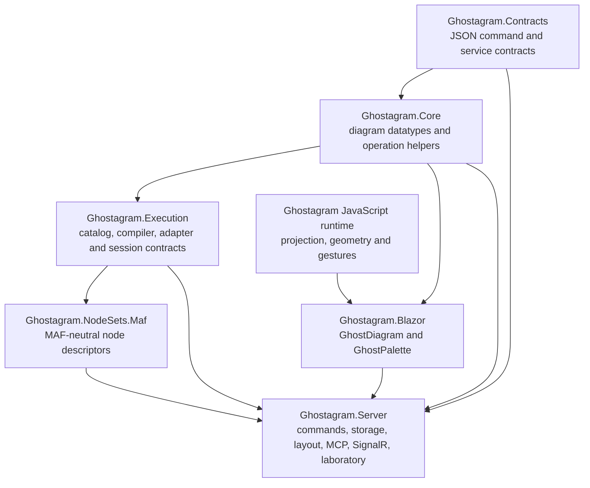
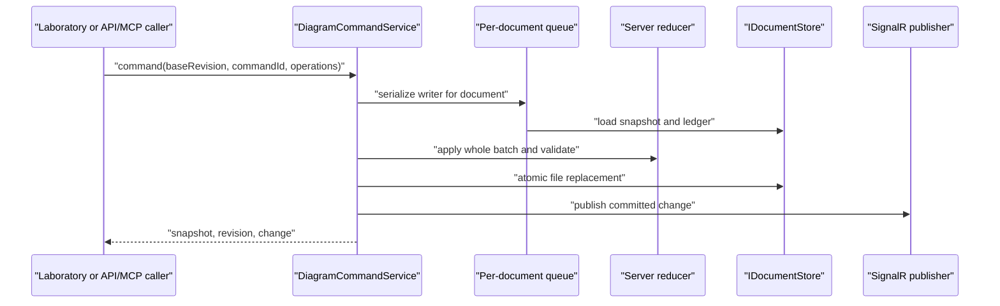
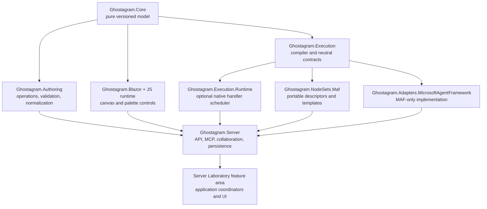

# Ghostagram solution architecture assessment

**Assessment date:** 2026-08-08
**Scope:** current source, solution/project references, architecture records, focused tests, JavaScript runtime, Blazor components, Server laboratory, command/persistence pipeline, execution abstractions, and the MAF node set.

## Executive assessment

Ghostagram is presently a strong **local-first diagram authoring platform** and a promising **graph execution architecture**, but it is not yet a complete graph orchestration engine.

The project boundaries are directionally correct:

- `Ghostagram.Core` holds heterogeneous diagram data.
- `Ghostagram.Execution` holds node catalogs, compilation, adapter-neutral run contracts, and run-session lifecycle.
- `Ghostagram.NodeSets.Maf` describes a provider-neutral MAF authoring vocabulary.
- the JavaScript runtime owns browser geometry, rendering, and interaction proposals.
- `Ghostagram.Blazor` packages that runtime as reusable Razor components.
- `Ghostagram.Server` owns durable document commands, layout, local persistence, realtime publication, MCP/HTTP hosting, and the integrated laboratory.

Those layers are useful independently to different degrees, and their dependencies mostly point in the right direction. The strongest independently useful surfaces today are the JavaScript runtime, the diagram data model, the palette/diagram Blazor controls, the layout service, and the Server command pipeline. The weakest claim is execution: the compiler and adapter/session boundary are substantial, but production code does not schedule registered `INodeHandler` implementations and no Microsoft Agent Framework adapter exists.

The central architectural risk is no longer whether the features can be built. It is **semantic duplication**. Diagram mutation and validation rules are independently implemented in JavaScript, the Server reducer, and the execution compiler. SVG projection exists in both JavaScript and C#. Application orchestration is concentrated in a 1,267-line laboratory page. Without a conformance layer, these implementations will gradually disagree.

### Overall verdict

| Area | Current maturity | Independent value | Main limitation |
|---|---|---|---|
| Browser diagram runtime | Strong prototype / early library | High | Monolithic engine, no DOM/browser automation, at-most-once event delivery |
| Blazor diagram and palette | Useful reusable controls | High as a JS/Blazor pair | Imperative synchronization and limited component lifecycle testing |
| C# diagram model | Sound heterogeneous model | Medium-high | No single model validator/schema version; several weakly typed fields |
| Server authoring pipeline | Strong local-first host | High | Process-local concurrency, file persistence, no security or integrated realtime client |
| Node catalog/compiler | Strong architectural foundation | Medium-high | Not connected to a production node scheduler |
| Execution session/adapter boundary | Good boundary design | Medium | Requires a custom adapter; several policy budgets are delegated rather than enforced |
| MAF node set | Good authoring vocabulary | Medium as metadata | No handlers, templates, or real MAF adapter |
| Integrated orchestration product | Not implemented | Low | No executable end-to-end agent workflow |

## Current dependency architecture

The diagram reveals one dependency that should be reconsidered: `Ghostagram.Core` references `Ghostagram.Contracts` because `DiagramOperations` returns `GhostagramOperation`. A datatype library should ideally not depend on server/transport contracts. Moving operation construction to a small `Ghostagram.Authoring` or `Ghostagram.Operations` package would make the model genuinely foundational.

## Layer-by-layer assessment

### Contracts

`Ghostagram.Contracts` defines JSON-shaped command, snapshot, change, layout, session, read, and export records. It does not depend on Server or UI implementation, which makes it a useful transport boundary for HTTP, MCP, SignalR, tests, and alternate hosts.

What is working well:

- command IDs, actor IDs, base revisions, change records, and snapshots give the authoring pipeline explicit concurrency semantics;
- `JsonElement` preserves an open document format without forcing transport consumers to load the typed model;
- the same contracts support Server endpoints and MCP/session adapters.

What remains:

- add explicit protocol/document schema versions and compatibility rules;
- specify operation semantics independently of either reducer, especially cascading removal and rendering-only viewport operations;
- generate or publish JSON Schema for commands, models, events, and diagnostics;
- separate portable authoring contracts from Server-specific session/export contracts if non-server consumers begin using the package.

### Core diagram datatypes

The decision to keep `DiagramDocument` and `DiagramNode` heterogeneous and non-generic is correct. A diagram can contain many node types, old files remain readable, and dynamic property values remain JSON-safe. Typed behavior belongs at the registry/handler boundary, not in persisted polymorphic CLR objects.

Current strengths:

- nodes support stable type identity (`TypeId` and `TypeVersion`), primitive/custom JSON properties, display modes, validation metadata, and property-bound ports;
- ports contain topology policies, scopes, capacity, endpoint appearance, and property association;
- groups, connector types, overlays, waypoints, styles, viewport, and selection remain data rather than renderer objects;
- extension data on documents, nodes, node properties, and ports preserves some future fields;
- `DiagramGroupMembership` shares nested drop selection semantics with the Server palette flow;
- `DiagramBuilder` and `DiagramOperations` provide a small C# creation surface.

Important limitations:

1. There is no canonical `DiagramDocument` validator in Core. Browser acceptance, Server persistence, and execution compilation apply different rules.
2. Forward compatibility is partial. `DiagramEdge`, `DiagramGroup`, styles, overlays, endpoints, policies, and edge types do not carry extension data.
3. `DiagramPort.Anchor`, edge animation, and edge-type animation are `object?`. This is convenient for interop but weakens the goal of treating graph models as well-defined datatypes.
4. Collections are exposed as `IReadOnlyList`, but input lists are not universally deep-copied. They are read-only by interface, not intrinsically immutable.
5. The model has no `SchemaVersion` or migration pipeline.
6. `DiagramBuilder` covers only the basic shape and does not expose the newer property, style, policy, overlay, and typed-node features.
7. C# group styling is not modeled even though the browser renderer can consume `group.style` from JSON.
8. Core operation helpers do not encode aggregate-safe deletion. The browser reducer cascades node/port deletion, while the Server requires callers to include dependent removals in the same batch.

Recommended destination: make Core a dependency-free model package, add a model normalization/validation package shared by every C# host, introduce a versioned serialization contract, and move command creation out of Core.

### Node registry and node factory

`NodeTypeDescriptor`, `NodeSetDescriptor`, `NodeRegistration`, and `NodeTypeRegistry` provide a strong extension seam. Catalogs are immutable snapshots, duplicate registrations fail early, descriptor JSON is cloned, palette metadata is available without instantiating handlers, and typed handlers can bind persisted properties to application state.

The deterministic factory produces stable node and port IDs and correctly stamps type/version identity. This is a good golden path for library authors.

Missing pieces:

- `DeterministicNodeFactory` accepts supplied property values without applying all `PropertyValueRules`; invalid required or typed values are normally found later by compilation rather than at creation time;
- there is no public DI registration builder that composes node sets, handler lifetimes, editor providers, migrations, and adapter capabilities as one extension package;
- there is no catalog persistence/version negotiation or hot-reload model;
- custom nodes created in the laboratory are page-local templates, not registered node types, so they do not gain typed handlers or durable schema identity;
- property type IDs are open, but there is no corresponding property serializer/editor/validator registry shared by C# and the browser.

### Graph compiler

The compiler is one of the most mature new layers. It validates registered schemas and topology, projects ports to node dependencies, computes deterministic strongly connected components and concurrent stages, supports DAG, bounded-cycle, and adapter-native profiles, requires a registered loop controller for bounded cycles, and fingerprints compiled plans for checkpoint safety.

This layer is independently valuable to a console application, service, test harness, or future orchestration adapter.

Remaining design work:

- make diagnostics richer with severity, structured property/port paths, and suggested remediation;
- decide whether untyped visual nodes are legal in executable graphs or must be excluded/diagnosed explicitly;
- replace the hard-coded `maxIterations` loop-property convention with descriptor-provided execution semantics;
- define the data contract carried by each projected edge/port, not just node dependency topology;
- specify which visual-only fields are intentionally excluded from plan fingerprints;
- expose compile/validation diagnostics in the Server laboratory before a run is attempted.

### Execution abstractions and session lifecycle

`GraphExecutionEngine` is accurately described today as a **compiler plus orchestration-adapter lifecycle coordinator**. It validates adapter capabilities and run/checkpoint identity, prepares a run, retains it across human-input pauses, serializes session segments, validates ordered events, supports cancellation, and disposes adapter resources explicitly. These are valuable and difficult boundary concerns.

The component activator/lease boundary is also well positioned for future DI-created agent components: Ghostagram-owned JSON contracts cross the boundary, while a provider implementation owns native instances and cleanup.

Crucial functionality that is not implemented:

1. There is no production scheduler that resolves `NodeRegistration.HandlerFactory`, calls `StateBinder`, executes `INodeHandler`, routes `NodeExecutionResult` outputs, applies retry/failure policy, or coordinates fan-out/fan-in. Those contracts are exercised by tests but are disconnected from production execution.
2. There is no orchestration adapter implementation in the solution. A consumer must supply one before `GraphExecutionEngine` can run anything.
3. Run/session/checkpoint state is not durably stored. A process restart loses active runs and external-input waits.
4. There is no execution API, MCP tool, or laboratory run/debug interface.
5. Timeout, maximum parallelism, and cost budgets are passed to adapters but not enforced by the Ghostagram session. The node-execution limit currently counts unique completed node IDs, so repeated loop activations of the same node do not consume additional budget.
6. Events do not carry a per-node activation/attempt identity or cost information, limiting idempotency, loop accounting, retries, and traceability.
7. There is no durable execution event journal, telemetry contract, replay view, or distributed run ownership.

Before calling this an execution engine, implement either a native Ghostagram handler runtime or the real MAF adapter as a complete vertical slice. The best long-term design can support both: a small native runtime for deterministic C# nodes/tests and an adapter for MAF-native workflows.

### MAF orchestration node set

The MAF node set is correctly provider-neutral. It supplies stable descriptors for start, agent component, data capture, decision, parallel split, join, handoff, human input, loop guard, and output nodes. Styles, icons, property-bound ports, required properties, enum options, and the loop-controller marker make it useful immediately as an authoring catalog.

It is not yet executable:

- the Server registers descriptors without handler factories or state binders;
- no MAF package or real adapter project is referenced;
- there are no mock behaviors in the node-set package, only adapter/session test doubles in the execution test executable;
- no reusable sequential, concurrent, handoff, human-in-the-loop, or guarded-loop graph templates are published;
- several nodes are invalid for compilation immediately after drop because required values such as component keys, expressions, fields, targets, or prompts have no default; the laboratory does not yet surface that as a design-time validation state.

The correct next layer is a separate `Ghostagram.Adapters.MicrosoftAgentFramework` package. MAF types should remain inside it. `Ghostagram.NodeSets.Maf` should remain portable metadata plus neutral handler/component contracts.

## Thorough JavaScript architecture review

### Intended boundary

The JavaScript runtime is intentionally optimized for Blazor interop. That coupling is reasonable. The important boundary is not “JavaScript must know nothing about Blazor”; it is that JavaScript should exchange versioned JSON and event envelopes, remain independently testable, and not absorb Server persistence or execution policy.

The present contract follows that direction:

- module entry points accept JSON-shaped values and instance IDs;
- `ProtocolFacade` privately owns engine instances;
- `GhostDiagram` uses `IJSObjectReference` and a .NET callback sink;
- committed C# state enters through revision-checked `replace`/`apply` calls;
- browser gestures emit proposals rather than persisting data directly.

The runtime can still run from the standalone demo or any JavaScript host with an `HTMLElement` and event callback. The Blazor RCL packages the same source as a static web asset, so the pair is cohesive without depending on Server.

### Internal decomposition

The runtime has four extracted helpers:

- `ProtocolFacade`: multi-instance handle ownership and public module dispatch;
- `OperationDispatcher`: named operation routing;
- `RenderScheduler`: one flush per animation frame;
- `InteractionController`: canvas-level pointer, keyboard, pan, zoom, selection, and history bindings.

The main `GhostagramEngine` still spans roughly 611 lines, and `ghostagram.js` is 1,442 lines. The engine owns lifecycle, revision/idempotency, retained state, preview state, dirty tracking, DOM maps, render methods, labels, node/group drag, resize, rotation, connections, reconnection, waypoints, event delivery, and disposal. The remainder of the file contains model mutation, validation, hierarchy indexing, selection, geometry, routing, export, style, icons, and DOM construction.

This is coherent enough for the current size, but it is no longer a small engine. The extracted classes are thin and `InteractionController` reaches directly into engine state, DOM, pending flags, and gesture methods. That is acceptable as an internal JS/Blazor-optimized implementation, but it is not yet a durable module boundary.

Recommended internal seams, without forcing a separate package for each file:

1. `model/`: normalized state, indexes, reducer, invariants, serialization;
2. `geometry/`: anchors, group membership, collapse proxies, routes, lasso, hit testing;
3. `render/`: DOM/SVG projection, dirty renderer, overlays, property editors, export;
4. `interaction/`: gesture state machines and proposal creation;
5. `protocol/`: instance facade, schemas, revisions, request deduplication, event delivery;
6. `extensions/`: connector, endpoint, overlay, icon, and property-editor registries.

These can remain implementation details shipped with `Ghostagram.Blazor`.

### State and mutation model

The browser state model is strong:

- maps and reverse indexes support node/port/edge/group lookup;
- `apply` clones state, applies the whole operation batch, validates it, and only then swaps state;
- base and next revisions must be consecutive;
- request IDs are cached for bounded idempotent replay;
- preview node/group/waypoint/selection state is separate from committed state;
- dirty sets rerender only affected entities and incident edges;
- a render failure transitions to `desynced`, requiring authoritative replacement.

This design explains why nested group drag and fault recovery now behave substantially better than the first Blazor port.

The main risk is cross-runtime semantic drift. Examples in current source:

- JavaScript `node.remove` and `port.remove` cascade dependent removals; the Server reducer only removes the requested collection item and rejects the result if references remain;
- JavaScript distinguishes rules for existing edges versus newly created/reconnected edges, while the execution compiler validates the final topology strictly;
- JavaScript supports `viewport.fit` and `viewport.center`; the Server intentionally does not persist them;
- JavaScript, the Server reducer, and the compiler emit different diagnostic codes and validate different subsets of property, port, group, and edge rules.

This needs a written operation specification and a shared conformance fixture suite. Bit-for-bit shared implementation between JavaScript and C# is unnecessary; identical observable semantics are essential.

### Rendering and geometry

The browser runtime is the authoritative visual geometry implementation. It supports:

- straight, flowchart/square, Bezier, and state-machine paths;
- explicit waypoints and editable waypoint handles;
- static, relative, continuous/automatic, and perimeter anchors;
- rotated node endpoint geometry;
- property-bound left/right ports aligned to visible property rows;
- nested group membership, group dragging, multi-selection, collapse visibility, and collapsed-group edge proxies;
- edge types, endpoint descriptors, overlays, animation, labels, label offsets, reconnect/detach controls, lasso selection, fit, center, pan, and zoom.

Geometry was wisely kept in runtime functions rather than pushed into the laboratory page. The focused JavaScript tests cover the most important mathematical and state transitions, including nested groups and connector paths.

Remaining issues:

- raw/imported nodes can contain more visible property rows than their height can display; descriptor and laboratory creation paths enforce a minimum, but the runtime only requires a positive height and clamps later port anchors;
- selection and lasso scan visible graph elements; validation, export, and full replacement are linear in graph size, and there is no spatial index or viewport virtualization;
- incremental rendering still reconstructs every property row and port for a dirty node;
- inline style construction and hard-coded colors make theming and host CSS overrides harder than necessary;
- icon rendering loads Iconify from a CDN on demand, so the otherwise dependency-free/offline runtime has an optional external dependency and requires host CSP changes;
- custom connector/endpoint/overlay registries are global to the module, have no unregister/lifetime/version mechanism, and affect every instance.

### Event and fault model

Preview events are coalesced to an animation frame, while commit events are delivered immediately. Event envelopes include protocol version, event ID, instance/document identity, render revision, origin, time, type, and payload. The Server laboratory serializes received events with a semaphore and ignores duplicate event IDs.

This is responsive and resilient, but delivery is effectively at-most-once. `invokeMethodAsync` rejection is swallowed so callback failures cannot break rendering. That is an appropriate renderer safety rule, but a failed commit callback can silently leave browser intent unpersisted. There is no acknowledgement, retry queue, durable proposal log, or automatic snapshot comparison. The laboratory also does not use the event's `renderRevision` when deciding whether a proposal was based on stale visual state.

A mature interop channel should distinguish disposable previews from reliable commits:

- previews may remain coalesced and lossy;
- commits should have an acknowledgement/result, bounded retry or explicit rejection, and a resync path;
- event schemas and payload versions should be generated/tested on both sides;
- stale proposal handling should compare render revision with host revision.

### Extensibility

Connectors, endpoints, and overlays are genuinely extensible in JavaScript while C# continues to send descriptors. This is a good visual-extension pattern.

Dynamic property types are only partially extensible. Unknown types can round-trip and display, but editable controls are restricted to a fixed set. There is no `registerPropertyEditor`/parser/formatter/validator contract, no Blazor-rendered editor slot, and no way for a node-set package to install matching C# and JavaScript property behavior. This is the next important UI extension seam.

### Testing posture

The JavaScript suite currently contains 65 focused `node:test` checks plus a 1,000-node/2,000-edge model benchmark. Coverage is strong for reducers, invariants, group hierarchy, geometry, connection policy, routing, export text, and helper behavior.

The largest missing test class is real DOM/browser behavior:

- no automated pointer sequence verifies drag, reconnect, label editing, focus, blur, property input, or disposal;
- no test mounts `GhostDiagram` through a real Blazor circuit and checks JS interop/reconnection;
- no visual regression checks CSS, clipping, icon loading, selection controls, or nested group layering;
- accessibility behavior is not exercised with keyboard navigation or an accessibility scanner;
- the benchmark does not measure DOM render/interaction latency or memory over many actions.

For this project, browser tests are not optional polish; they are a release gate for renderer and component changes.

## Blazor component architecture

`GhostDiagram` is a thin owner of one JavaScript instance, and `GhostPalette` is a genuinely reusable folder-style control whose host supplies groups, items, persistence, and node creation. This is the correct amount of deliberate JS/Blazor coupling.

Strengths:

- JavaScript assets ship with the Razor Class Library;
- the diagram supports controlled-document and declarative-child modes;
- browser events remain host proposals;
- the palette has host-neutral item/group models and callbacks for invoke, canvas drop, group move, delete, and expansion;
- palette pointer and keyboard activation are isolated in its own small JS module;
- neither component depends on Server, MAF, or execution packages.

Limitations:

1. `GhostDiagram` initializes only on first render. Parameter changes do not automatically replace the JS projection; hosts must keep an `@ref` and call imperative methods.
2. Declarative components register only during `OnInitialized`, so changed Razor parameters do not rebuild the composed document.
3. `ReplaceAsync` updates component parameters before JS success, while `ApplyAsync` updates only the browser revision and does not update the C# document. The controlled-state contract therefore depends on host discipline.
4. `FitAsync` temporarily advances browser revision for a visual calculation; the Server laboratory contains special orchestration to persist the resulting viewport.
5. Host callback exceptions are deliberately suppressed at the component boundary. This protects the Blazor circuit but can hide lost intent unless the host implements recovery.
6. There is no component test project, reconnect test, or reusable adapter that translates standard Ghostagram events into authoritative C# operations.
7. Palette groups and items do not model ordering, nesting, search, virtualization, or rich validation feedback. Drag errors are console-only.

The components should remain paired with the optimized JS runtime. Improvement should focus on an explicit controlled-state lifecycle, reliable commit acknowledgement, tests, and extension slots rather than artificial decoupling.

## Server and integrated laboratory

The Server command pipeline has a clear local-first architecture:

Strengths:

- a single service is the commit path for Razor, REST, layout, sessions, and MCP;
- revision compare-and-swap and actor/command idempotency are explicit;
- file replacement is the commit point and SignalR publishes only afterward;
- reducers are DOM-free and preserve unknown JSON during merges;
- layout is strategy-based and independently testable;
- MCP/session APIs reuse the same services rather than duplicating persistence or layout logic;
- the laboratory recovers by authoritative replacement after rejected or failed browser changes.

Production and separation gaps:

1. The queue, command ledger, session table, and SignalR grouping are process-local. Multiple Server instances can write the same file without distributed ownership.
2. File persistence rewrites the snapshot, complete change log, and complete command ledger for every command. There is no compaction, outbox, database transaction, backup/version recovery, or concurrency token at the store boundary.
3. Authentication, authorization, tenant/document isolation, quotas, and actor verification are absent. Actor IDs are caller-supplied strings.
4. SignalR publishes changes, but the laboratory page does not subscribe to `document.changed`; realtime collaboration exists at the backend boundary, not in the actual design UI.
5. Session participant state is in memory with an eight-hour timeout and is not tied to authenticated connections.
6. The two SVG exporters are not equivalent. Browser export understands more runtime geometry and styles; Server/MCP export hard-codes much of group, node, edge, collapse, overlay, waypoint, and icon appearance.
7. Execution services are registered in DI but have no endpoint, MCP tool, background coordinator, or UI consumer.

### Laboratory composition

Keeping the laboratory inside `Ghostagram.Server` was the right product decision: it is a reference host and administrative/design surface for the same server capabilities, not a second server.

The implementation needs an internal application layer. `Home.razor.cs` currently owns document loading, catalog projection, palette state, custom node design, modals, style editing, browser event translation, command retries, synchronization, layout, fit/export, selection deletion, undo/redo, and starter data. Its private `NodeTemplate`, `PropertyTemplate`, and palette-category models are also the only persistence location for custom palette organization.

Consequences:

- custom node types and custom palette groups disappear when the page/server session is recreated;
- the node designer creates visual templates, not durable registered schemas or executable node definitions;
- undo/redo is local page memory and is not collaboration-aware;
- another Server page or host would have to duplicate the event-to-command switch and recovery behavior;
- testing laboratory workflows requires testing a large component rather than small application services.

Recommended extraction inside the Server project, without creating a separate Laboratory project:

- `LaboratoryDocumentCoordinator`: load, submit, conflict/retry, resync, undo/redo policy;
- `BrowserProposalTranslator`: typed event payload to operation batches;
- `NodeCatalogProjectionService`: registered node sets to palette view models;
- `CustomNodeCatalogStore`: durable custom types/groups and versioned schemas;
- `DiagramSelectionService`: deletion and group/member aggregate operations;
- `LaboratoryExportService`: one canonical export policy;
- small modal/view-model components for node design and style editing.

## Separation-of-concerns verdict

The solution has **clear conceptual layers and mostly healthy compile-time dependencies**, but only **partial behavioral separation**.

### Independently beneficial today

- **JavaScript runtime:** yes; it can host a complete interactive canvas without Server.
- **JavaScript plus Blazor RCL:** yes; this is the preferred reusable .NET UI package and deliberate coupling is appropriate.
- **Core model:** mostly; useful for serialization and diagram construction, though it unnecessarily depends on command contracts and lacks one validator.
- **Contracts and Server command/layout services:** yes; useful to REST, MCP, tests, or another UI.
- **Palette:** yes; its host-neutral callbacks make it reusable outside the laboratory.
- **Compiler:** yes; useful for validation and plan projection with any registered catalog.
- **Execution session boundary:** conditionally; useful only when an application supplies an adapter.
- **MAF node set:** yes as a catalog/design vocabulary, not as runtime behavior.

### Coupling that is healthy

- Blazor knowing the JavaScript protocol and JavaScript optimizing its JSON/events for Blazor;
- Server composing Core, Blazor, Execution, layout, and node sets;
- the MAF node set depending on neutral execution descriptors;
- JavaScript owning browser geometry while C# owns durable state.

### Coupling or duplication that should be removed

- Core depending on transport contracts for operation helpers;
- three separate, non-conformant model/operation validators;
- two different SVG projection engines without a declared fidelity contract;
- the private laboratory node catalog shadowing the DI node registry;
- the laboratory page acting as UI, application service, synchronization coordinator, and catalog store;
- execution handler registrations existing without any production scheduler that consumes them.

## Crucial missing capabilities, in priority order

### Priority 1: semantic and authoring stability

1. Publish a versioned model/operation/event specification and cross-runtime conformance fixtures.
2. Add canonical C# normalization/validation and use it before persistence and compilation.
3. Persist custom node definitions, palette groups, ordering, and version history.
4. Extract laboratory application services from `Home.razor.cs` while keeping the UI in Server.
5. Make `GhostDiagram` controlled-state synchronization explicit and add browser/Blazor integration tests.
6. Choose a canonical export engine or define/test deliberate browser versus server fidelity tiers.

### Priority 2: executable vertical slice

1. Implement a native handler scheduler or a real MAF adapter; do not leave `INodeHandler` disconnected.
2. Resolve handlers per run through DI, bind typed state, route port outputs, and define deterministic fan-in/fan-out behavior.
3. Enforce timeout, activation count, parallelism, cost, retry, cancellation, and loop budgets with per-activation identity.
4. Add durable run, checkpoint, external-input, and event-journal storage.
5. Add compile, run, pause/respond, cancel, resume, inspect, and trace APIs plus a laboratory debugger.
6. Publish tested orchestration templates and mock behaviors for the MAF node set.

### Priority 3: collaboration and deployability

1. Connect the laboratory to SignalR changes and implement deterministic remote-change reconciliation.
2. Add authenticated users, document authorization, tenant scoping, and participant presence tied to connections.
3. Replace process-local write ownership with a transactional store/distributed concurrency strategy and reliable event outbox.
4. Add change-log compaction, retention, audit, recovery, and operational metrics.

### Priority 4: extension ecosystem and scale

1. Add package-friendly registration builders for node sets, handlers, adapters, property editors, icons, and migrations.
2. Add property editor/formatter/validator registries across C# and JavaScript.
3. Add viewport virtualization or spatial indexing for large diagrams and benchmark DOM behavior.
4. Self-host or make icon assets explicit so offline/CSP behavior is deterministic.
5. Complete accessibility, keyboard tree navigation, browser automation, and visual regression coverage.

## Recommended target architecture

The target does not require a return to a separate Laboratory project. It requires clearer internal boundaries and two missing runtime packages.

`Ghostagram.Execution.Runtime` is optional if the product deliberately chooses MAF as its only executor. The current `INodeHandler` API implies a native runtime, however; either implement it or remove/relocate the dormant contract so the public architecture is honest.

## Delivery gates

Ghostagram can reasonably claim the following milestones when these conditions are met:

- **Reusable diagram library:** versioned model, Core validator, controlled Blazor lifecycle, browser automation, export contract, package documentation.
- **Collaborative diagram server:** authenticated SignalR consumption in the laboratory, distributed-safe persistence, presence, audit, and recovery.
- **Graph execution engine:** production handler scheduler or adapter, durable run state, enforced policies, per-activation traces, pause/resume/cancel APIs.
- **MAF orchestration integration:** real adapter package, component activator implementation, checkpoint/event mapping, guarded loop tests, and no MAF types outside the adapter.
- **Agentic design platform:** live collaborative execution visualization, human-input workflows, reusable templates, provenance, safe policy controls, and operational observability.

## Validation performed for this assessment

- `dotnet build Ghostagram.slnx -c Release --no-restore`: passed with zero warnings and zero errors;
- `Ghostagram.Core.Tests`: passed;
- `Ghostagram.Execution.Tests`: passed;
- `Ghostagram.Layout.Verification`: all 11 named verification groups passed;
- `npm test` in `src/Ghostagram`: 65 of 65 checks passed;
- `npm run benchmark`: passed with 1,000 nodes and 2,000 edges;
- Markdown diff hygiene: passed.

No live browser/DOM automation was performed for this documentation-only assessment. The absence of that test layer is itself recorded above as a release gap; the passing helper tests must not be interpreted as proof of rendered interaction behavior.

## Final answer

Ghostagram already has the right **shape** for independently useful layers, and the JavaScript/Blazor coupling is appropriate for an optimized component library. The authoring stack is the product's current strength. The separation becomes unclear at two boundaries: duplicated graph semantics across runtimes, and application orchestration concentrated in the Server laboratory page.

The next phase should not add more surface features first. It should establish one semantic contract, persist the node catalog, extract the laboratory coordinator, and complete one executable end-to-end path. Once those are in place, the existing layers will not merely look separate in the solution file; they will be independently trustworthy and substantially more powerful when composed.
